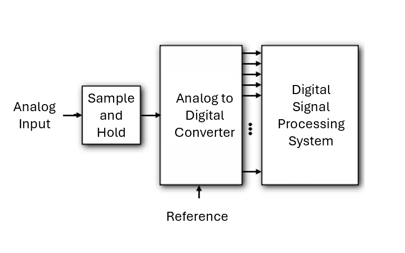
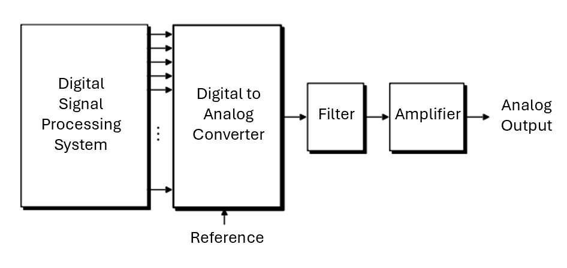
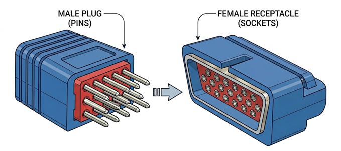
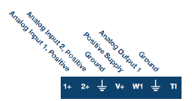
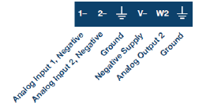
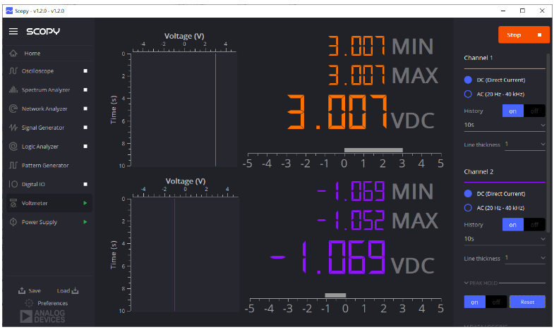
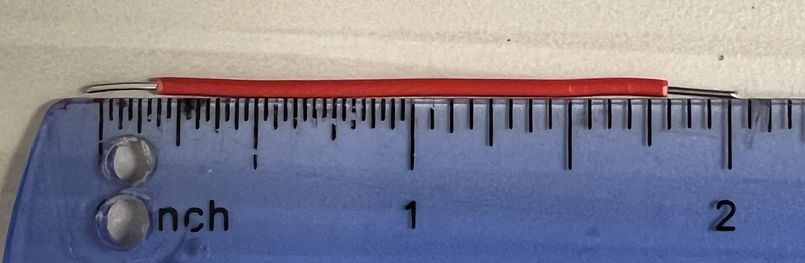
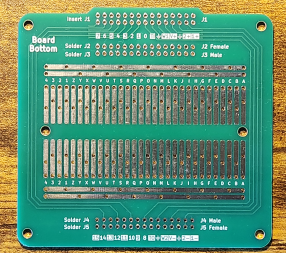
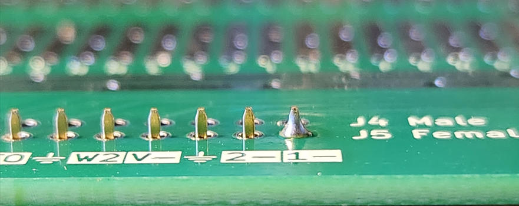

# ECE Emerge Lab #1: Introduction to ADALM2000 (M2K)

**Department of Electrical and Computer Engineering**

**Spring 2026**

---

## Overview

The purpose of Lab 1 is to:

- Install the M2K software and verify that the installation is functional
- Perform DC measurements using the M2K voltage source and power supply
- Become familiar with a solderless breadboard
- Build an adaptor board for the M2K that will be used in future labs
- Collect the parts that will be used throughout the course

---

## 1. Prelab Assignment

### 1.1 Reflective AI Exercise

**Objective:** Demonstrate conceptual understanding of physical signal capture and conversion using AI-assisted exploration.

#### Part 1: Exploration

Before starting, read the chapter *A Mind Worth Questioning* in your course textbook, paying particular attention to the *Putting It Into Practice* section, which explains the three-part format and what each part requires. Use the prompts below exactly as written. After each response, write two or three sentences in your own words summarizing what you learned before moving on. (These per-response summaries are for your own notes and are not submitted.)

**Focus Area 1: Single-Ended vs. Differential Measurements**

> *"I am a first-year electrical engineering student about to do my first lab using a data acquisition instrument. Can you explain the difference between single-ended and differential voltage measurements? Focus on how each method connects to the circuit under test, and explain in physical terms why one is more immune to noise picked up along the wiring."*

Follow up with:

> *"Can you give me a concrete example of a situation where using a single-ended measurement instead of a differential one would cause a significant measurement error? Describe what would happen physically."*

**Focus Area 2: ADC and DAC Hardware**

> *"I am a first-year electrical engineering student. Can you explain what an analog-to-digital converter (ADC) does, using the idea of resolution and quantization? I want to understand why a higher bit-depth ADC produces a more faithful digital representation of an analog signal, and what quantization error means physically."*

Follow up with:

> *"Now explain the DAC (the digital-to-analog converter) and how it is the reverse process. If a DAC has 12-bit resolution and a 5 V output range, what is the smallest voltage step it can produce? Walk me through the calculation."*

After completing both focus areas, work through the following concrete scenario in 3–5 sentences, for yourself, not for submission. Your M2K ADC has a resolution of approximately 2 mV in the $\pm$2.5 V range: that is the smallest voltage change it can distinguish. Now suppose your single-ended wiring picks up 15 mV of noise before the signal reaches the ADC. What is the smallest signal change you can actually detect? How does switching to differential wiring change that answer, and why? The goal is to see that the ADC's resolution sets a theoretical limit, but your wiring choice determines whether you can get anywhere near it in practice.

#### Part 2: The Self-Test

A quiz prompt is a set of instructions you give the AI telling it to quiz you. You are not asking for an explanation. You are asking the AI to test whether you can apply what you have learned.

Before writing, review the *Step 2: Writing Your Own Quiz Prompt* subsection in the textbook's *Putting It Into Practice* section. Your prompt must satisfy all four structural criteria listed there, and the worked example in that subsection is a useful template to adapt.

Using Gemini (or whichever AI tool you used for Part 1), write a quiz prompt that instructs the AI to ask you at least three questions, one at a time, waiting for your answer before continuing. Beyond the four structural criteria, your questions must also cover both of the following topics:

- **Single-ended vs. differential:** Given a described wiring scenario, decide which measurement type is appropriate and explain why, not just define the terms.
- **ADC or DAC performance:** Either calculate a numerical result (for example: the voltage resolution of a 12-bit ADC with a $\pm$2.5 V range) or predict what happens to measurement quality in a specific situation (for example: the effect of 20 mV of input noise on a system with 2 mV resolution).

Your prompt must explicitly instruct the AI not to ask definition-only questions.

Next, use the meta-prompt from the *Step 3: The Meta-Prompt* subsection. Copy it exactly as written, paste your draft prompt where indicated, and submit it to the AI. Save the AI's critique and revised version. Then run the final quiz using the revised prompt and save the complete transcript.

You will collect four items for submission: (1) your original draft prompt, (2) the AI's critique of your draft, (3) your revised prompt, and (4) the full quiz transcript. Take a screenshot of each and add your name before uploading.

> **Prelab Deliverable #1**
>
> Submit the following four items via the course submission app. For each item, take a screenshot of the AI chat window showing the full text, add your name using your device's markup tool, and upload the image.
>
> - **(a)** Your original quiz prompt draft.
> - **(b)** The AI's critique: the AI's full response when you applied the meta-prompt.
> - **(c)** Your revised quiz prompt after incorporating the feedback.
> - **(d)** The quiz transcript: your revised prompt, the AI's questions, and your responses in full. Use multiple screenshots if needed.

#### Part 3: Formal Reflection (150–250 words)

Your written synthesis must address all three of the following points:

- **The Link** — How wiring choices protect the signal before it reaches the ADC.
- **The Technical "Why"** — Correct use of terms such as common-mode rejection or quantization error.
- **The Lab Application** — A specific "Aha!" moment identifying a physical wiring mistake you can now prevent.

> **What a strong reflection looks like**
>
> This reflection will be assessed by an AI grader. To help you write a response that demonstrates real understanding, here is what distinguishes a strong response from a weak one.
>
> **The Link** is strong when your prose makes a chain of cause and effect: a wiring decision leads to a signal property (or problem), which affects what the ADC receives. Weak versions state the two topics side by side without connecting them.
>
> **The Technical Why** is strong when you use a term like *common-mode rejection* or *quantization error* to explain *how* something works physically. Naming the term alone is not enough; show that you understand the mechanism it describes.
>
> **The Lab Application** is strong when it names a specific, concrete action you could get wrong (for example: connecting both signal wires to the same reference instead of using the differential inputs) and describes what you would actually observe as a result (for example: a measurement corrupted by mains noise). Vague statements like "the measurement would be less accurate" do not meet this standard.
>
> Write as a single argument in continuous prose. Do not use bullet points or separate paragraphs for each point; they should flow together. Include your word count at the end.

> **Prelab Deliverable #2**
>
> Submit your Part 3 formal reflection (150–250 words) via the course submission app.

---

### 1.2 Solderless Breadboard

You will use a solderless breadboard, as depicted in Figure 1, to construct basic circuits. Take the time to understand [**What is a solderless breadboard?**](https://wiki.analog.com/university/courses/electronics/electronics-lab-breadboards) and how it is used.

*Figure 1: Typical solderless protoboard, with yellow lines indicating the electrical connections. The horizontal connections, the two at the top and the two at the bottom, are typically used for connecting any power supplies and ground.*

Figure 2 shows how a solderless protoboard will be used in ECE Emerge.

*Figure 2: An example of how a solderless circuit board will be used in ECE Emerge. The circuit contains two 1 kΩ resistors. You can verify this value from their color codes. If you are unfamiliar with resistor color coding, you can use any Large Language Model (LLM) with the prompt: "Please explain color codes used on resistors" to learn how to interpret them. Note how these resistors are connected to the female 1x15 connector on the printed circuit board. Pay attention to the colored wires, which provide hints about the circuit connections. When a circuit is built, the person will typically use (not always) red wires to indicate positive voltage connections, black wires for negative voltage connections, and green for ground. Observe how the red, green, red, and orange wires are used in this circuit — their colors give you important clues about the electrical connections being made.*

The M2K is a USB-powered data acquisition module featuring two 12-bit ADCs (100 MSPS sampling rate) and two DACs (150 MSPS sampling rate). An analog-to-digital converter samples an analog signal to produce a digital representation of the signal, as shown in Figure 3. A digital-to-analog converter does the opposite, using a digital representation of the signal to produce an analog signal, as shown in Figure 4.

*Figure 3: An analog digital converter samples an analog signal to produce a digital representation of the signal.*

*Figure 4: A digital to analog converter produces an analog signal from a digital representation.*

When the M2K is paired with Analog Devices' Scopy™ graphical application software on a computer, the M2K provides the following advanced instrumentation functionalities:

- Dual-channel voltmeter (AC, DC, ±25 V)
- Two programmable power supplies (0 to +5 V, 0 to −5 V)
- Dual-channel oscilloscope with differential inputs
- Two-channel arbitrary function generator
- Network analyzer with a frequency range: 1 Hz to 10 MHz
- Spectrum Analyzer
- 16-channel digital logic analyzer (3.3 V CMOS and 1.8 V or 5 V tolerant, 100 MS/s)
- 16-channel pattern generator (3.3 V CMOS, 100 MS/s)
- 16-channel digital I/O with virtual displays
- Two input/output digital trigger signals for connecting multiple instruments (3.3 V CMOS)
- Digital Bus Analyzers (SPI, I²C, UART, Parallel)

*Figure 5: The ADALM2000 (M2K) USB module provides five instrument functions in a single device: a dual-channel DAC source, a dual-channel ADC measurement input, a variable power supply, digital trigger I/O, and 16-channel digital I/O, all accessible via the Scopy software interface.*

---

### 1.3 M2K Connections

You need to get acquainted with the M2K connections input/outputs. Electrical connectors are categorized by their gender, as illustrated in Figure 6. The M2K unit comes with one 2×15 male connector to which mates a 2×15 female connector.

*Figure 6: Terminology analogy: The male connector protruding pins fit into the female connector's recessed sockets, similar to biological mating.*

In this course you will encounter two types of 2×15 female connections:

1. The wire harness that comes with the M2K (i.e., the M2K Wire Harness Connector)
2. The UC Davis Adaptor Board, which you will assemble in the lab for your future use.

#### 1.3.1 M2K Wire Harness Connector

Figure 7 shows the M2K wire harness connector and the connections to the M2K unit. From the wire harness, connections are made to a solderless board. The M2K connections that will be used most of the time in this course are the connections on the left side of the connector (5 on top and five on the bottom row).

To use the M2K wire harness connector, you will need to know how to interpret the colored wires:

*Figure 7: Pinout diagram of the ADALM2000 M2K module showing the signal assignment and color code for each of the 30 pins across the two 1×15 connectors. The top connector carries analog inputs, positive supply, analog output W1, trigger input, and digital I/O lines 0–7. The bottom connector carries the complementary analog input references, negative supply, analog output W2, trigger output, and digital I/O lines 8–15.*

- The first two on the left are the connections for the first M2K analog-to-digital converter channel:
  - On top, the solid **ORANGE** wire is the ADC Analog Input #1, positive terminal and labeled as 1+
  - On the bottom, the **ORANGE-WHITE** wire is ADC Analog Input #1, negative terminal, labeled as 1−
  - These connections are "floating," which means they can be connected anywhere in a circuit
  - If a single-ended measurement is made (voltage measurement referenced to ground), the negative terminal is connected to the circuit ground, which is the node we consider to be at zero volts

- The next pair of wires connect to the second M2K analog-to-digital converter channel:
  - The **BLUE** wire on top is ADC Analog Input #2, positive terminal, labeled as 2+
  - The **BLUE-WHITE** wire on the bottom is ADC Analog Input #2, negative terminal and labeled as 2−

- The next two wires are **BLACK**. They are connected to each other and to the internal ground of the M2K, hence representing the circuit ground.

- The next two wires are connected to the internal power supplies:
  - The **RED** wire on the top goes to the variable Positive Power Supply, labeled V+
  - The **WHITE** wire on the bottom goes to the variable Negative Power Supply, labeled V−
  - Both voltage supplies refer to ground (i.e., once the ground connection is made to the circuit, you use the voltage output)

- The final two wires that will be used are **YELLOW** and **YELLOW-WHITE**:
  - The **YELLOW** wire on top connects to the first M2K DAC channel, labeled as W1
  - The **YELLOW-WHITE** wire is connected to the second M2K DAC channel, labeled as W2
  - There will always need to be a ground connection to the circuit under test. Therefore, only one wire is needed to connect a DAC channel as the second terminal of each DAC is ground

#### 1.3.2 UC Davis M2K Adaptor Board

Most of the time in the course, you will be using the UC Davis M2K Adaptor Board as it simplifies the connections to a solderless board. The PCB makes connections from the M2K to two 1×15 female headers mounted on the PCB. From these connections, wired connections are made to the solderless board fixed to the PCB.

*Figure 8: The ADALM2000 Active Learning Module plugged into the UC Davis adapter board. The adapter board provides a solderless breadboard for circuit assembly and routes all M2K signals to labeled connectors for easy access.*

The silkscreen lettering shows the connections (they are in exactly the same order as shown in Figure 7).

One 1×15 connector connects to the M2K connections:

- 1+: Analog Input #1, positive terminal
- 2+: Analog Input #2, positive terminal
- Ground
- V+: Positive Power Supply
- W1: Analog Output #1
- Gnd: Ground connection, and so on (others are not used in ECE Emerge)

*Figure 9: UC Davis M2K Adaptor Board: Connections on the top connector that will be used extensively in ECE Emerge.*

The second 1×15 connector connects to the M2K connections:

- 1−: Analog Input #1, negative terminal
- 2−: Analog Input #2, negative terminal
- Gnd: Ground connection
- V−: Negative Power Supply
- W2: Analog Output #2
- Gnd: Ground connection, and so on (others are not used in ECE Emerge)

*Figure 10: UC Davis M2K Adaptor Board: Connections on the bottom connector that will be used extensively in ECE Emerge.*

*Figure 11: Example of how UC Davis M2K Adaptor Board is used with M2K. The board will be plugged into a M2K. There are two sets of horizontal rails on the solderless board. In each set, they are labeled + (red) and − (blue). Ignore the specific meaning of the labels on the solderless boards. In this example, the person implementing the circuit chose to use the horizontal rails such that: the "+" on the top rail is for the positive supply voltage; the "+" on the bottom rail for negative supply voltage; and the "−" on both the top and bottom horizontal rails for ground. Note how the red, black, and green wires were used to indicate positive, negative, and ground connections, respectively. Get into a habit of doing the same, as it makes debugging a circuit much easier.*

During the lab you will be given a printed circuit board and the necessary connectors, and you will assemble and solder your own adapter board. This video shows how this will be done: [Assembling a UC Davis M2K Adaptor Board](https://video.ucdavis.edu/media/Assembly+of+M2K+Adaptor+Board.mp4/1_ia02ldof)

---

### 1.4 Software Installation and Calibration

Before coming to Lab 1, two software installations are required. One is for the M2K, and the other is the Scopy™ graphical application software. Follow the directions:

1. [M2K Video Series: Video 1 - Unboxing](https://www.youtube.com/watch?v=LCf-_iREESQ&list=PLE6soOeVPOJ0Pj5sMui4KPDiTa7HY50y3&index=1)

2. [M2K Video Series: Video 2a - Windows Installation](https://www.youtube.com/watch?v=894HkVXf7-U&list=PLE6soOeVPOJ0Pj5sMui4KPDiTa7HY50y3&index=2&t=15s)
   *(Note: If you experience problems setting up the M2K device, before contacting a teaching assistant, verify that you have installed Scopy version 1.4.1 with firmware version 0.31, as these specific versions are known to be reliable.)*

> **WARNING: Documentation Convention — Your Name in Every Image**
>
> Every screenshot, photograph, or saved plot you submit in this course must have your name visible *inside* the image itself, not just in the filename. Images without your name cannot be attributed and will not receive credit.
>
> **For screenshots on Windows:** Use the Snipping Tool (`Win+Shift+S`) to capture. Open the saved file in the Photos app, select *Edit and Create*, then *Draw*, and use the text tool to type your name in the upper-left corner. Save.
>
> **For screenshots on Mac:** Press `Shift+Cmd+4` to capture. Open in Preview, click the markup toolbar (pencil icon), select the Text tool, and type your name. Save.
>
> **For photographs of hardware:** Before photographing, place a small piece of paper with your name written clearly next to the hardware so it appears in the frame. Alternatively, annotate the photo after using your phone's built-in photo editor or the methods above.
>
> Save files with descriptive names, for example: `Smith_Lab1_Deliverable2a.png`.

> **Prelab Deliverable #3**
>
> Take a screenshot of your Scopy application's main interface. Add your name to the screenshot using the method described in the Documentation Convention above, then insert the labeled image into your prelab report.

#### M2K Calibration

Watch [M2K Video Series: Video 3 - Calibration](https://www.youtube.com/watch?v=M7degXTb2CA&list=PLE6soOeVPOJ0Pj5sMui4KPDiTa7HY50y3&index=5). Plug in your M2K using the USB connector in the middle. Open SCOPY, click the connect button and allow the calibration of the unit to conclude.

*(Note: During calibration, the M2K signal generator temporarily switches to low impedance mode, which can disrupt any connected circuits. The generator outputs a ground signal (0 V) followed by a near full-scale voltage for approximately 100 ms. This sudden voltage change explains why you should never have circuitry connected during the calibration process. Furthermore, if a load is connected during calibration, the system will incorrectly adjust its calibration values to compensate for that specific load. This compromises accuracy, as voltages near full scale may not be output correctly when different loads are used later.)*

> **IMPORTANT**
>
> Calibration occurs each time you connect to the ADALM2000 after power on. A COMMON MISTAKE IS TO CONNECT THE M2K ANALOG INPUTS AND OUTPUTS BEFORE STARTUP. ALWAYS DISCONNECT THE ANALOG INPUTS AND OUTPUTS BEFORE CALIBRATION TAKES PLACE WHEN SCOPY IS LAUNCHED.

---

### 1.5 Lab Safety

Complete the required ECE Safety Training quiz before attending your first lab session. Carefully review all safety requirements detailed in Appendix B. These safety protocols are mandatory for maintaining a safe lab environment.

---

### 1.6 Guidelines for Good Soldering Practices

Complete the required ECE Solder Training before your first lab session. During the lab, you will be soldering electronic components. Review the guidelines for good soldering practices in Appendix C to ensure proper technique and safety.

---

### 1.7 M2K Adaptor Construction

During the lab period, you will construct your M2K adaptor board. Review the detailed instructions in Appendix A before lab so you can ask any clarifying questions during the lab session.

---

### 1.8 Lab Instructions: Become Familiar

Carefully read through the lab procedure in the next section before coming to the lab session. This preparation will help you use your lab time efficiently and allow you to ask specific questions about any steps you find unclear.

---

### 1.9 Complete Pre-Lab Assessment

Complete your pre-lab assessment as well as the assessments of lab safety and soldering training.

*Finally, before coming to the lab, read through all the lab instructions to understand the procedures, prepare clarifying questions, and maximize your lab time efficiency.*

***You are now ready for the lab!***

---

## 2. Lab Procedure

Coming to the labs, you must bring:

1. Your laptop
2. Your M2K with all software installed
3. Phone/camera to take pictures during lab

During the lab there are three general tasks that need to be completed:

1. Investigate the M2K Power Supply and Voltmeter (if your adaptor board is done, use it. If not, just use the solderless board without attaching it to the adaptor board)
2. Building the UC Davis M2K Adaptor Board
3. Collection of parts for future labs

The tasks will not be completed sequentially. The lab will be divided into groups that will cycle through the activities.

> **IMPORTANT**
>
> At each step that requests an image, capture it immediately. Do not wait until the end of the session. Your name must be visible in every image you submit (see the Documentation Convention in the Prelab Assignment). Blurry or unlabeled images will not receive credit.

Complete all steps during your scheduled lab session when teaching assistants are available to help. Address any issues during this time by consulting student assistants or the teaching assistant. If you need assistance after the lab period, contact only your assigned teaching assistant.

While you may complete unfinished M2K measurements after the lab period if necessary, you are strongly encouraged to take full advantage of the lab session when expert help is readily available.

---

### Part 1: Software Installation Verification

Verify that you have successfully installed both the M2K drivers and the Scopy™ application. Connect your M2K to your computer using the USB cable and launch the Scopy™ application. Confirm that the software recognizes your device.

---

### Part 2: M2K Power Supply

The M2K has two power supplies that can be used in tracking and independent modes:

1. Positive supply from zero to plus five volts that can provide up to 50 milliamps of current
2. Negative supply from zero to minus five volts that can provide up to 50 milliamps of current
3. The ground of power supplies are made internally and shows up externally as the ground connections.

In tracking mode, the supplies are maintained equal and opposite, whereas in independent mode, you can adjust positive and negative voltage individually.

Set the positive supply voltage to the last three digits of your telephone number multiplied by 5, scaled to fall within 0–5 Volt, for instance:

- If your number is (301) 314-5111, set it to 0.555 V (i.e. 111 × 5)
- If your number is (720) 423-2344, set it to 1.72 V

Adjust the negative supply voltage to reflect your birth date in the format of d.dmm (day.month); for instance:

- If born on March 12th, set it to −1.203 V
- If born on January 1st, set it to −0.101 V
- If born on December 31st, set it to −3.112 V

> **Lab Deliverable #1**
>
> Enable the output voltages and capture a screenshot of the power supply displaying the programmed and measured voltages. Add your name to the screenshot before saving. Upload the image via the course submission app.

*Figure 12: The Scopy Power Supply interface configured to generate 3 V and -1 V: The positive power supply (V+) is generating approximately 2.996 V and the negative power supply (V-) is generating approximately -0.988 V.*

---

### Part 3: M2K Voltmeter

Become familiar with [Scopy™ Voltmeter](https://wiki.analog.com/university/tools/M2K/scopy/voltmeter). The M2K voltmeter uses 12-bit ADCs to measure voltages. There are two channels:

1. Channel one uses differential analog input channels 1 positive (1+) and 1 negative (1−)
2. Channel two uses differential analog input channels 2 positive (2+) and 2 negative (2−)

In each channel, there are two ranges: ±25 V and ±2.5 V. It is important to pay attention to what range the voltmeter is using as that will determine the resolution of the measurement. The ADC is 12-bit, which implies that changes in voltage can be detected as small as $50/(2^{12}) = 12.2$ mV in the ±25 V range, and 1.2 mV in the ±2.5 V range.

Allowing for noise and non-ideal ADC behavior, you can expect results slightly worse than this. For this course, we will state that the smallest voltage change that the M2K ADC can detect is 20 mV for the ±25 V and 2 mV in the ±2.5 V range. Resolution is optimized by performing a measurement in the smallest range. For instance, with the M2K a 1 V measured signal in the ±2.5 V range can be measured within 2 mV, so the measured value should be reported as $(1.000 \pm 0.001)$ V.

The DC voltages provided by the M2K power supplies are produced on the **RED** and **WHITE** output leads (corresponding to V+ and V−, respectively). The input voltages of the voltmeter are measured using the **ORANGE** and **BLUE** wires.

#### Single-Sided Voltage Measurements

In single-sided voltage measurement, the voltage is measured relative to ground. Use the solderless breadboard and implement the connections shown in Figure 13.

> **IMPORTANT**
>
> Get into a habit of using horizontal bus rails and colored wires connections, such as shown in Figure 11. Use jumper wires to make connections from the horizontal buses to the central part of the solderless board, where typically the components will be placed.

<!-- CIRCUITIKZ FIGURE: Render from LaTeX source as media/fig_single_meas_circuit.png -->

*Figure 13: Single sided voltage measurements of the power supplies.*

If your UC Davis adaptor board is ready, use it. Otherwise, use the harness connector. Make sure to connect wires according to the circuit in Figure 13:

- Use Channel 1+ input to measure the V+ power supply terminal
- Use Channel 2+ input to measure the V− power supply terminal
- Channel 1− input, Channel 2− input are connected to common ground.

> **Lab Deliverable #2a**
>
> Take a clear photograph of your breadboard showing the connections made. You do not need to show the entire M2K, just enough to document which wires are connected and how the ground and negative terminals are wired. Your name must be visible in the photograph. Upload the image via the course submission app.

Turn on both channels of the voltmeter, and record the voltages produced by the power supply. You will find that they do not exactly match what you programmed — that is normal. See if you can get the output measurements to match your target values by making small adjustments to the power supply voltages.

> **Lab Deliverable #2b**
>
> Capture a screenshot of the voltmeter displaying the measured voltages for both channels. Add your name to the screenshot before saving. Upload the image via the course submission app.

*Figure 14: The Scopy Voltmeter instrument displaying two simultaneous DC voltage measurements: Channel 1 reading approximately 3.007 V and Channel 2 reading approximately negative 1.069 V, consistent with the M2K positive and negative supply outputs.*

#### Differential Voltage Measurement

Since the connections to Ch1+ and Ch1− are "floating" (and also Ch2+ and Ch2−), they can be linked anywhere in a circuit for a differential measurement. This experiment makes a differential voltage measurement with Ch1+ and Ch1−. Make the connections illustrated in Figure 15 to perform a differential voltage measurement between the positive and negative power supplies, and a single sided measurement of the negative voltage supply.

<!-- CIRCUITIKZ FIGURE: Render from LaTeX source as media/fig_differential_circuit.png -->

*Figure 15: Differential and single-sided voltage measurements of the power supplies.*

> **Lab Deliverable #2c**
>
> Take a screenshot showing the measured voltages from the differential setup. Add your name to the screenshot before saving. Upload the image via the course submission app.

> **Lab Deliverable #2d**
>
> In 2–3 sentences, interpret your results: what did Channel 1 measure, what did Channel 2 measure, and what does the comparison reveal about the difference between a differential and a single-ended measurement in this circuit? Enter your answer via the course submission app.

---

### Part 4: Building the UC Davis M2K Adaptor Board

In this part of the lab, you will assemble your own UC Davis M2K Adaptor Board that will be used in future labs. This adaptor board simplifies connections and circuit construction for future experiments.

> **IMPORTANT**
>
> Detailed step-by-step instructions for the adaptor board construction are provided in Appendix A. Follow these instructions carefully as improper assembly can render the board unusable.

#### Materials Provided

- 1× Unpopulated printed circuit board (PCB)
- 1× 2×15 Edge connector
- 2× 1×15 Female header
- 1× Solderless breadboard

#### Safety Requirements

- Safety glasses must be worn at all times during soldering
- Review all lab safety rules in the adaptor board handout before beginning
- Soldering must be performed under supervision

#### Assembly Process Overview

1. Identify proper board orientation (top vs. bottom)
2. Position connectors correctly (edge connector from bottom, headers from top)
3. Solder one terminal of each connector and get verification
4. Complete soldering of all terminals after approval
5. Mount the solderless breadboard to complete assembly

> **Lab Deliverable #3**
>
> Take clear photographs of your completed UC Davis M2K Adaptor Board from all sides. Ensure solder joints are visible in at least one photograph, and your name is visible in at least one photograph. Upload the images via the course submission app.

---

### Part 5: Collecting Parts

Get your component box, assemble it, place TI sticker on it, and your name. Store your parts in this box for the duration of the course. Bring it with you to labs.

#### Solid Core Stripped Connecting Wires

1. Cut approximately 2-inch long solid core wires in the following quantity and colors:

   | Quantity | Description |
   |----------|-------------|
   | 2 | Red |
   | 2 | Black |
   | 2 | Green |
   | 1 | Yellow |
   | 1 | Blue |
   | 1 | Orange |

2. Strip both ends of each wire using the stripping tool available in the lab. Ensure the tool is set to remove approximately 1/4 inch of insulation from each end.

3. If you need additional wires in future, or wires of different length, make additional ones the next time you are in the lab. While wires could also be stripped with an edge cutter, the stripping tool makes it much easier.

*Figure 16: Example of a 2-inch long solid core red wire.*

#### Components for Lab #2 and #3

Collect the following components:

| Quantity | Description |
|----------|-------------|
| 2 | 820 Ω ±10% Resistors |
| 2 | 1 kΩ ±10% Resistors |
| 2 | 1.2 kΩ ±10% Resistors |
| 1 | Red LED |
| 1 | 100 Ω Resistor |
| 1 | 2.2 kΩ Resistor |
| 1 | 1 mH Inductor |
| 1 | 1 µF Capacitor |

> **Lab Deliverable #4a**
>
> Take a clear, well-lit photograph of all your stripped connecting wires, organized by color. Your name must be visible in the photograph. Upload the image via the course submission app.

> **Lab Deliverable #4b**
>
> Take a clear, well-lit photograph of all your collected components, arranged neatly so every item is identifiable. Your name must be visible in the photograph. Upload the image via the course submission app.

#### Resistance Measurements

Perform the following measurements:

1. Measure the resistance of each resistor using the Keysight multimeter on your bench. See: [How to Measure Resistance with Keysight EDU34450A Multimeter](https://drive.google.com/file/d/1j6iN7GsJH1oI6mBRQmlJVnS2WCd6dato/view?usp=sharing)

2. Measure the capacitance of the capacitor using the Keysight multimeter on your bench. See: [How to Measure Capacitance with Keysight EDU34450A Multimeter](https://drive.google.com/file/d/1bbq8x2qO2SVNvI8vk4P20AJ2q68jkg8e/view?usp=sharing)

3. Record all measured values for future reference.

> **Lab Deliverable #4c**
>
> Enter all measured component values via the course submission app: the resistance of each resistor (820 Ω ×2, 1 kΩ ×2, 1.2 kΩ ×2, 100 Ω, 2.2 kΩ) and the capacitance of the 1 µF capacitor.

**BEFORE LEAVING THE LAB:**

- **CLEAN UP YOUR WORK BENCH.**
- **MAKE SURE ALL CABLES THAT YOU USED ARE RETURNED TO THE CABLE CONNECTOR RACKS.**
- **MAKE SURE ALL EQUIPMENT, INCLUDING THE SOLDERING IRON, ARE TURNED OFF.**

---

### Lab Completion Self-Verification Checklist

> **Self-Verification Checklist**
>
> Before leaving the lab, verify that you have collected all the necessary information and materials to complete your lab report by checking off each item below:
>
> 1. **Part 1: Software Installation Verification**
>    - [ ] Software has been installed and tested
>
> 2. **Part 2: M2K Power Supply**
>    - [ ] Screenshot of the power supply displaying programmed and measured voltages (Deliverable 1)
>    - [ ] Recorded your programmed voltage values and target calculations
>
> 3. **Part 3: M2K Voltmeter**
>    - [ ] Photograph of breadboard with single-sided connections (Deliverable 2a), name visible
>    - [ ] Screenshot of single-sided voltmeter readings (Deliverable 2b), name visible
>    - [ ] Screenshot of differential voltmeter readings (Deliverable 2c), name visible
>    - [ ] Written interpretation comparing the two measurement types (Deliverable 2d)
>
> 4. **Part 4: UC Davis M2K Adaptor Board**
>    - [ ] Photographs of completed adaptor board, all sides (Deliverable 3), name visible in at least one
>    - [ ] Solder joints visible in at least one photograph
>    - [ ] Adaptor board is fully assembled and functional
>
> 5. **Part 5: Component Collection**
>    - [ ] Photograph of stripped connecting wires (Deliverable 4a), name visible
>    - [ ] Photograph of all collected components (Deliverable 4b), name visible
>    - [ ] Measured resistance and capacitance values recorded (Deliverable 4c)
>    - [ ] All required components have been collected:
>      - [ ] 2× Red, 2× Black, 2× Green, 1× Yellow, 1× Blue, 1× Orange wires. More will be better.
>      - [ ] Resistors: 2× 820 Ω, 2× 1 kΩ, 2× 1.2 kΩ, 1× 100 Ω, 1× 2.2 kΩ
>      - [ ] 1× Red LED
>      - [ ] 1× 1 mH Inductor
>      - [ ] 1× 1 µF Capacitor
>
> 6. **Work area**
>    - [ ] Clean?
>    - [ ] Soldering iron off?

> **IMPORTANT**
>
> If any items are missing, consult with your lab TA before leaving. Completing this checklist ensures you have all required materials for your lab report.

---

## 3. Post Lab

Complete the following after your lab session and submit via the course submission app.

> **Lab Deliverable #5**
>
> Enter the positive and negative supply voltages you programmed and the actual voltages the M2K produced. For each supply, state whether the measured value matched the target and by how much it differed.

> **Lab Deliverable #6**
>
> In one or two sentences, state the resolution of the M2K voltmeter in the ±25 V range and in the ±2.5 V range. Explain why using the smaller range gives a more precise measurement.

> **Lab Deliverable #7**
>
> In 2–3 sentences, describe one observation or challenge from the lab session and what it revealed about the equipment or your understanding of the measurement concepts.

> **Lab Deliverable #8**
>
> In 2–3 sentences, describe one specific advantage the UC Davis M2K Adaptor Board provides compared to using the wire harness directly, based on your experience in this lab session.

---

## Appendix A: M2K Adaptor Board Construction

### Overview

In this lab, you will construct an adaptor board for the M2K. This adaptor board simplifies circuit construction and testing with the M2K. During this process, you will also develop essential soldering skills that will be valuable throughout your engineering career.

### Materials Provided

- 1× Unpopulated printed circuit board (PCB)
- 1× 2×15 Edge connector
- 2× 1×15 Female header
- 1× Solderless breadboard

### Step-by-Step Assembly Instructions

#### Step 1: Identify Board Orientation

Familiarize yourself with the top and bottom of the PCB (see Figures A1 and A2).

*Figure A1: Top of the PCB. **The top side features the UC Davis logo.***

*Figure A2: Bottom of the PCB.*

Figure A3 shows how the adaptor board will interface with the M2K.

*Figure A3: The M2K connected to the UC Davis ECE adaptor board. The arrows highlight the three connectors and their proper mounting positions. The yellow arrow indicates the edge connector, which is mounted on the BACK of the adaptor board. The red arrows point to the 1×15 female headers, mounted from the adaptor board's TOP side.*

> **IMPORTANT**
>
> Note that the 2×15 edge connector is mounted from the BACK of the board, while the 1×15 female headers are mounted from the top. DO NOT GET THIS WRONG.

#### Important Notes

- **DO NOT START SOLDERING WITHOUT SUPERVISION.**
- Incorrect connector mounting will make the board unusable.
- Follow all instructions precisely.

#### Step 2: Position Connectors (DO NOT SOLDER YET)

1. Insert all connectors:
   - 1 edge connector mounted from the bottom of the PCB
   - 2 1×15 female headers from the top of the PCB

2. Important: Mount the 1×15 headers in the holes labeled **J2 Female** and **J5 Female** (refer to Figure A7).

3. Have your lab partner verify the correct positioning before proceeding.

#### Step 3: Soldering Review

1. Review the information in Appendix C: Guidelines for Good Soldering Practices before proceeding.

#### Step 4: Initial Soldering

1. Solder ONLY ONE terminal on each of the three connectors — see Figures A4 and A5.

2. **STOP after soldering just one terminal per connector.**

3. Apply the appropriate amount of solder:
   - Position the soldering iron so it simultaneously heats both the connector terminal and the PCB pad
   - Only after both surfaces are heated (typically 2–3 seconds), apply the solder
   - Work quickly but carefully — you have approximately 5 seconds before the board may overheat
   - The solder should naturally flow and "wick" into the joint, creating a smooth, concave connection
   - Avoid using excessive solder which creates unwanted "blobs"

> **WARNING**
>
> If you make a mistake, immediately notify the undergraduate student assistant for help.

*Figure A4: Close-up of the edge connector installation. Note the edge connector is mounted from the <u>bottom</u> of the adaptor board.*

*Figure A5: Close-up of the solder joints for one of the two 1×15 female header connectors, viewed from the bottom of the adaptor board. The 1×15 connectors are mounted from the top of the adaptor board.*

*Figure A6: Example of properly soldered connection.*

#### Step 5: Verification Check #1

> **CHECKPOINT**
>
> **STOP HERE** and have either:
> - The undergraduate lab assistant, OR
> - The teaching assistant
>
> check your work and approve you to continue to the next step.

#### Step 6: Complete Soldering

1. After receiving a check off to proceed, solder all remaining terminals
2. Maintain consistent solder quantity for each joint
3. If you make a mistake, immediately notify the undergraduate student assistant for help
4. Your board should now match the appearance shown in Figure A7
5. Verify all connections are properly soldered

*Figure A7: Completed soldered board with all connectors installed, ready for breadboard attachment.*

#### Step 7: Verification Check #2

> **CHECKPOINT**
>
> **STOP HERE** and have either:
> - The undergraduate lab assistant, OR
> - The teaching assistant
>
> check your work and check it off, then proceed to the next step.

#### Step 8: Final Assembly

1. Mount the solderless protoboard onto your completed adaptor board (Figure A3)
2. Your M2K adaptor board is now ready for use in Lab 2

### Documentation and Submission

> **Required Documentation**
>
> For your lab report submission, you must document your completed adaptor board with the following:
>
> 1. Take clear photographs of your assembled adaptor board from the following angles:
>    - Top view showing the entire board with breadboard mounted
>    - Bottom view showing all solder joints
>    - Close-up view of at least 3–4 solder joints to demonstrate proper soldering technique
>
> 2. Insert these photographs in the designated spaces in the Lab 1 Submission Template
>
> 3. Complete the self-assessment checklist in the template regarding your soldering quality
>
> This documentation is part of Deliverable #3 in your overall Lab 1 submission to Gradescope.

> **IMPORTANT**
>
> SAVE YOUR ADAPTOR BOARD CAREFULLY! This board will be used throughout the semester for all remaining labs. Store it in a safe place where it won't be damaged.

---

## Appendix B: ECE Lab Safety Rules

The following safety rules must always be followed in ECE labs.

1. **Safety glasses must always be worn when soldering.** The safety glasses are required even for users who wear prescription glasses. The safety glasses should be worn over regular glasses. The safety glasses must also be worn when trimming leads using horizontal cutters as pieces of metal can fly upward.

2. Do not use faulty equipment. Inspect the soldering iron power cord for fraying, burns or exposed wire. Report faulty equipment immediately.

3. Use lead-free solder whenever possible.

4. Food and drink are ***never*** allowed in the work area.

5. Avoid placing your face directly over the work when soldering.

6. Tie back long hair so it cannot get burned by the soldering iron.

7. Always return the soldering iron to its stand. Do not lay it on the workbench.

8. **Always turn off the soldering iron when you are done soldering.**

9. Wash your hands with soap and water when you finish soldering.

---

## Appendix C: Guidelines for Good Soldering Practices

### Safety First

- Always wear safety glasses to protect your eyes from solder splashes
- Work in a well-ventilated area to avoid inhaling solder fumes
- Never touch the metal part of the soldering iron — it reaches temperatures of 400°C (750°F)
- Place the soldering iron in a stand when not in use
- Wash your hands after soldering to remove flux and lead residues

### Proper Soldering Technique

1. **Ensure clean surfaces:** Both the component lead and PCB pad should be clean and free of oxidation
2. **Heat the joint properly:** Apply the soldering iron tip to make contact with both the pad and component lead simultaneously
3. **Apply solder correctly:** Add solder to the joint (not the iron tip) after both surfaces are properly heated
4. **Use appropriate timing:** A good joint typically takes 2–3 seconds to form
5. **Proper solder amount:** Use just enough solder to form a smooth concave fillet between the lead and pad
6. **Avoid movement:** Hold components still until the solder has completely solidified

*Figure C1: Soldering sequence. Source: <https://www.raypcb.com/through-hole-soldering/>*

### Characteristics of a Good Solder Joint

- Smooth, shiny surface (dull joints indicate "cold solder" problems)
- A concave shape that wets both surfaces completely
- No excess solder forming balls or bridges to adjacent connections
- No visible cracks or gaps

### Common Problems and Solutions

| Problem | Cause | Solution |
|---------|-------|----------|
| Cold Solder Joint | Insufficient heat or movement during cooling | Reheat the joint properly |
| Solder Bridge | Too much solder or iron touching adjacent pads | Remove excess with solder wick |
| Insufficient Solder | Not enough solder was applied | Add more solder to create a proper joint |
| Blob Formation | Too much solder or improper heating | Remove excess and reheat properly |

*Figure C2: Examples of soldering connections. Source: <https://www.raypcb.com/through-hole-soldering/>*

### Soldering Tip Maintenance Guidelines

**Keep the soldering tip from becoming oxidized at all times.**

Follow these specific guidelines to prevent oxidation:

1. **Keep the soldering iron tip tinned when in use and during storage.** To tin the tip, wipe it on a slightly damp sponge or dry brass wool to clean it. Then melt a small amount of solder onto the tip (the copper part). Leave the melted solder coating on the tip to give it a shiny appearance. Tin the soldering iron tip before and after your soldering session and every few minutes during soldering. Whenever the soldering iron is in its stand, there should be solder coating the tip to prevent oxidation. Lead-free soldering wears out soldering tips two to three times faster than lead-based soldering, partly due to the higher temperature needed, so be sure to re-tin often when using lead-free solders. (Note: The ECE labs will be using lead-free solder.)

2. **Use the *lowest possible temperature* when soldering.** Low temperatures reduce oxidation. The temperature should be just high enough to melt the solder. For lead-free solder, a temperature of around 600 degrees Fahrenheit should be sufficient.

3. **Use minimum pressure when soldering.** Excessive pressure will damage the tip.

4. **Keep your sponge damp, not wet,** with deionized water.

5. **Choose the largest possible soldering tip** for the job to ensure proper heat transfer.

6. **Sponge wipe and re-tin the tip before turning the soldering iron off.** Always leave a layer of melted solder coating on the tip to prevent oxidation.

7. **Turn the soldering iron OFF when finished soldering.** Do not leave the soldering iron on any longer than necessary.

8. **Never file the tip to clean it** as this removes the protective coating.

> **IMPORTANT**
>
> Remember: Soldering is a skill that improves with practice. If you are unsure about a joint, it is better to ask for assistance than to risk damaging your board.
