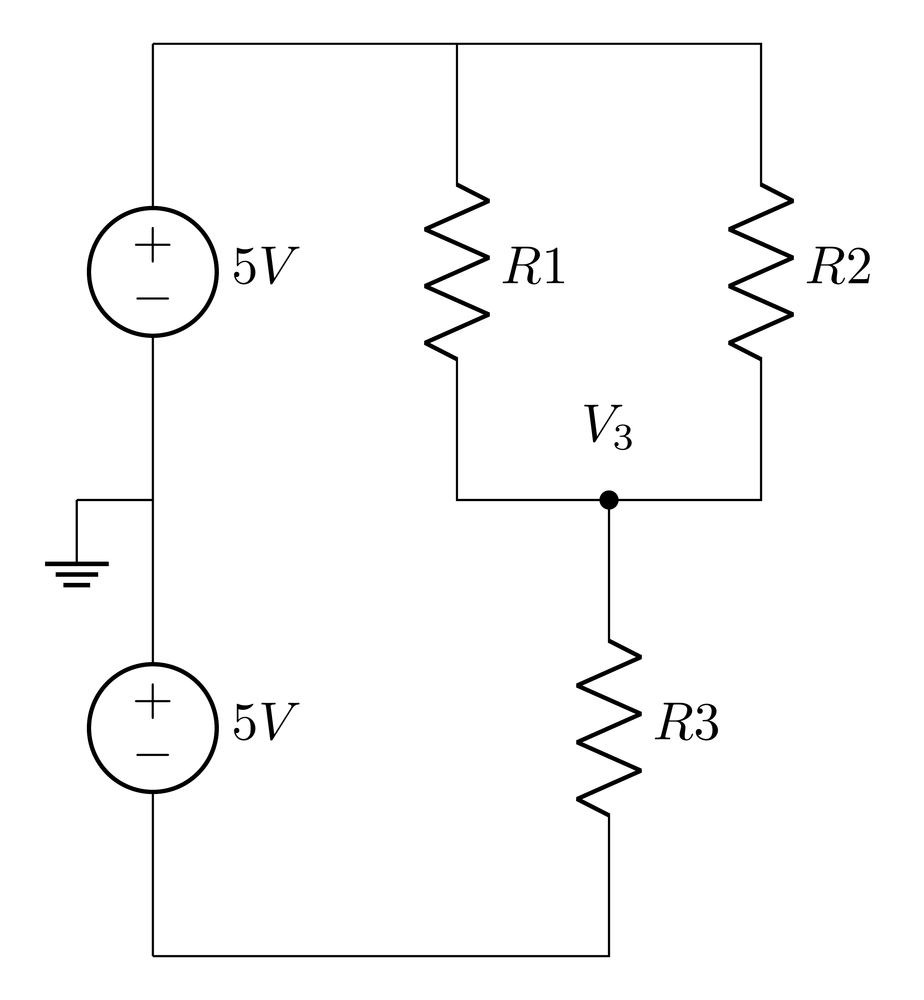
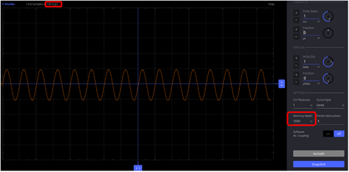
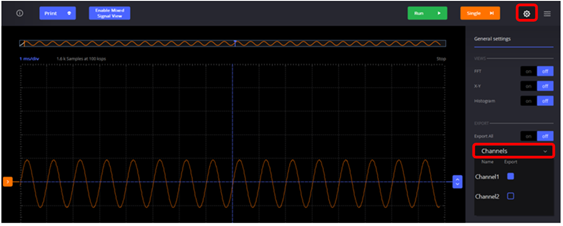
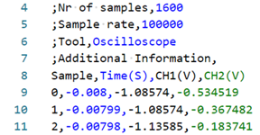
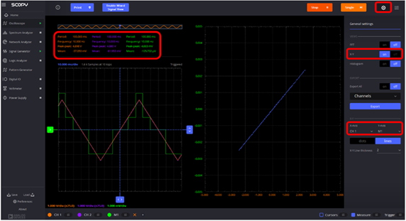

# ECE Lab #2: DC Voltage Measurements and Signal Analysis

**Department of Electrical and Computer Engineering**

**Spring 2026**

---

## Overview

The purpose of Lab 2 is to:

- Apply Ohm's Law and Kirchhoff's Laws to analyze resistor networks
- Make single-ended and differential voltage measurements using the M2K
- Calculate currents using voltage measurements and known resistance values
- Become familiar with the ADALM2000 (M2K) Oscilloscope and Signal Generator
- Generate and analyze periodic signals
- Understand key measurement concepts: accuracy, precision, resolution, tolerance, and error

---

## 1. Prelab Assignment

### 1.1 Reflective AI Exercise 1: Ohm's Law

**Objective:** Demonstrate understanding of how real measurement instruments interact with circuits, and how to quantify measurement quality.

Use an AI assistant to review Ohm's Law with the following prompt:

> *"I am a first-year electrical engineering student. Can you explain Ohm's Law: what it states, what assumptions it requires, and under what conditions it breaks down? Give me a concrete example involving a resistor in a simple circuit, including a numerical calculation."*

Read the response carefully. Then verify what the AI told you against this reference: <https://wiki.analog.com/university/courses/electronics/ohm_law>. You do not need to perform the experiments described there.

If anything in the AI's explanation conflicts with the reference, or if the AI introduced concepts or terminology not found there, note it. This is not a sign that the exercise failed; it is the exercise. An AI will sometimes explain a correct concept using a framework that differs from the one this course uses. Learning to catch that difference is a skill you will use throughout the course.

*This exercise is preparatory reading. No submission is required.*

---

### 1.2 Resistor Networks

Review the material on resistor networks in the course reader:

- **Ohm's Law:**
  The voltage across a resistor is directly proportional to the current flowing through it.
  Mathematically: $V = I \times R$, where $V$ is voltage, $I$ is current, and $R$ is resistance.

- **Kirchhoff's Current Law (KCL):**
  The sum of currents entering a node (junction) is equal to the sum of currents leaving that node.

- **Kirchhoff's Voltage Law (KVL):**
  The sum of voltages around any closed loop in a circuit is zero.

- **Series Resistors:**
  The equivalent resistance of resistors connected in series is the sum of their individual resistances.
  Mathematically: $R_{eq} = R_1 + R_2 + \ldots + R_n$

- **Parallel Resistors:**
  The reciprocal of the equivalent resistance of resistors connected in parallel is equal to the sum of the reciprocals of their individual resistances.
  Mathematically: $\frac{1}{R_{eq}} = \frac{1}{R_1} + \frac{1}{R_2} + \ldots + \frac{1}{R_n}$

> **IMPORTANT**
>
> Note: This lab involves building very basic circuits. For success in this lab, you only need to understand: Kirchhoff's Current Law (KCL), Kirchhoff's Voltage Law (KVL), Ohm's Law ($I = V/R$), series resistance calculations, and parallel resistance calculations. We will guide you through the process step by step.

#### Resistance Networks

For the circuit below, what are $I_1$, $I_2$, $I_3$, $I_{3a}$, $I_{3b}$, and $I_{3c}$?

<!-- CIRCUITIKZ FIGURE: Render from LaTeX source as media/fig_resistive_networks.png -->

*Figure 1: Resistive networks.*

> **Guidance for Solving Current Problems**
>
> For each circuit, follow these steps:
>
> 1. **Identify the type of connection:** Determine whether resistors are in series, parallel, or a combination.
> 2. **Calculate equivalent resistances:** For series resistors, add their values. For parallel resistors, use $\frac{1}{R_{eq}} = \frac{1}{R_1} + \frac{1}{R_2}$.
> 3. **Find the total current:** Using Ohm's Law, calculate $I = \frac{V_s}{R_{eq}}$.
> 4. **Determine individual currents:**
>    - For resistors in series, the current is the same through all components
>    - For resistors in parallel, use current division or calculate each branch current independently using Ohm's Law
> 5. **Verify with KCL:** Ensure that currents entering a node equal currents leaving the node
>
> **Example:** For circuit in Figure 1(a), if $V_s = 10\text{V}$ and $R_1 = 1\text{k}\Omega$:
>
> 1. This is a simple circuit with one resistor
> 2. $R_{eq} = R_1 = 1\text{k}\Omega$
> 3. Total current $I_1 = \frac{V_s}{R_{eq}} = \frac{10\text{V}}{1\text{k}\Omega} = 1\text{mA}$

> **Prelab Deliverable #1**
>
> On a piece of paper, show how you calculate $I_1$, $I_2$, $I_3$, $I_{3a}$, $I_{3b}$. Show your work clearly. Photograph or scan your hand-drawn diagram and upload via the course submission app.

#### Breadboard Implementation

Consider the following schematic of a resistor network. While the ADALM2000 only provides $+5$ V and $-5$ V supplies, by connecting these supplies as shown in the circuit, we effectively apply 10 V across the resistor network. The total voltage represents the difference between the positive and negative rails rather than a single supply referenced to ground. In future circuits using the ADALM2000, when a schematic indicates 10 V, you should understand this refers to utilizing both power supplies in series to achieve the required potential difference, even though the individual supplies are limited to $\pm 5$ V.

<!-- CIRCUITIKZ FIGURE: Render from LaTeX source as media/fig_series_parallel.png -->
  

*Figure 2: Series-parallel resistive network with two stacked 5 V supplies. R1 and R2 are in parallel; their combination is in series with R3. Node V3 marks the junction between the parallel and series sections.*

*Figure 3: Solderless breadboard with columns numbered 1–30 and rows labeled A–J across two banks separated by a center gap.*

> **Prelab Deliverable #2**
>
> On the breadboard image above, draw how you would connect the components to implement the circuit shown in Figure 2. Complete your work by hand: print the breadboard image, draw your connections clearly, and make sure the drawing is clear and oriented correctly.
>
> Before photographing, add your name to the image: place a small piece of paper with your name written on it in the frame before taking the photo, or add it in an image editor afterward. **This applies to all photos of your work that you submit in this course.**
>
> Then use a scanning app or your phone's camera to take a clear, well-lit photo and upload via the course submission app.

---

### 1.3 ADALM2000 (M2K) Instruments

The following subsections prepare you to operate the M2K signal generator and oscilloscope during Lab 2. Read each reference before answering.

#### Signal Generation

Become familiar with the Scopy Signal Generator: <https://wiki.analog.com/university/tools/m2k/scopy/siggen>

> **Prelab Deliverable #3**
>
> How does the M2K generate signals? Describe the Scopy interface elements you will use to control frequency, amplitude, waveform type, and phase offset.

#### Oscilloscope Fundamentals

Become familiar with the Scopy Oscilloscope and review the Sparkfun video "How to Use an Oscilloscope" (<https://www.youtube.com/watch?v=u4zyptPLlJI>):

- <https://wiki.analog.com/university/tools/m2k/scopy/oscilloscope>

The M2K oscilloscope has two differential input channels, Ch 1 and Ch 2, both capable of measuring signals ranging from $-25$ to $+25$ V at a sample rate of 100 mega-samples per second.

> **Prelab Deliverable #4**
>
> What are the basic functions of an oscilloscope? List and briefly describe each function.

> **Prelab Deliverable #5**
>
> Explain the function of the vertical scale (volts/div) and the horizontal scale (time/div). What does each control, and what happens to the displayed waveform when you change each setting?

> **Prelab Deliverable #6**
>
> What is the difference between AC coupling and DC coupling on an oscilloscope? When would you choose to use each?

#### Timebase

> **Prelab Deliverable #7**
>
> Explain the concept of "Timebase" of an oscilloscope. How does it relate to the horizontal scale (time/div)? Why is understanding the Timebase critical for accurate signal measurement?

#### Trigger

> **Prelab Deliverable #8**
>
> Explain the concept of "Trigger" of an oscilloscope. Why is triggering necessary, and how does it help in visualizing signals?

#### M2K Oscilloscope Implementation

The M2K implements its oscilloscope function differently from a traditional bench instrument. Review the Scopy oscilloscope reference above, paying attention to the hardware architecture section.

> **Prelab Deliverable #9**
>
> What hardware inside the M2K performs the analog-to-digital conversion? State its key specifications: sample rate and bit depth.

> **Prelab Deliverable #10**
>
> How are the two differential input channels (Ch 1 and Ch 2) physically connected to a circuit under test? Identify the relevant pins or leads by name.

> **Prelab Deliverable #11**
>
> Identify the Scopy controls that correspond to each of the following oscilloscope functions: (a) vertical scale, (b) horizontal scale, and (c) trigger. For each, state the control name and describe what it does.

#### Experimental Setup

In Lab 2 Section 4, you will connect the M2K signal generator outputs to its own oscilloscope inputs to capture the signals you generate.

> **Prelab Deliverable #12**
>
> Draw a diagram showing how the M2K signal generator outputs (W1, W2) are connected to the oscilloscope input channels (Ch 1, Ch 2) for signal capture. Label all wires, including the ground reference. Photograph or scan your hand-drawn diagram and upload via the course submission app.

#### Signal Generation Procedure

> **Prelab Deliverable #13**
>
> Outline the step-by-step procedure to configure the M2K signal generator in Scopy to produce two sine waves with the following specifications:
>
> - Frequency: 10 Hz
> - Amplitude: 2 V peak
> - Phase: 0° on W1, 90° on W2
>
> List each setting you must change in the Scopy interface and the value you would enter. You will execute this procedure in the lab.

#### Oscilloscope Measurement Procedure

> **Prelab Deliverable #14**
>
> Using the M2K oscilloscope in Scopy, how would you measure the **peak-to-peak amplitude** of a captured signal? Identify the specific cursor, measurement panel entry, or display element you would use.

> **Prelab Deliverable #15**
>
> Using the M2K oscilloscope in Scopy, how would you measure the **frequency** of a captured signal? Identify the specific cursor, measurement panel entry, or display element you would use.

> **Prelab Deliverable #16**
>
> Using the M2K oscilloscope in Scopy, how would you measure the **period** of a captured signal? Identify the specific cursor, measurement panel entry, or display element you would use.

---

### 1.4 Theory and Background

#### Understanding Measurement Concepts

In this lab, you will be making various measurements, and it is crucial to understand the following concepts. These terms are often used interchangeably, but they have distinct meanings. Understanding them will help you interpret your measurements and analyze their reliability. Figure 4 illustrates the meaning of the terms.

- **Accuracy:** How close a measured value is to the true value.
- **Precision:** How close repeated measurements are to each other.
- **Resolution:** The smallest change in a quantity that can be measured by an instrument.
- **Tolerance:** The permissible variation in a component's value from its nominal value.
- **Error:** The difference between a measured value and the true value.

<!-- CIRCUITIKZ FIGURE: Render from LaTeX source as media/fig_precision_accuracy.png -->

*Figure 4: Measurement analogy: High precision refers to how consistently repeated measurements cluster together, regardless of whether they are near the true value. Resolution represents the smallest increment a measuring instrument can detect. The top right bullseye demonstrates both excellent precision and accuracy. The top left shows good accuracy but poor precision. When making real-world measurements, you do not know the true value beforehand; you must rely on your instrument's precision and accuracy capabilities to estimate it.*

For each of the five concepts below, provide a concise definition **in your own words** and explain how it relates to the measurements you will be making in Lab 2.

> **Prelab Deliverable #17**
>
> **Accuracy.** Define accuracy and give a specific example of how it applies to a measurement you will make in Lab 2.

> **Prelab Deliverable #18**
>
> **Precision.** Define precision and give a specific example of how it applies to a measurement you will make in Lab 2.

> **Prelab Deliverable #19**
>
> **Resolution.** Define resolution and give a specific example of how it applies to a measurement you will make in Lab 2.

> **Prelab Deliverable #20**
>
> **Tolerance.** Define tolerance and give a specific example of how it applies to a component you will use in Lab 2.

> **Prelab Deliverable #21**
>
> **Error.** Define measurement error and give a specific example of a source of error you anticipate in Lab 2.

---

### 1.5 Reflective AI Exercise 2: The Nature of Variability

**Objective:** Use AI-assisted exploration to understand the statistical nature of electronic components and the difference between nominal values and physical reality.

#### Part 1: Exploration

Example prompts are provided below. You may use them, adapt them, or write your own at the same level of specificity.

**Focus Area 1: Accuracy, Precision, and Standard Deviation**

> *"I am a first-year electrical engineering student looking at a spreadsheet of hundreds of measurements of 820 Ω resistors. Can you explain the difference between accuracy and precision in this context? If the average value of the batch is exactly 820 Ω but the individual measurements are spread widely, is the batch accurate, precise, or both?"*

Follow up with:

> *"If I have two batches of resistors with the same mean, but Batch A has a standard deviation of 5 Ω and Batch B has a standard deviation of 50 Ω, what does that tell me about manufacturing quality and the reliability of a circuit built from Batch B?"*

**Focus Area 2: Distributions and Tolerance**

> *"I have a dataset of resistor values. Can you explain what a normal distribution is and why component values are expected to follow a bell-shaped curve? What physical factors in manufacturing might cause a batch to not look like a bell curve, for example if it were bimodal or skewed?"*

Follow up with:

> *"If a resistor is labeled 1 kΩ with 10% tolerance and I measure it at 1050 Ω, is it within specification? How does the standard deviation of a whole batch relate to the manufacturer's tolerance rating?"*

#### Part 2: AI-Assisted Data Analysis and Self-Test

**Data Analysis.**

Download a dataset of measured resistors, specified to be 10% tolerance, of 820 Ω, 1 kΩ, and 1.2 kΩ resistors (same values that you will use in the lab): <a href="https://raw.githubusercontent.com/AndreKnoesen/eec1-widgets/main/Measure_Resistance_Values.csv" target="_blank" rel="noopener noreferrer">Measured\_Resistances</a>.

Open MATLAB and use the **Import Data** app (found under the Home tab) to load the CSV file into your workspace. The app will guide you through selecting columns and previewing the data before importing; no code is required for this step.

Once the data is in your workspace, write a script yourself, or use MATLAB's built-in AI assistant to help you write a script that does the following for each of the three resistor values:

- Calculate the mean and standard deviation using `mean()` and `std()`
- Plot a histogram using `histogram()`

Read and understand every line of code the AI produces before running it. If something is unclear, ask the AI to explain it. Do not submit code you cannot explain.
> **Prelab Deliverable #22**
>
> Submit images of the three histograms, one for each of the three resistors.
>

**Self-Test.** Open Gemini and write your own quiz prompt using the class data as the scenario. Your questions must involve interpreting the measured distributions: for example, predicting how many resistors in a batch would fail a 5% tolerance test (instead of the given 10%) given the calculated standard deviation, or explaining what the histogram shape reveals about the manufacturing process.

> **Prelab Deliverable #23**
>
> Submit a screenshot of the full quiz transcript, capturing your knowledge check interaction with the AI. Upload via the course submission app.

Apply the meta-prompt from *A Mind Worth Questioning* to evaluate and strengthen your draft, then run the quiz.

#### Part 3: Formal Reflection (150–250 words)

Your written synthesis must address all three of the following points:

- **The Link** — How the statistical spread (standard deviation) of your components affects the predictable behavior of a circuit you might build, such as a voltage divider.
- **The Technical "Why"** — Use the class data to explain the relationship between the mean value, the nominal value, and the manufacturer's tolerance specification.
- **The Lab Application** — A specific moment where the histograms changed how you think about a simple component: for example, recognizing that "1000 Ω" describes a distribution, not a fixed value.

> **Prelab Deliverable #24**
>
> Submit your formal reflection (150–250 words) addressing The Link, The Technical "Why", and The Lab Application. Upload via the course submission app.
>
> In this activity, reflect on what the data revealed about resistor values. Explain how the spread of the measurements (standard deviation) contributes to uncertainty in circuit behavior, and relate the measured average and variation to the ideas of nominal value and manufacturer tolerance. Most importantly, describe how viewing the histogram changed your understanding—specifically, how it helped you recognize that a resistor’s labeled value represents a range of real values rather than a single guaranteed number—and explain why this matters for practical engineering decisions.

---

## 2. Lab Procedure

> **IMPORTANT**
>
> **Collaboration and Assistance:** You are encouraged to collaborate with your fellow students and assist each other during the lab. However, each student is expected to complete their own work and submit their own individual lab report. If you encounter any difficulties or have questions, first try to seek assistance from your classmates. If you are unable to resolve the issue with their help, please do not hesitate to ask the student assistant or TA for guidance.
>
> **Flexibility Notice:** Students may complete this assignment at home using their M2K and UC Davis Adaptor board. However, you must come to the lab to measure components accurately with the Keysight EDU34450A DMM. You are welcome to make these measurements during other ECE-Emerge lab sections if space is available. Any questions or difficulties with the lab should be addressed to your assigned Lab TA. If you experience significant challenges or have multiple questions when working outside your assigned lab period, you must attend your assigned lab section.

---

### Section 1: Resistor Measurements

While you already made such measurements in the previous lab, re-measure the resistors that you will be using in this lab with the Keysight EDU34450A. **Make sure you record the measurement error in the resistor values that you use in the experiments. The measurement error is indicated by the lowest digit(s) that are not stable.**

| Description | Value |
|-------------|-------|
| 820 Ω | |
| 1 kΩ | |
| 1.2 kΩ | |
| 100 Ω | |
| 2.2 kΩ | |

> **Lab Deliverable #1**
>
> Record your measured values, including an estimated measurement error, for all resistors in a table (take a screenshot of the table above) and submit via the submission app.

---

### Section 2: Resistor Networks, Part 1 (Two Resistors in Series)

In this section, you will work with a simple resistor network consisting of two resistors connected in series. You will use the M2K to make single-ended and differential voltage measurements and then apply Ohm's Law and Kirchhoff's Laws to analyze the circuit.

In addition to using the M2K, also use the Keysight EDU34450A DMM to measure the same voltages and confirm that both instruments give consistent results. See: <a href="https://aknoesen.github.io/ECE-Emerge/EquipmentInstructions/htmlconversion/DCVoltageMeasurement.html" target="_blank" rel="noopener noreferrer">How to Measure DC Voltage with Keysight EDU34450A Multimeter</a>

#### Build the Circuit

Construct the following circuit on your breadboard:

<!-- CIRCUITIKZ FIGURE: Render from LaTeX source as media/fig_voltage_divider.png -->

*Figure 5: Resistive network #1.*

> **Lab Deliverable #2**
>
> Take a clear photo of your breadboard with the circuit built. Your name must be visible in the photo: place a piece of paper with your name written on it in the frame before photographing, or add it using an image editor. Label the components and connections clearly.

#### Make Single-Ended Measurements

Use the M2K voltmeter to measure the following voltages:

- $V_{ac}$: Voltage between point $V_a$ and ground ($V_c$)
- $V_{bc}$: Voltage between point $V_b$ and ground ($V_c$)

> **Lab Deliverable #3**
>
> Record the measured values of $V_{ac}$ and $V_{bc}$, including measurement error. The measurement error is indicated by the lowest digit(s) that are not stable.

> **Lab Deliverable #4**
>
> Calculate the voltage across $R_2 = 820\,\Omega$ ($V_{ab}$) using the measured values of $V_{ac}$ and $V_{bc}$.

#### Make Differential Measurement

Use the M2K voltmeter to measure the differential voltage between points $V_a$ and $V_b$ directly.

> **Lab Deliverable #5**
>
> Record the value of $V_{ab}$ measured differentially, including measurement error.

#### Compare Single-Ended and Differential Measurements

> **Lab Deliverable #6**
>
> Compare the value of $V_{ab}$ you calculated from the single-ended measurements ($V_{ac}$ and $V_{bc}$) with the value you measured directly using the differential measurement. Use KVL to explain the comparison. Are they the same? If not, why might there be a difference?

> **Lab Deliverable #7**
>
> Based on your observations, which method (single-ended or differential) do you think is more accurate for measuring $V_{ab}$ in this circuit? Why?

---

### Section 3: Resistor Networks, Part 2 (Two Resistors in Series and One in Parallel)

In this section, you will add a third resistor ($R_3$) in parallel with $R_2$ in the circuit from Part 1. You will then measure the currents and voltages in this modified circuit and analyze the results.

#### Modify the Circuit

Add resistor $R_3 = 1.0\,\text{k}\Omega$ in parallel with $R_2 = 820\,\Omega$ in the existing circuit.

<!-- CIRCUITIKZ FIGURE: Render from LaTeX source as media/fig_resistive_net2.png -->

*Figure 6: Resistive network #2. Note that grounds are not explicitly shown in this circuit. You need to decide where to place them. Hint: See Figure 5.*

> **Lab Deliverable #8**
>
> Take a clear photo of your breadboard with the modified circuit. Your name must be visible in the photo. Label the components and connections clearly.

#### Measure Voltages and Currents

Use the M2K voltmeter to measure the necessary voltages to determine the currents in the different branches of the circuit.

> **Lab Deliverable #9**
>
> Describe the voltage measurements you made and explain how you used them to determine $I_{3}$, $I_{3a}$, $I_{3b}$, and $I_{3c}$.

> **Lab Deliverable #10**
>
> Record the calculated currents $I_{3}$, $I_{3a}$, $I_{3b}$, and $I_{3c}$ obtained from the voltage measurements. Include measurement error estimates based on the errors in the resistor and voltage measurements.

> **Lab Deliverable #11**
>
> Using the currents from Deliverable 10, verify KCL at the top node numerically: check whether $I_{3a} + I_{3b} = I_{3}$ holds within your estimated measurement error bounds. Record the numerical check.

---

### Section 4: Generating and Visualizing Periodic Signals

In this part, you will use the M2K to generate periodic signals, visualize them using the oscilloscope's voltage-versus-time display, and export the data to a CSV file.

#### Generate and Capture Signals

1. To view the generated signals, connect the signal generators to the oscilloscope as shown in Figure 7. Make the connections on the breadboard.

   > **Lab Deliverable #12**
   >
   > Take a photo of the breadboard connections. Your name must be visible in the photo.

   <!-- CIRCUITIKZ FIGURE: Render from LaTeX source as media/fig_signal_gen_config.png -->

*Figure 7: M2K signal generation channels and oscilloscope channels. This configuration creates single-ended measurements of the generated signals.*

2. On Signal Generator 1 and 2, generate a 10 Hz sine wave with a 2 V peak-to-peak amplitude and no DC offset. Adjust the phase such that a *cosine* wave is generated by Signal Generator 1 (the orange display) and a *sine* wave by Signal Generator 2 (the purple display). Adjust the linewidth on the oscilloscope display to a minimum of 2 units. **Activate signal generation by selecting the Run button.**

   > **Lab Deliverable #13**
   >
   > Capture a screenshot of the signal generator display and submit it via the course submission app.

3. Display the signals on Channel 1 and Channel 2 of the oscilloscope. The vertical axis Volts/div settings and horizontal timebase setting should be the same for both channels. Ensure that at least 2 periods of the signals are visible. Trigger on Channel 1 at the rising edge to ensure steady traces. Adjust the linewidth to a minimum of 2 units. Use the Measure icon to display signal measurements. Figure 8 shows an example of what your display should look like; yours may differ. Indicated on the figure are time reference points $t=0$, $t=T/4$, $t=T/2$, $t=3T/4$, and $t=T$ along the waveform period $T=1/f$, where $f$ is the signal frequency.

   > **Lab Deliverable #14**
   >
   > Take a screenshot that shows the oscilloscope traces and also shows the timebase and vertical scale settings for one of the channels. Submit it via the course submission app.

*Figure 8: Oscilloscope trace example. Yellow markers were added to the Scopy display to indicate over a period $T$ where $t=0$, $t=T/4$, $t=T/2$, $t=3T/4$, and $t=T$ occur.*

#### Export Data to CSV

Stay in the Oscilloscope tab and export the captured sine and cosine waves at 100 ksps sample rate.

1. Adjust the sample rate to 100 ksps by changing the Memory Depth. The updated sample rate should be displayed in the top left corner of the oscilloscope.

2. Click the Single button in the top right corner to capture one sweep of data using the new sample rate. Make sure the signal is well captured like the one in Figure 9.

*Figure 9: Scopy oscilloscope display showing how to adjust the sample rate. The red boxes highlight the sample rate indicator in the toolbar and the Memory Depth setting in the right panel.*

3. Click the Gear icon and use the Channels drop-down menu to select both Channel 1 and Channel 2 for export.

*Figure 10: Scopy oscilloscope export settings. Click the gear icon to open the export panel, select Channels from the dropdown, then check both Channel 1 and Channel 2 before exporting.*

4. Click the Export button and name the CSV file `lab2_TY_100ksps_ch1_ch2.csv`.

*Figure 11: Steps to export CSV for signal in time domain. After selecting both channels, click the highlighted Export button to save the data.*

5. Inspect the CSV file.
   1. Line 4 shows the number of samples captured by the oscilloscope.
   2. Line 5 shows the sample rate is 100 ksps.
   3. Line 8 shows the headers of the data table from line 9 to the end of the file. In the data table:
      1. Column 1 contains the sample index, ranging from 0 to 1599 since a total of 1600 samples were acquired as indicated in line 4 (your number of samples may differ).
      2. Column 2 contains the time values, corresponding to the x-axis of the oscilloscope display.
      3. Column 3 contains the CH1 voltage values, corresponding to the y-axis of the oscilloscope display.
      4. Column 4 contains the CH2 voltage values.
   4. The waves can be reconstructed in MATLAB by plotting and connecting all sample points recorded in the CSV file. You will analyze the YT data during the post-lab.

*Figure 12: `lab2_TY_100ksps_ch1_ch2.csv` lines 4–11, showing the Scopy CSV header metadata and the first three data rows.*

> **Lab Deliverable #15**
>
> Export the data from the oscilloscope to a CSV file. Take a screenshot showing the export process and the saved file.

---

### Section 5: XY Oscilloscope Display

Become familiar with the information in <https://www.youtube.com/watch?v=p3qvsSAwmu4>. You will now use the M2K XY oscilloscope display to generate a Lissajous pattern of the two signals with equal amplitudes that are 90 degrees out of phase.

Using the same experimental configuration as in Section 4, select the general purpose gear icon on the oscilloscope display and set X-Y on. The X-axis represents the measured values on Channel 1, while the Y-axis represents the measured values on Channel 2.

Set the oscilloscope to XY mode:

- Click the Gear Icon, then set X-Y on.
- Change X-Axis to CH1.
- Change Y-Axis to CH2.

*Figure 13: Enabling XY mode in Scopy. Click the X-Y button in the toolbar, then set X-Axis to CH1 and Y-Axis to CH2 in the settings panel.*

> **Lab Deliverable #16**
>
> Take a screenshot of the XY oscilloscope display showing the Lissajous pattern and submit it via the course submission app.

> **Lab Deliverable #17**
>
> On your captured XY plot, annotate the following and submit the annotated image:
>
> - Mark the point $t=0$, where the X-channel (cosine signal) reaches its maximum; this corresponds to $t=0$ in Figure 8.
> - Mark the points $t=T/4$, $t=T/2$, and $t=3T/4$ at their correct locations along the trace.
> - Indicate the direction in which the point moves along the path as time progresses.

#### Optional Explorations

If you have time and want to explore further, try these activities:

##### Waveform Exploration

- Generate different types of waveforms (square, triangle) using the signal generator.
- Experiment with adjusting the duty cycle and offset and observe how the waveform changes.
- Explain how these parameters affect the shape of the waveform.

##### Advanced Oscilloscope Functions

- Explore the measurement features of the oscilloscope. Use them to measure frequency, period, amplitude, and rise/fall time.
- Learn how to use cursors for precise measurements on the waveform.

##### Advanced Lissajous Patterns

In the video <https://www.youtube.com/watch?v=p3qvsSAwmu4>, various scenarios are explored, including cases where signal amplitudes are unequal and frequencies are integer multiples of each other or not. Use the M2K to showcase a particular application of a Lissajous pattern that intrigues you.

---

### Lab Completion Self-Verification Checklist

> **Self-Verification Checklist**
>
> Before leaving the lab, verify that you have collected all the necessary information to complete your post-lab report:
>
> 1. **Resistor Measurements**
>    - [ ] Deliverable 1: Table of measured resistor values with error estimates
>
> 2. **Resistor Network #1 (Two Resistors in Series)**
>    - [ ] Deliverable 2: Photo of series resistor circuit
>    - [ ] Deliverable 3: Recorded values of $V_{ac}$ and $V_{bc}$
>    - [ ] Deliverable 4: Calculated $V_{ab}$
>    - [ ] Deliverable 5: Differential measurement of $V_{ab}$
>    - [ ] Deliverable 6: Comparison of single-ended and differential measurement methods
>    - [ ] Deliverable 7: Judgment on which method is more accurate
>
> 3. **Resistor Network #2 (Two Resistors in Series and One in Parallel)**
>    - [ ] Deliverable 8: Photo of modified circuit
>    - [ ] Deliverable 9: Description of voltage measurements
>    - [ ] Deliverable 10: Calculated branch currents $I_3$, $I_{3a}$, $I_{3b}$, $I_{3c}$
>    - [ ] Deliverable 11: KCL verification
>
> 4. **Generating and Visualizing Periodic Signals**
>    - [ ] Deliverable 12: Photo of breadboard connections
>    - [ ] Deliverable 13: Signal generator screenshot
>    - [ ] Deliverable 14: Oscilloscope screenshot with scale settings visible
>    - [ ] Deliverable 15: CSV export screenshot and saved file
>
> 5. **XY Oscilloscope Display**
>    - [ ] Deliverable 16: XY plot screenshot
>    - [ ] Deliverable 17: Annotated XY plot with time points and direction of rotation
>
> 6. **Notes and Observations**
>    - [ ] Recorded any challenges encountered during the lab
>    - [ ] Documented insights gained from the lab experience

---

## 3. Post-Lab Analysis Report

### Guidance for Post-Lab Report Writing

When preparing your analysis and discussion for this post-lab report, follow these guidelines:

- **Clarity of Presentation:**
  - Use clear, concise language that focuses on the data and your observations
  - Organize your thoughts logically, moving from observations to analysis to conclusions
  - Include properly labeled figures with descriptive captions
  - Use appropriate numerical precision (do not report more decimal places than are meaningful)

- **Effective Data Analysis:**
  - Begin with factual observations about your data (e.g., "The mean measured value for the 820 Ω resistor was 845 Ω")
  - Compare your results with expected values and calculate percent differences
  - Explain the significance of statistical measures (e.g., what a smaller standard deviation tells you about measurement consistency)
  - Identify any patterns, trends, or anomalies in your data

- **Scientific Discussion:**
  - Connect your observations to the theoretical concepts (Ohm's Law, tolerances, etc.)
  - Address sources of error or uncertainty in your measurements
  - Suggest possible explanations for unexpected results
  - Consider how the results might impact real-world circuit design or measurement practices

- **Professional Presentation:**
  - Use proper units and include them in all measurements
  - Create well-formatted tables to present numerical data
  - Ensure all plots have proper axis labels, titles, and legends
  - Present your analysis as a cohesive narrative rather than disconnected statements

This analysis will serve as practice for more comprehensive lab reports later in the course. Focus on developing good habits of observation, interpretation, and technical communication.

---

### Network Analysis

#### Measured versus Theoretical Values

Using the resistor values from Deliverable 1 and Ohm's Law, calculate the theoretical values of $V_{ab}$ for Network 1 and the branch currents $I_3$, $I_{3a}$, $I_{3b}$, and $I_{3c}$ for Network 2. Then compare those theoretical values to what you measured in the lab.

> **Lab Deliverable #18**
>
> Complete the following table. Use your Keysight-measured resistor values to compute the theoretical entries. Calculate percent error as $\frac{|\text{measured} - \text{theoretical}|}{\text{theoretical}} \times 100\%$.

| Quantity | Theoretical | Measured | Percent Error (%) |
|----------|-------------|----------|-------------------|
| $V_{ab}$, single-ended (Network 1) | | | |
| $V_{ab}$, differential (Network 1) | | | |
| $I_3$ (Network 2) | | | |
| $I_{3a}$ (Network 2) | | | |
| $I_{3b}$ (Network 2) | | | |
| $I_{3c}$ (Network 2) | | | |

#### Sources of Discrepancy

> **Lab Deliverable #19**
>
> Discuss the sources of discrepancy between your measured and theoretical values. Which method (single-ended or differential) produced a $V_{ab}$ closer to the theoretical prediction? Does this match the judgment you made in Deliverable 7 during the lab? Explain why one method would be expected to agree more closely with theory.
> 
> In this activity, reflect on how the method of measurement affects accuracy. Explain why measuring $V_{ab}$​ using a single‑ended approach requires subtracting two voltage measurements, each with its own uncertainty, and how this causes the errors to accumulate in the final result. Compare this with differential measurement, where $V_{ab}$​​ is measured directly with a single source of measurement error. Finally, explain how this difference helps account for why differential measurements more closely agree with theoretical predictions when measuring voltages that are not referenced to ground.

#### KCL Verification

> **Lab Deliverable #20**
>
> Using the current values from Deliverable 10, verify KCL quantitatively. Check whether $I_{3a} + I_{3b} = I_3$ and whether $I_3 = I_{3c}$ within your estimated measurement error. Present the numerical check and explain any deviation that falls outside your error bounds.

---

### Signal Analysis

#### MATLAB Analysis of Captured Waveforms

Load the CSV file you exported in Deliverable 15 into MATLAB. Plot both channels versus time on the same axes.

> **Lab Deliverable #21**
>
> From your MATLAB plot, extract the period, frequency, and peak-to-peak amplitude of each signal. Complete the following table and compare the extracted values to the signal generator settings you used in the lab.

| Quantity | Ch 1 (set) | Ch 1 (data) | Ch 2 (set) | Ch 2 (data) |
|----------|-----------|------------|-----------|------------|
| Period (ms) | | | | |
| Frequency (Hz) | | | | |
| Amplitude, peak-to-peak (V) | | | | |

Include your MATLAB plot as a figure in your report. Attach your MATLAB script.

---

### Discussion Questions

> **Lab Deliverable #22**
>
> Analyze the resolution of your current measurements, accounting for inaccuracies associated with the M2K. You may assume the Keysight resistor values are accurate. What is the cause of the inaccuracies? Discuss your findings.
>
> You are encouraged to use an AI assistant to help structure your analysis or to clarify concepts such as measurement uncertainty and error propagation. Ask it to explain, check your reasoning, or suggest a framework; then apply that framework to your own data. **The analysis you submit must be your own work: use AI as a thinking partner, not as a substitute for your own conclusions.**

> **Lab Deliverable #23**
>
> What essential information did you need to know to determine current, given that you could only measure voltages?

> **Lab Deliverable #24**
>
> Based on your results from this lab, explain what you would do differently in a future measurement to improve both accuracy and resolution. Identify at least two specific changes, and cite observations from your data to justify each one. 
> 
> In this activity, reflect on how your measurement process could be improved in future experiments. Propose at least two specific, physically meaningful changes that would reduce measurement error or improve resolution. For each improvement, explain why it would help and explicitly connect it to an observation from your own data or results. Your response should demonstrate an understanding of how experimental limitations influence accuracy and how thoughtful changes to procedure can address those limitations.
---

## Submission Instructions

> **IMPORTANT**
>
> Submit your completed work via the course submission app. All plots, images, data tables, and calculations must be clearly labeled and referenced in your post-lab report.

Version:  1.0