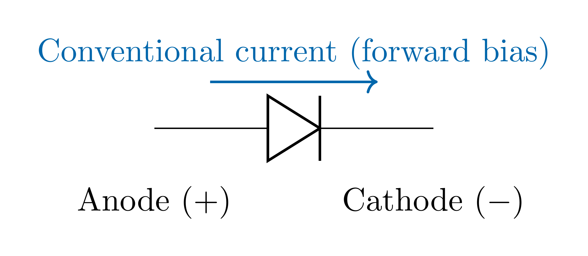
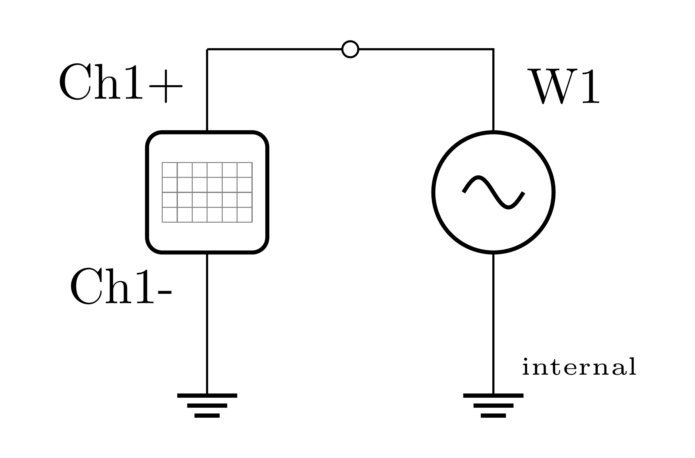
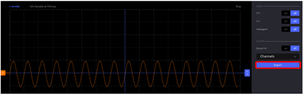
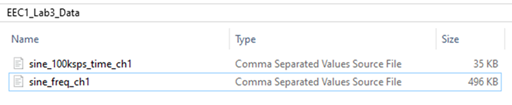

# ECE Lab #3: Device Characterization and Frequency Domain Analysis

**Department of Electrical and Computer Engineering**

**Spring 2026**

---

## Overview

The purpose of Lab 3 is to:

- Apply frequency domain concepts to analyze periodic waveforms
- Use the M2K Spectrum Analyzer to visualize signal frequency content
- Compare theoretical spectral predictions with actual measurements
- Use the provided `SignalLab` class to synthesize periodic waveforms and compute theoretical spectra in MATLAB
- (Optional) Observe current-voltage characteristics of electronic components using the M2K in XY mode

## 1. Prelab Assignment

### 1.1 Reflective AI Exercise 1: Voltmeter Loading and Measurement Concepts

**Objective:** Demonstrate understanding of how a voltmeter's internal resistance interacts with the circuit under test, and how to distinguish between accuracy, precision, and resolution as distinct measurement concepts.

#### Part 1: Exploration

Using what you practiced in Lab 2, construct your own AI prompts to explore the following two areas:

- Voltmeter loading effects and internal resistance
- Accuracy, precision, resolution, and tolerance as distinct concepts

Focus your prompts on how internal meter resistance creates a voltage divider with the circuit under test, and how resolution limits what a measurement can report.

#### Part 2: The Self-Test

Write your own quiz prompt targeting these two concepts. Your questions must involve predicting the effect of a voltmeter's internal resistance on a measured voltage in a resistive circuit, and distinguishing between accuracy, precision, and resolution in a real measurement scenario.

Apply the meta-prompt from *A Mind Worth Questioning* to evaluate and strengthen your draft, then run the quiz.

#### Part 3: Formal Reflection (150–250 words)

Your written synthesis must address all three of the following points:

- **The Link** — How a voltmeter's internal resistance creates a loading effect that changes the very voltage it is trying to measure.
- **The Technical "Why"** — Correct use of terms such as loading error, voltage divider, or resolution versus accuracy.
- **The Lab Application** — A specific measurement situation you anticipate in Lab 3 where loading could matter, and how you would recognize it if it occurred.

> **Prelab Deliverable #1**
>
> Submit your Self-Test prompt-craft work via the course submission app. Upload up to two screenshots capturing your original draft prompt, the AI's critique, your revised prompt, and the quiz transcript. Your name must be visible in each image before uploading.

> **Prelab Deliverable #2**
>
> Submit your formal written reflection (150–250 words) via the course submission app.

### 1.2 Reflective AI Exercise 2: Signals in the Frequency Domain

**Objective:** Demonstrate understanding of how the shape of a time-domain waveform is determined by its frequency-domain harmonic content.

#### Part 1: Exploration

Example prompts are provided below. You may use them, adapt them, or write your own at the same level of specificity.

**Focus Area 1: Fourier Series and Harmonic Content**

> *"I am an electrical engineering student preparing for a lab on frequency-domain analysis. Can you explain what the Fourier Series tells us about a periodic waveform? Specifically, why does a square wave contain only odd harmonics, and what happens to the time-domain shape as higher harmonics are removed one by one?"*

Follow up with:

> *"If I have a triangle wave and a square wave at the same fundamental frequency, how does their harmonic content differ? What does that difference look like in a frequency-domain plot?"*

**Focus Area 2: The Nyquist Criterion**

> *"I am using a digital measurement instrument that samples at 100 kSa/s. Can you explain the Nyquist criterion and what it tells me about the highest frequency signal I can faithfully capture? What happens physically if I try to measure a signal above that limit?"*

Follow up with:

> *"A square wave at 10 kHz contains harmonics at 30 kHz, 50 kHz, 70 kHz, and beyond. If my instrument samples at 100 kSa/s, which harmonics can I observe and which cannot? What will the captured waveform look like compared to the true signal?"*

After completing both focus areas, connect them: if a square wave is bandwidth-limited by the Nyquist constraint of your instrument, what does that do to its time-domain shape in the captured waveform? Is what you see on screen the true signal?

#### Part 2: The Self-Test

Open Gemini and write your own quiz prompt targeting these two concepts. Your questions must involve predicting the harmonic content of a waveform from its time-domain shape, or applying the Nyquist criterion to predict what a captured waveform will look like when the sampling rate is insufficient.

Apply the meta-prompt from *A Mind Worth Questioning* to evaluate and strengthen your draft, then run the quiz.

#### Part 3: Formal Reflection (150–250 words)

Your written synthesis must address all three of the following points:

- **The Link** — How the harmonic content of a waveform determines its time-domain shape: more harmonics with more energy produce sharper edges, and fewer or weaker harmonics produce smoother shapes.
- **The Technical "Why"** — How the Nyquist criterion sets a hard limit on what your instrument can capture, and what the consequence is for measuring a waveform whose harmonics extend above that limit.
- **The Lab Application** — A specific moment you anticipate in Lab 3 where you expect to see a difference between the theoretical spectrum and the measured spectrum, and a candidate explanation for that difference.

> **Prelab Deliverable #3**
>
> Submit your Self-Test prompt-craft work via the course submission app. Upload up to two screenshots capturing your original draft prompt, the AI's critique, your revised prompt, and the quiz transcript. Your name must be visible in each image before uploading.

> **Prelab Deliverable #4**
>
> Submit your formal written reflection (150–250 words) via the course submission app.

### 1.3 M2K Spectrum Analyzer

The M2K Spectrum Analyzer displays the frequency content of signals. To prepare for the lab, review the following resources:

- <https://wiki.analog.com/university/tools/m2k/scopy/spectrumanalyzer>
- <https://wiki.analog.com/university/tools/m2k/scopy/oscilloscope>

> **Prelab Deliverable #5**
>
> Briefly explain how the Spectrum Analyzer in Scopy works. What key settings should be configured before making a frequency-domain measurement? Your answer should address frequency range, resolution bandwidth, windowing function, and averaging mode.

### 1.4 Noise in Measured Spectra

When a spectrum is measured using a real instrument, the result is never a perfectly clean set of spectral lines on a silent background. A noise floor is always present, and its level is not arbitrary: it is set by the physics and engineering of the measurement system. Understanding where this noise comes from is essential for interpreting measurements intelligently.

**Quantization noise.** The M2K oscilloscope is a digital instrument. Before any signal processing can occur, the continuous analog voltage at the input must be converted to a sequence of numbers by an analog-to-digital converter (ADC). An ADC with $N$ bits can represent $2^N$ distinct voltage levels. The M2K ADC uses 12 bits, giving $2^{12} = 4096$ levels. Any voltage that falls between two adjacent levels must be rounded to the nearest level; this rounding error is called *quantization error*.

If the input signal spans the full range of the ADC, the quantization step size is:

$$\Delta = \frac{V_\mathrm{FS}}{2^N}$$

where $V_\mathrm{FS}$ is the full-scale voltage range. The quantization error at any instant is bounded by $\pm\,\Delta/2$ and, for a well-designed ADC with a varying input signal, behaves approximately as white noise uniformly distributed over this range. This quantization noise power spreads across all frequencies up to the Nyquist limit, forming the noise floor visible in the spectrum.

For an ideal $N$-bit ADC, the theoretical signal-to-noise ratio (SNR) when the input is a full-scale sine wave is well approximated by:

$$\mathrm{SNR} \approx 6.02\,N + 1.76 \quad \text{(dB)}$$

This result is worth remembering: each additional bit of resolution improves the SNR by approximately 6 dB, which halves the noise amplitude. For the M2K with $N = 12$:

$$\mathrm{SNR} \approx 6.02 \times 12 + 1.76 \approx 74~\text{dB}$$

Spectrum Analyzer amplitudes are displayed in dBFS (decibels relative to full scale), where 0 dBFS corresponds to the maximum representable signal. The theoretical noise floor therefore sits at approximately $-74$ dBFS for a full-scale input. In practice, additional noise sources push the floor somewhat higher.

**Other noise sources.** Quantization noise is not the only contribution to the measured noise floor. Thermal noise (Johnson noise) arises from random electron motion in any resistive element at a temperature above absolute zero and is present in every electronic circuit. Non-ideal waveform generation in the signal generator can also introduce low-level harmonic distortion: spectral energy appears at harmonics that theory predicts to be zero (for example, even harmonics of an ideal square wave). Clock jitter, ground loops, and electromagnetic interference from nearby equipment can add further artefacts. When comparing measured spectra to theoretical predictions in Part 2, these effects must be considered alongside quantization noise.

> **Prelab Deliverable #6**
>
> The M2K ADC has a 12-bit resolution and a full-scale input range of $\pm\,2.5$ V (5 V total). Calculate the quantization step size $\Delta$ and the theoretical SNR for a full-scale sine wave input. Work on paper, showing all steps. Photograph your completed work and submit the image via the course submission app. Your name must be visible in the photo.

> **Prelab Deliverable #7**
>
> A square wave has odd harmonics only in theory. Explain two distinct reasons why even harmonics might still appear at non-zero amplitude in a measured spectrum.

> **Prelab Deliverable #8**
>
> If a measurement were repeated with a 16-bit ADC instead of a 12-bit ADC, by how many dB would the theoretical noise floor improve? How would this change the visibility of weak harmonics in the spectrum?

### 1.5 Fourier Series Predictions

Based on the material covered in Signals in Time and Signals in Frequency of the reader, predict the frequency-domain characteristics of different waveforms before making any measurements.

> **Prelab Deliverable #9a**
>
> For a 1 kHz sine wave (pure tone), state the expected frequency-domain content up to the 5th harmonic: which harmonics are present, their relative amplitudes, and the pattern of harmonic amplitude decay. Present your predictions in a table.

> **Prelab Deliverable #9b**
>
> For a 1 kHz square wave (50% duty cycle), state the expected frequency-domain content up to the 5th harmonic: which harmonics are present, their relative amplitudes, and the pattern of harmonic amplitude decay. Present your predictions in a table.

> **Prelab Deliverable #9c**
>
> For a 1 kHz triangle wave, state the expected frequency-domain content up to the 5th harmonic: which harmonics are present, their relative amplitudes, and the pattern of harmonic amplitude decay. Present your predictions in a table.

> **Prelab Deliverable #9d**
>
> For a 1 kHz sawtooth wave, state the expected frequency-domain content up to the 5th harmonic: which harmonics are present, their relative amplitudes, and the pattern of harmonic amplitude decay. Present your predictions in a table.

---

### 1.6 IV Curve Basics

> **Note**
>
> While this section and its deliverables are required, the IV curve observation activity in Part 3 of the lab procedure is optional. Completing it may be done during or outside the lab period and will count for 10 points of extra credit, with a maximum score of 100 points for the lab.

The current-voltage (IV) curve of a two-terminal component describes its terminal behavior across a range of applied voltages. Read Chapter 4 of the reader before attending lab. In Part 3 of the lab, the M2K is used in XY mode to display IV curves for several component types. The focus is on building visual intuition for how different devices behave; detailed post-lab analysis of the IV data is not required.

A diode is the simplest semiconductor device. It behaves as a one-way valve for electric current: it conducts readily in one direction (forward bias) and blocks current in the other (reverse bias). The terminal through which conventional current enters is called the *anode*; the terminal through which it exits is the *cathode*.

<!-- CIRCUITIKZ FIGURE: Render from LaTeX source as media/diode-symbol-lab-1.png -->


*Figure 1: Diode symbol. Current flows freely from anode to cathode in forward bias and is blocked in reverse bias.*

When the anode voltage exceeds the cathode voltage by approximately 0.7 V (for a silicon diode), the diode turns on and current rises steeply. Below this threshold, essentially no current flows. In reverse bias, the diode blocks current until the breakdown voltage is reached. Figure 2 shows a typical IV characteristic.

<!-- CIRCUITIKZ FIGURE: Render from LaTeX source as media/diode-iv-lab-1.png -->


*Figure 2: Typical IV characteristic of a silicon diode. Current is negligible until the forward voltage reaches approximately 0.7 V, then rises steeply. In reverse bias, current is near zero until breakdown.*

A Zener diode is designed to operate in the reverse breakdown region in a controlled way. Once the reverse voltage reaches the Zener voltage $V_Z$, the device holds that voltage approximately constant regardless of current, making it useful for voltage regulation. A 1N5222B Zener diode with $V_Z \approx 2.4$ V is used in this lab.

<!-- CIRCUITIKZ FIGURE: Render from LaTeX source as media/zener-iv-lab-1.png -->


*Figure 3: IV characteristic of a Zener diode. The forward region is the same as a standard diode. In reverse bias, current is negligible until the Zener voltage $V_Z$ is reached, at which point the device clamps the voltage.*

LEDs are diodes; their IV curves in the forward region have the same shape as a standard silicon diode, but the forward voltage threshold is higher and varies by color. In this lab, red, green, and blue LEDs will be observed. The forward voltage at which each LED begins to emit visible light can be read directly from the IV curve.

> **Prelab Deliverable #10a**
>
> Read The I-V Menagerie in the reader before completing this deliverable. Sketch the expected IV curve for a 1 kΩ resistor, labeling the axes and any key features. Work on paper, photograph your sketch, and submit via the course submission app. Your name must be visible in the photo.

> **Prelab Deliverable #10b**
>
> Sketch the expected IV curve for a silicon diode (1N914). Label the approximate forward voltage threshold and indicate the reverse-bias blocking region. Work on paper, photograph your sketch, and submit via the course submission app. Your name must be visible in the photo.

> **Prelab Deliverable #10c**
>
> Sketch the expected IV curve for a Zener diode (1N5222B). Label the forward voltage threshold, the Zener voltage $V_Z$, and the breakdown region. Work on paper, photograph your sketch, and submit via the course submission app. Your name must be visible in the photo.

The following circuit measures the IV characteristics of electronic components using the M2K.

<!-- CIRCUITIKZ FIGURE: Render from LaTeX source as media/iv-circuit-planning-1.png -->


*Figure 4: Connection diagram for IV characteristics measurement. CH1 and CH2 are used in XY mode (review the XY mode introduced in Lab #2).*

The circuit:

- Applies a voltage sweep to the device under test
- Measures the voltage across the device
- Measures the current through the device

> **Prelab Deliverable #11**
>
> Based on this circuit, explain how the current through the device under test would be calculated from the measured voltages.

---

## 2. Lab Procedure

### 2.1 Part 1: Frequency Domain Analysis: Data Collection

> **IMPORTANT**
>
> **Work Policy for Part 1: Data Collection**
>
> - **Initial Setup through Square Wave Analysis**: individual work. Each student takes their own measurements and exports their own data files. The sine wave measurement must be completed during the scheduled lab session, where there is a check-off.
> - **Triangle Wave and Sawtooth Wave**: Two students may work together and share data files. Each student must prepare and submit their own post-lab report and analysis independently.
> - In all sections, discussion with classmates is permitted. Co-authoring of written analysis is not permitted regardless of section.
> - The student assistant and TA are available during office hours and via email for guidance.

#### 2.1.1 Initial Setup and Calibration

1. Connect the M2K to the computer and launch Scopy.
2. Allow the calibration process to complete before making any connections.
3. Connect the waveform generator output (W1) to the oscilloscope input (CH1) as shown in Figure 5.

<!-- CIRCUITIKZ FIGURE: Render from LaTeX source as media/connection-1.png -->


*Figure 5: Connection diagram for signal measurement.*

> **Lab Deliverable #1a**
>
> Take a clear photograph of the connections and submit via the course submission app. Your name must be visible in the photo.

#### 2.1.2 Sine Wave Analysis

1. Configure the M2K signal generator to output a 1 kHz sine wave with 2 V peak-to-peak amplitude on channel W1.
   1. Navigate to the Signal Generator tab and select the Math tab.
   2. Adjust the record length to 1 ms to show 1 period of a 1 kHz signal.
   3. Adjust the sample rate to 1 Msps (mega samples per second).
   4. Disable CH2 by clicking the purple circle at the bottom.


*Figure 6: Part 1: Generating a sine wave in Scopy using the Math channel. Select Signal Generator from the left panel (red box), open the Math tab (top right red box), and enter the formula sin(2 times pi times t times 1000). Confirm CH2 is active at the bottom of the screen (red box).*

   5. Scroll down and generate a 1 kHz sine wave with 2 Vpp by entering: $$f(t) = \sin(2 \cdot \pi \cdot 1000 \cdot t)$$
   6. Click Run to generate the sine wave on W1.


*Figure 7: Part 2: Confirm the sine wave is generating in Scopy. Verify Signal Generator is selected in the left panel (red box), the formula f(t) equals sin(2 times pi times 1000 times t) is entered with Apply clicked (bottom red box), and the Run button is active in the top right (red box).*

2. Open the oscilloscope and observe the time domain representation.
   1. Navigate to the Oscilloscope tab.
   2. Adjust the horizontal Time Base and vertical Voltage Division to view at least 6 cycles of the 1 kHz sine wave.
   3. Click Single to capture one sweep of data.
   4. Click Run to start continuous acquisition.
   5. Note the sample rate shown in the top left corner. For example, "1.6k Sample at 100 ksps" indicates 1600 data points captured at 100k samples per second.

3. Export the captured sine wave in the time domain at 100 ksps.
   1. Adjust the sample rate to 100 ksps by changing the Memory Depth. Click Single to confirm the signal is well captured, as shown in Figure 8.


*Figure 8: Changing the sample rate in Scopy. The red boxes highlight the sample rate indicator in the top toolbar and the Memory Depth field in the right panel; adjust Memory Depth to change the effective sample rate for the capture.*

   2. Click the Gear icon and use the Channels drop-down menu to select the channel to export. Only Channel 1 is required for the sine wave.


*Figure 9: Step 1 of exporting oscilloscope data as CSV: click the gear icon in the top right toolbar (red box), then select Channels from the Export dropdown (red box). Check both Channel 1 and Channel 2 before proceeding to export.*

   3. Export all data files to the folder `EEC1_Lab3_Data`. Name the file `sine_100ksps_time_ch1.csv`. Follow the naming convention: `<waveform>_<sample rate>_<domain>_<channel>.csv`.



*Figure 10: Step 2 of exporting oscilloscope data as CSV: click the Export button (red box) to save the selected channel data to a CSV file.*

   4. Examine the CSV file structure:
      1. Line 4 shows the number of samples captured.
      2. Line 5 shows the sample rate (100 ksps).
      3. Line 8 contains the column headers. Column 1 is the sample index (0 to 1599 for 1600 samples), Column 2 is the time axis, and Column 3 is the voltage.


*Figure 11: `sine_100ksps_time_ch1.csv` (lines 4–11), showing Scopy CSV metadata and the first three data rows with sample index, time, and CH1 voltage.*

4. Open the Spectrum Analyzer and observe the frequency domain representation.
   1. Navigate to the Spectrum Analyzer tab.
   2. Disable the Channel 2 display.
   3. Click Single to capture the signal.
   4. Click Sweep to access the settings.
   5. Zoom in by left-clicking and dragging on the signal; right-click to zoom out.


*Figure 12: Steps to display a signal in the frequency domain using the Scopy Spectrum Analyzer. Select Spectrum Analyzer from the left panel (red box), click Single to capture (top right red box), and use the Sweep tab (bottom right red box) to configure the frequency range and zoom into the spectrum of interest.*

5. Adjust the Spectrum Analyzer settings:
   1. Set the frequency range to 0–20 kHz to observe the fundamental peak at 1 kHz. Click Single to capture under the new settings.
   2. Set the Resolution BW to provide clear visualization of the fundamental frequency. A smaller Resolution BW gives finer frequency resolution but increases acquisition time.


*Figure 13: 1 kHz sine wave in the frequency domain, showing a sharp spectral peak at 1 kHz rising well above the noise floor. The sweep is configured from 0 to 20 kHz with a narrow Resolution BW of 2.44 Hz to resolve the peak clearly.*

   3. Navigate to the CH1 settings.
   4. To reduce noise, change Type to Peak Hold, Window to Hamming, and Averaging to 10. Additional information on these settings is available at: <https://wiki.analog.com/university/tools/m2k/scopy/spectrumanalyzer>.
   5. Click Run to remeasure and average the signal.
   6. Click Snapshot to store the result.
   7. Click Single to compare stored signals from different settings.
   8. Experiment with the Type, Window, and Averaging settings to obtain a smooth curve, and use those settings throughout the remainder of the lab. Hint: try setting Type to Peak Hold Continuous.


*Figure 14: 1 kHz sine wave in the frequency domain with averaging enabled. The orange trace shows the instantaneous spectrum while the green trace shows the Peak Hold average over 10 sweeps, producing a smoother noise floor and clearer spectral peak. Averaging settings are configured in the Channel 1 panel on the right.*

6. Once the best settings have been identified, export the frequency domain data.
   1. Click Run to display a single curve with the optimal settings. The signal should appear less noisy than in Figure 13.
   2. Click the Gear icon and select Export.
   3. Name the file `sine_freq_ch1.csv`. The export collects data on both CH1 and CH2; only the CH1 column is relevant for the sine wave. Examine the file:
      1. Line 7 stores the channel settings (for example, "Peak hold Continuous, Hamming, 10" for Channel 1).
      2. Column 4 in the data table contains Channel 2 data. Since Channel 2 is not connected, this column is not relevant.


*Figure 15: `sine_freq_ch1.csv` (lines 4–13), showing Scopy Spectrum Analyzer CSV metadata and the first five data rows with sample index, frequency, and amplitude readings for CH1 and CH2 in dBFS.*



*Figure 16: The `EEC1_Lab3_Data` folder at this stage, containing the time-domain and frequency-domain CSV exports.*

7. Measure and record the amplitude at the fundamental frequency.
   1. Navigate to the Markers settings.
   2. Enable a marker and click Peak to mark the highest peak at the fundamental frequency.
   3. Turn on the Marker Table to view the precise frequency and magnitude of the peak. The video at <https://wiki.analog.com/university/tools/m2k/scopy/spectrumanalyzer> provides instructions on using the Peak and Amplitude buttons.

| Waveform | Harmonic | Frequency (Hz) | Measured Amplitude (dBFS) |
|----------|----------|----------------|--------------------------|
| Sine | 1 | | |

> **Lab Deliverable #1b**
>
> Capture a screenshot of the oscilloscope (time domain) showing the sine wave and submit via the course submission app. Your name must be visible in the image before uploading.

> **Lab Deliverable #1c**
>
> Capture a screenshot of the Spectrum Analyzer (frequency domain) showing the sine wave with a marker placed at the fundamental frequency and submit via the course submission app. Your name must be visible in the image before uploading.


*Figure 17: Placing a frequency marker in the Scopy Spectrum Analyzer. Select a marker slot from the upper right panel (red box), click Peak to snap the marker to the nearest spectral peak (red box), then enable the Marker Table (bottom right red box) to read the exact frequency and amplitude values below the display.*

8. Optional: View the FFT and oscilloscope simultaneously.
   1. Navigate to the Oscilloscope tab.
   2. Click the Gear icon and enable the FFT.
   3. **Do not** submit this FFT as the frequency domain screenshot; the Spectrum Analyzer settings are not available in the Oscilloscope tab. This view is provided for quick visual comparison only.


*Figure 18: Viewing the FFT spectrum and oscilloscope time-domain signal simultaneously in Scopy. Select Oscilloscope from the left panel (red box), click the gear icon (top right red box), and enable FFT in the settings panel (red box) to display both views at the same time.*

> **IMPORTANT**
>
> LAB CHECK OFF: Demonstrate the spectrum measurement to the Lab TA or student assistant.

#### 2.1.3 Harmonic Synthesis Experiment

The following section provides less procedural detail than Section 2.1.2 and focuses primarily on demonstrating the expected output.

1. Configure the signal generator to output the sum of the first three odd harmonics of a square wave.
   1. A square wave is composed of a fundamental sine wave and a series of odd harmonics with decreasing amplitudes. Letting $N$ denote the harmonic number (1, 3, 5, 7, …), the amplitude of each harmonic is $1/N$. A square wave is represented by:

$$f(t) = \frac{4}{\pi} \sum_{N = 1,\ 3,\ 5,\ \ldots}^{\infty} \frac{1}{N} \sin(2\pi \cdot N f_{0} \cdot t)$$

   2. W1: construct a 1 kHz square wave with 50% duty cycle and 2 V peak-to-peak amplitude.

<!-- CIRCUITIKZ FIGURE: Render from LaTeX source as media/square_wave_spectrum-1.png -->


*Figure 19: A square wave in the time domain (left) and frequency domain (right). The spectrum shows the fundamental frequency $f_0$ and odd harmonics ($3f_0$, $5f_0$, etc.) with decreasing amplitudes, illustrating the discrete frequency content of periodic signals.*

   3. W2: construct an approximation of the square wave using the first three odd harmonics at $f_0$, $3f_0$, and $5f_0$.
      1. 1st harmonic: fundamental at 1 kHz with 2 Vpp.

$$f(t) = \sin(2 \cdot \pi \cdot 1000 \cdot t)$$


*Figure 20: First harmonic of the synthesized square wave. The orange trace shows the original square wave on Channel 1 and the blue trace shows the Math channel output of sin(2 times pi times 1000 times t), representing the fundamental frequency component alone.*

> **Lab Deliverable #1d**
>
> Capture a screenshot of the oscilloscope showing the fundamental frequency alone (W2) alongside the original square wave (W1). Submit via the course submission app. Your name must be visible in the image before uploading.

      2. 3rd harmonic: add the 3rd harmonic at $3 \cdot f_0$ with amplitude $2 \cdot (1/3)$ Vpp.

$$f(t) = \sin(2 \cdot \pi \cdot 1000 \cdot t) + \frac{\sin(2 \cdot \pi \cdot 3000 \cdot t)}{3}$$


*Figure 21: First and third harmonics of the synthesized square wave combined. Adding the third harmonic at one-third amplitude produces a closer approximation to the square wave, visible as a flatter top and steeper edges on the blue trace compared to the first harmonic alone.*

> **Lab Deliverable #1e**
>
> Capture a screenshot of the oscilloscope showing the fundamental plus 3rd harmonic (W2) alongside the original square wave (W1). Submit via the course submission app. Your name must be visible in the image before uploading.

      3. 5th harmonic: add the 5th harmonic at $5 \cdot f_0$ with amplitude $2 \cdot (1/5)$ Vpp.

$$f(t) = \sin(2 \cdot \pi \cdot 1000 \cdot t) + \frac{\sin(2 \cdot \pi \cdot 3000 \cdot t)}{3} + \frac{\sin(2 \cdot \pi \cdot 5000 \cdot t)}{5}$$


*Figure 22: First, third, and fifth harmonics of the synthesized square wave combined. Each additional odd harmonic at decreasing amplitude brings the blue synthesized trace closer to the ideal square wave shape, with a flatter top and sharper transitions than the two-harmonic approximation.*

> **Lab Deliverable #1f**
>
> Capture a screenshot of the oscilloscope showing the fundamental plus 3rd plus 5th harmonic approximation (W2) alongside the original square wave (W1). Submit via the course submission app. Your name must be visible in the image before uploading.

2. Observe both the time domain and frequency domain representations of the square wave on W1 and the synthesized wave on W2.


*Figure 23: Frequency-domain spectra of the original square wave (orange) and the synthesized wave (purple) overlaid in the Scopy Spectrum Analyzer. Markers M1 through M5 identify the first five odd harmonics at 1 kHz, 3 kHz, 5 kHz, 7 kHz, and 9 kHz, with amplitudes decreasing as expected for a square wave Fourier series.*

3. Export the following CSV files. Export both CH1 and CH2 for the time domain data files.
   1. `synth_100ksps_time_ch1_ch2.csv`
   2. `synth_freq_ch1_ch2.csv`

| Waveform | Harmonic | Frequency (Hz) | Measured Amplitude (dBFS) |
|----------|----------|----------------|--------------------------|
| Synthesis | 1 | | |
| Synthesis | 3 | | |
| Synthesis | 5 | | |

> **Lab Deliverable #1g**
>
> Capture a screenshot of the Spectrum Analyzer showing both the original square wave and the synthesized wave overlaid in the frequency domain, and a screenshot of the oscilloscope showing both signals in the time domain. Submit both screenshots via the course submission app. Write one to two sentences describing how the synthesized waveform compares to the original square wave. Your name must be visible in each image before uploading.

---

#### 2.1.4 Square Wave Analysis

1. Change the signal generator output to a 1 kHz square wave with 50% duty cycle and 2 V peak-to-peak amplitude.


*Figure 24: Generating a square wave in the Scopy Signal Generator. Select Signal Generator from the left panel (red box), then configure the Waveform settings (red box) with waveform type Square, Amplitude 2 V, Frequency 1 kHz, and Duty Cycle 50 percent.*

2. Observe both the time domain and frequency domain representations.
   1. If the FFT view is enabled in the Oscilloscope tab, click Run to update the FFT display.
   2. Export the captured square wave in the time domain at 100 ksps. Name the file `square_100ksps_time_ch1.csv`.
   3. In the Spectrum Analyzer, adjust the CH1, Sweep, and Marker settings to smooth the frequency domain signal and identify the fundamental frequency and harmonics.
3. Measure and record the amplitude of each harmonic up to the 9th harmonic.
4. Export the frequency domain data. Name the file `square_freq_ch1.csv`.

| Waveform | Harmonic | Frequency (Hz) | Measured Amplitude (dBFS) |
|----------|----------|----------------|--------------------------|
| Square | 1 | | |
| | 2 | | |
| | 3 | | |
| | 4 | | |
| | 5 | | |
| | 6 | | |
| | 7 | | |
| | 8 | | |
| | 9 | | |

> **Lab Deliverable #1h**
>
> Capture screenshots of both the time domain and frequency domain displays of the square wave and submit via the course submission app. Your name must be visible in each image before uploading.

#### 2.1.5 Triangle Wave Analysis

1. Generate a 1 kHz triangle wave with 2 V peak-to-peak amplitude.
2. Observe and record both the time and frequency domain representations.
3. Export the following CSV files. Only CH1 is required for the time domain data.
   1. `triangle_100ksps_time_ch1.csv`
   2. `triangle_freq_ch1.csv`

| Waveform | Harmonic | Frequency (Hz) | Measured Amplitude (dBFS) |
|----------|----------|----------------|--------------------------|
| Triangle | 1 | | |
| | 2 | | |
| | 3 | | |
| | 4 | | |
| | 5 | | |
| | 6 | | |
| | 7 | | |
| | 8 | | |
| | 9 | | |

> **Lab Deliverable #1i**
>
> Capture screenshots of both the time and frequency domain displays for the triangle wave and submit via the course submission app. Your name must be visible in each image before uploading.

#### 2.1.6 Sawtooth Wave Analysis

1. Repeat the measurement procedure with a 1 kHz rising ramp sawtooth wave.
2. Export the following CSV files. Only CH1 is required for the time domain data.
   1. `sawtooth_100ksps_time_ch1.csv`
   2. `sawtooth_freq_ch1.csv`

| Waveform | Harmonic | Frequency (Hz) | Measured Amplitude (dBFS) |
|----------|----------|----------------|--------------------------|
| Sawtooth | 1 | | |
| | 2 | | |
| | 3 | | |
| | 4 | | |
| | 5 | | |
| | 6 | | |
| | 7 | | |
| | 8 | | |
| | 9 | | |

> **Lab Deliverable #1j**
>
> Capture screenshots of both the time and frequency domain displays for the sawtooth wave and submit via the course submission app. Your name must be visible in each image before uploading.

#### 2.1.7 Data Export Summary

1. Confirm that both time domain and frequency domain data have been exported for all five waveforms: sine, square, synthesis, triangle, and sawtooth.
2. The `EEC1_Lab3_Data` folder should contain 10 files at this point.


*Figure 25: Contents of the `EEC1_Lab3_Data` folder, showing the ten CSV data files collected for sine, square, synthesized, triangle, and sawtooth waveforms in both time and frequency domains.*

3. Confirm that all files are correctly labeled before proceeding to the post-lab analysis.

### 2.2 Part 3: IV Curve Observation (Optional)

> **Note**
>
> Part 3 is optional. It may be completed during or outside the lab period after Part 1 is finished. Prelab Deliverables 10 and 11 provide the required background. Completing this part will count for 10 points of extra credit, with a maximum score of 100 points for the lab.

In Part 3, the XY mode of the M2K oscilloscope is used to observe the IV curves of a resistor, a diode, a Zener diode, and three LEDs. The purpose is to see these characteristics directly and to develop intuition for how each device behaves at its terminals. Screenshots of each curve are required; no CSV export or post-lab MATLAB analysis is needed for this part.

> **IMPORTANT**
>
> All measurements in Part 3 must be completed independently. Discussion with classmates is permitted; data sharing is not. A check-off is required during the lab session.

| Part Name | Type | Quantity |
|-----------|------|----------|
| Resistor | 1 kΩ | 2 |
| LED | Blue | 1 |
| LED | Red | 1 |
| LED | Green | 1 |
| Diode | 1N914 | 1 |
| Zener Diode | 1N5222B | 1 |

#### 2.2.1 Circuit Setup for IV Measurements

The circuit in Figure 26 will be used for all IV characteristic measurements.

<!-- CIRCUITIKZ FIGURE: Render from LaTeX source as media/iv-circuit-1.png -->


*Figure 26: Circuit connection for IV curve measurement for a Device Under Test (DUT).*

> **Lab Deliverable #3a**
>
> Take a clear photograph of the measurement circuit setup and submit via the course submission app. Your name must be visible in the photo. The DUT socket does not need to be populated when taking the photograph; indicate where the DUT will be inserted.

#### 2.2.2 Resistor IV Curve

1. Place a 1 kΩ resistor as the device under test (DUT).
2. Configure the signal generator to produce a slow triangle wave (approximately 10 Hz) that sweeps from $-5$ V to $+5$ V.
3. Use the Math function to display the derived current trace.
   1. Navigate to the Oscilloscope tab. Adjust the Channel 1 Time Base to 50 ms and the Voltage Division value to 1 V.
   2. Add a channel by clicking the + sign at the bottom and enter the current equation for the series resistor. The variable `t1` represents the differential voltage signal from CH2.
   3. Enable the measurement tool to view the channel details.


*Figure 27: Steps to display a derived current signal in Scopy. Click Math (top right), enter the scaling formula Ky equals negative 1 divided by 1000 to convert the CH2 voltage across the 1 kilohm sense resistor into current, then click Add Channel to overlay the current trace on the oscilloscope display.*

   4. Navigate to the M1 channel settings by clicking the M1 setting button at the bottom.
   5. Adjust the Voltage Division value of M1 to 1 mV.

4. Set the oscilloscope to XY mode, with CH1 ($V_\mathrm{DUT}$) on the X-axis and the calculated current ($V_S / R_S$) on the Y-axis. Verify that the resulting IV curve is a straight line through the origin, consistent with Ohm's law for the 1 kΩ resistor.
5. Observe and capture a screenshot of the IV curve.

> **Lab Deliverable #3b**
>
> Capture a screenshot of the resistor IV curve from the oscilloscope and submit via the course submission app. Confirm the curve is consistent with Ohm's law. Your name must be visible in the image before uploading.

#### 2.2.3 Diode IV Curves

1. Replace the resistor with a standard diode (1N914 or similar) and repeat the IV curve measurement. If the IV curve does not resemble the expected diode characteristic shown in Figure 2, rotate the diode.

> **IMPORTANT**
>
> LAB CHECK OFF: Demonstrate the diode IV measurement to the Lab TA or student assistant.

2. Repeat the IV measurement with a Zener diode (1N5222B). If the IV curve does not resemble the expected Zener characteristic shown in Figure 3, rotate the diode. Observe both forward and reverse characteristics. Note the voltage at which current begins to flow in each direction.

> **Lab Deliverable #3c**
>
> Capture screenshots of the IV curves for both the standard diode and the Zener diode and submit via the course submission app. For each, note the approximate forward voltage and, for the Zener, the breakdown voltage. Your name must be visible in the image before uploading.

#### 2.2.4 LED Characterization

> **IMPORTANT**
>
> Do not exceed the current ratings of the LEDs. LEDs can typically tolerate a direct current in the range of a few milliamperes. Never use an LED without a current-limiting resistor. The 1 kΩ resistor in this circuit limits the LED current to a safe level.

1. Perform IV curve measurements for red, green, and blue LEDs.
   1. If the IV curve does not resemble the expected diode characteristic shown in Figure 2, rotate the LED.
   2. Observe and note why the LED appears to flicker during the measurement.
2. Note the forward voltage at which each LED begins to emit visible light. Zoom in by left-clicking and dragging on the signal; right-click to zoom out.
3. Observe any differences in the IV characteristics between the different colored LEDs.
4. Create a folder on the computer named `EEC1_Lab3_Data` for the frequency domain data collected in Part 2.

| Color | Forward Voltage (V) |
|-------|---------------------|
| Red | |
| Green | |
| Blue | |

> **Lab Deliverable #3d**
>
> Capture screenshots of the IV curves for all three LEDs and submit via the course submission app. Record the approximate forward voltage at which each LED begins to emit visible light in the table provided. Your name must be visible in the image before uploading.

> **Self-Verification Checklist**
>
> Before leaving the lab, verify that you have collected all the necessary information to complete your post-lab report:
>
> - **Section 1: Signal Measurements**
>   - 1a Photograph of M2K connections
>   - 1b Sine wave oscilloscope (time domain) screenshot
>   - 1c Sine wave Spectrum Analyzer (frequency domain) screenshot
>   - 1d Fourier synthesis: fundamental only screenshot
>   - 1e Fourier synthesis: fundamental + 3rd harmonic screenshot
>   - 1f Fourier synthesis: fundamental + 3rd + 5th harmonic screenshot
>   - 1g Synthesized wave vs. square wave (time domain and frequency domain screenshots)
>   - 1h Square wave screenshots (time domain and frequency domain)
>   - 1i Triangle wave screenshots (time domain and frequency domain)
>   - 1j Sawtooth wave screenshots (time domain and frequency domain)
> - **Section 3: IV Curves (if completed)**
>   - 3a Photograph of IV measurement circuit setup
>   - 3b Resistor IV curve screenshot
>   - 3c Diode and Zener diode IV curve screenshots
>   - 3d LED IV curve screenshots and forward voltage table
> - **Data Files:** Confirm all 10 CSV files (time-domain and frequency-domain for sine, square, synthesized, triangle, and sawtooth waveforms) are saved and correctly named in your `EEC1_Lab3_Data` folder.

## 3. Post-Lab Analysis Report

**Objective:** Use the `SignalLab` MATLAB class to connect theoretical signal models with the measurements collected during the lab session. This part is completed individually outside of the scheduled lab period and submitted via the course submission app.

**Background:** Chapters 5 and 6 of the reader establish that periodic waveforms have discrete frequency spectra whose harmonic amplitudes follow predictable decay patterns depending on waveform shape. The `SignalLab` class encapsulates these theoretical models and provides methods for generating periodic signals, computing their spectra, and measuring signal properties directly in MATLAB.

The four waveforms measured in Part 1 (sine, square, triangle, sawtooth) will each be compared to their theoretical counterpart. The goal is to examine where agreement between theory and measurement is strong, where it breaks down, and why.

#### Getting `SignalLab` Class

1. Download **SignalLab.m** (<https://ucdavis.box.com/s/gk3w1nbyqafmo13irx35ia1ziil8lqga>)
2. Place the file in your working MATLAB folder, *or* add its location permanently to the MATLAB path:

```matlab
addpath('C:/path/to/folder/containing/SignalLab')
savepath
```

3. Verify MATLAB can find the class:

```matlab
which SignalLab
```

MATLAB should respond with the full path to `SignalLab.m`. If it does not, check that the file is in the correct folder.

4. A complete usage guide (`SignalLab_Guide`) is found here (<https://ucdavis.box.com/s/3lgs68hcipowgcveyomcr5t7ogyxnkue>)

#### Starter Script

The following script sets up the signal parameters and loads your first measured CSV file. Use it as your starting point and extend it to complete Tasks 2a through 2e.

```matlab
%% Lab 3 Part 2 -- Frequency Domain Analysis
%  Complete each task below using SignalLab.
%  Refer to the SignalLab Guide for command syntax.

% --- Signal parameters (same for all waveforms) ---
Fs = 100000;   % sampling rate: 100 kSps
f0 = 1000;     % fundamental frequency: 1 kHz
A  = 1;        % amplitude: 1 V

s = SignalLab(A, f0, Fs);

% --- Load a measured CSV file ---
% Update the filename and path to match your saved files.
% Your files should be named: sine_100ksps_time_ch1.csv, etc.

data   = readmatrix("sine_100ksps_time_ch1.csv");
t_meas = data(:, 1);   % time vector (s)
x_meas = data(:, 2);   % measured voltage (V)

% --- Generate the matching theoretical signal ---
duration          = length(t_meas) / Fs;
[t_theory, x_th]  = s.generate(duration);

% --- Example: time-domain comparison for sine ---
figure;
plot(t_meas,   x_meas, "b-",  "LineWidth", 1.2);
hold on;
plot(t_theory, x_th,   "r--", "LineWidth", 1.2);
hold off;
xlabel("Time (s)");  ylabel("Amplitude (V)");
legend("Measured", "Theoretical");
title("Sine Wave -- Measured vs Theoretical");
grid on;

% -------------------------------------------------------
% YOUR WORK STARTS HERE
% Repeat the pattern above for square, triangle, sawtooth
% and complete Tasks 2b through 2e.
% -------------------------------------------------------
```

> **WARNING**
>
> Always create your `SignalLab` object *before* calling `setWave`. The constructor resets all settings to their defaults. The correct order is: **create** the object, **configure** the waveform type, then **generate** the signal.

```matlab
s = SignalLab(A, f0, Fs);     % 1. create
s = s.setWave("square");      % 2. configure
[t, x] = s.generate(dur);     % 3. generate
```

#### Tasks

> **Lab Deliverable #2a**
>
> Load the four time-domain CSV files collected in Part 1 into MATLAB. Plot the measured time-domain signal for each waveform. Each plot must include labeled axes (time in seconds, amplitude in volts) and a descriptive title. Arrange all four plots in a single figure using `subplot`. Upload the figure as an image via the course submission app. Your name must be visible in the image before uploading.

> **Lab Deliverable #2b**
>
> Use `SignalLab` to generate the theoretical version of each waveform at 1 kHz with 1 V amplitude. For each waveform, plot the measured and theoretical signals on the same axes. Use distinct colors or line styles and include a legend. For each waveform, write one to two sentences comparing the measured and theoretical time-domain signals. Upload the comparison figure as an image via the course submission app. Your name must be visible in the image before uploading.

> **Lab Deliverable #2c**
>
> Use `SignalLab` to compute the theoretical frequency spectrum for each waveform. Load the corresponding frequency-domain CSV files exported from the M2K Spectrum Analyzer during the lab session. For each of the four waveforms (sine, square, triangle, sawtooth), produce a plot showing the theoretical spectrum and the M2K-measured spectrum on the same axes over 0–10 kHz. Label all axes. Four plots are required, one per waveform. Upload all four plots as images via the course submission app. Your name must be visible in each image before uploading.

> **Lab Deliverable #2d**
>
> For the square wave, triangle wave, and sawtooth wave, tabulate the theoretical and measured amplitude of each harmonic from the 1st through the 9th. Use the amplitudes recorded in the in-lab harmonic tables for the measured values and `SignalLab` for the theoretical values. Three tables are required, one per waveform. In each table, identify any harmonic predicted to have zero amplitude and note whether a non-zero amplitude was observed in the measurement. Take a screenshot of each completed table and upload via the course submission app. Your name must be visible in each image before uploading.

> **Lab Deliverable #2e**
>
> For each of the three non-sinusoidal waveforms (square, triangle, sawtooth), write a short paragraph of 5–8 sentences: How well does the measured spectrum agree with the theoretical prediction? Where is the agreement closest, and where does it break down? Identify at least two physical or instrumental factors that could account for any observed discrepancies. Draw on Chapters 5 and 6 of the reader to support your explanation.
>
> You are encouraged to use an AI assistant to help structure your analysis or to clarify concepts such as Fourier analysis and frequency content. Ask it to explain, check your reasoning, or suggest a framework; then apply that framework to your own data. **The analysis you submit must be your own work: use AI as a thinking partner, not as a substitute for your own conclusions.**

## Submission Instructions

> **IMPORTANT**
>
> Submit your completed work via the course submission app. All plots, images, data tables, and calculations must be clearly labeled and referenced in your post-lab report.
