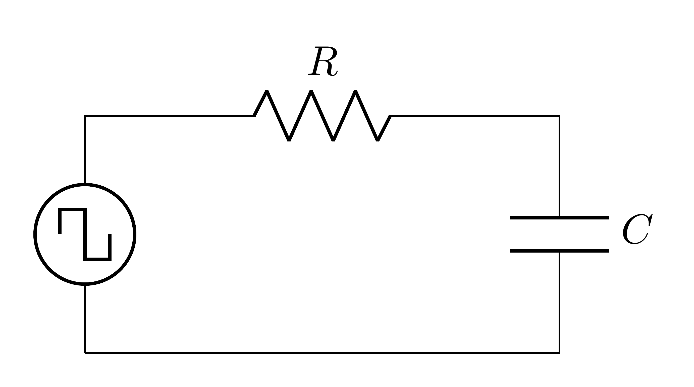
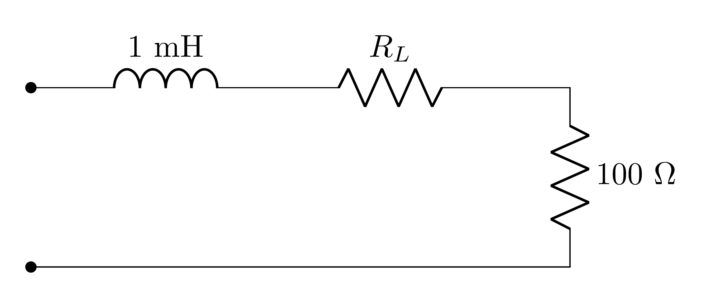
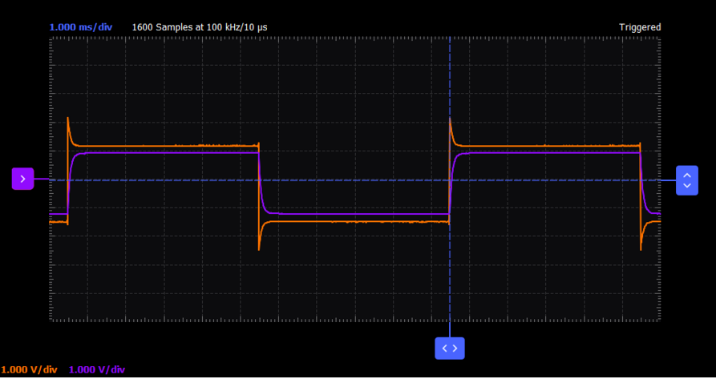

# Lab #4: Transient Response of RC and RL Circuits

**Department of Electrical and Computer Engineering**

**Spring 2026**

## Overview

The purpose of Lab 4 is to:

- Investigate and understand the transient response of RC and RL circuits
- Observe and measure the time constant concept using square wave excitation
- Compare experimental results with theoretical expectations
- Develop MATLAB analysis skills for processing experimental data

---

## 1. Prelab Assignment

### 1.1 Theoretical Review

Study the material at [**ECE Confidential, Cracking The Code: Circuits that Remember**](https://ucdavis.box.com/s/oynuuuo39k6ptme193ffs8gq8dt3pf3w) before proceeding.

### 1.2 RC Circuit Transient Response

The time constant ($\tau$) in RC circuits represents the time required for certain changes in voltages and currents to occur. After five time constants ($5\tau$), voltages and currents generally reach their final (steady-state) value.

For a series RC circuit:

- Charging voltage: $V_C(t) = V\!\left(1-e^{-t/RC}\right)$
- Discharging voltage: $V_C(t) = V_0\,e^{-t/RC}$
- Time constant: $\tau = RC$

where $V_C$ is the voltage across the capacitor, $V$ is the input voltage, and $V_0$ is the initial capacitor voltage before discharge. After four time constants ($4\tau$), the capacitor voltage reaches approximately 98% of its final value; this interval defines the transient response of the circuit.

<!-- CIRCUITIKZ FIGURE: Render from LaTeX source as media/cl-circuit-1.png -->


*Figure 1: Series RC circuit.*

### 1.3 RL Circuit Transient Response

The time constant ($\tau$) in RL circuits similarly represents the time required for changes in voltages and currents to occur. The time constant is the equivalent inductance divided by the total series resistance, which includes the external resistor, the generator's internal resistance, and the winding resistance of the inductor.

For a series RL circuit:

- Current rise: $I_L(t) = \dfrac{V}{R}\!\left(1-e^{-Rt/L}\right)$
- Current decay: $I_L(t) = I_0\,e^{-Rt/L}$
- Time constant: $\tau = L/R$

where $I_L$ is the current through the inductor, $V$ is the input voltage, and $I_0$ is the initial inductor current before the transient begins. Note the duality: voltage across a capacitor increases with time during charging, while current through an inductor increases with time during the transient; these two quantities have the same mathematical form.

<!-- CIRCUITIKZ FIGURE: Render from LaTeX source as media/rl-setup-1.png -->


*Figure 2: RL circuit experimental setup. The generator internal resistance $R_G \approx 50\,\Omega$. The three resistances $R_G$, $R_L$, and 100 $\Omega$ all contribute to the effective total resistance and therefore to the RL time constant.*

### 1.4 RC and RL Calculations

Before entering the lab, calculate the key parameters for each circuit. Keep the following in mind:

- The time constant $\tau$ defines the rate of the exponential transient.
- After $4\tau$ the circuit has reached approximately 98% of its steady-state value; this interval is the transient response.
- For a square wave input, the period must be long enough relative to $\tau$ to allow full charging and discharging.

> **Prelab Deliverable #1**
>
> Calculate the time constant $\tau$ for an RC circuit with $R = 2.2\,\text{k}\Omega$ and $C = 1\,\mu\text{F}$. Then calculate how long it will take to reach approximately 98% of the steady-state value ($4\tau$). Work on paper, showing all steps. Photograph your completed work and submit the image via the course submission app. Your name must be visible in the photo.

> **Prelab Deliverable #2**
>
> Calculate the time constant $\tau$ for an RL circuit with $R = 100\,\Omega$ and $L = 1\,\text{mH}$. Then calculate how long it will take to reach approximately 98% of the steady-state value ($4\tau$). Work on paper, showing all steps. Photograph your completed work and submit the image via the course submission app. Your name must be visible in the photo.

> **Prelab Deliverable #3**
>
> For the RC circuit with $R = 2.2\,\text{k}\Omega$ and $C = 1\,\mu\text{F}$, determine the maximum square wave frequency that still allows the capacitor to fully charge and discharge during each half-cycle. Justify your answer using the $4\tau$ criterion. Work on paper, showing all steps. Photograph your completed work and submit the image via the course submission app. Your name must be visible in the photo.

### 1.5 M2K and Scopy Preparation

> **Prelab Deliverable #4**
>
> Describe how you would configure the M2K signal generator in Scopy to produce a square wave with a specified frequency and peak-to-peak amplitude. List the specific Scopy controls you would use.

> **Prelab Deliverable #5**
>
> Describe how you would use the M2K oscilloscope in Scopy to simultaneously capture and display the input voltage and the output voltage (or sense resistor voltage) of the RC and RL circuits. Which channels would you use and how would you connect them?

> **Practice Problem (Ungraded)**
>
> Describe how you would extract the time constant $\tau$ from a captured exponential waveform using the M2K oscilloscope cursors in Scopy. At what voltage level (expressed as a fraction of the final value) does one time constant occur? How would you place the cursors to read this off the display? This will not be collected, but you will need this skill during the lab.

### 1.6 Circuit Analysis: RC Circuit

> **Interactive Widget: RC Transient Response**
>
> Use the [**RC Interactive Widget**](https://andreknoesen.github.io/eec1-widgets/RC_Interactive.html) to explore how the capacitor voltage builds and decays as you vary $R$, $C$, and the input frequency. Work through the deliverables below on your own first; then use the widget to check your thinking.

<!-- CIRCUITIKZ FIGURE: Render from LaTeX source as media/prelab-rc-1.png -->


*Figure 3: RC circuit for prelab analysis.*

For the following deliverables, assume the capacitor is initially uncharged and a 4 V peak-to-peak square wave with period much greater than $5\tau$ is applied.

> **Prelab Deliverable #6**
>
> Calculate the expected voltage across the capacitor after one time constant ($1\tau$) using the charging voltage equation. Report your calculated value and show the key step in your reasoning.

> **Prelab Deliverable #7**
>
> Calculate the expected voltage across the capacitor after five time constants ($5\tau$). Report your calculated value and explain what this result represents physically.

> **Prelab Deliverable #8**
>
> Sketch the expected capacitor voltage waveform $V_o(t)$ for one complete charge-and-discharge cycle. Label the following on your sketch: the initial voltage, the steady-state voltage, the $1\tau$ point on both the rising and falling edges, and the $4\tau$ point. You may use the RC Interactive Widget to check the expected waveform shape. Photograph your completed sketch and submit the image via the course submission app. Your name must be visible in the photo.

### 1.7 Circuit Analysis: RL Circuit

> **Interactive Widget: RL Transient Response**
>
> Use the [**RL Interactive Widget**](https://andreknoesen.github.io/eec1-widgets/RL_Interactive.html) to explore how the inductor current rises and decays as you vary $R$ and $L$. Work through the deliverables below on your own first; then use the widget to check your thinking.

<!-- CIRCUITIKZ FIGURE: Render from LaTeX source as media/prelab-rl-1.png -->


*Figure 4: RL circuit for prelab analysis. $R_L \approx 100\,\Omega$.*

For the following deliverables, assume the inductor carries no initial current and a 4 V peak-to-peak square wave with period much greater than $5\tau$ is applied. Use $R_L = 100\,\Omega$ for your calculations.

> **Prelab Deliverable #9**
>
> Calculate the expected current through the inductor after one time constant ($1\tau$) using the current rise equation. Report your calculated value and show the key step in your reasoning.

> **Prelab Deliverable #10**
>
> Calculate the expected current through the inductor after five time constants ($5\tau$). Report your calculated value and explain what this result represents physically.

> **Prelab Deliverable #11**
>
> Sketch the expected inductor current waveform $I_L(t)$ for one complete rise-and-decay cycle. Label the following on your sketch: the initial current, the steady-state current, the $1\tau$ point on both the rising and falling edges, and the $4\tau$ point. You may use the RL Interactive Widget to check the expected waveform shape. Photograph your completed sketch and submit the image via the course submission app. Your name must be visible in the photo.

---

## 2. Lab Procedure

> **IMPORTANT**
>
> Collaboration and Assistance: You are encouraged to collaborate with your fellow students and assist each other during the lab. However, each student is expected to complete their own work and submit their own individual post-lab report. If you encounter any difficulties or have questions, first try to seek assistance from your classmates. If you are unable to resolve the issue with their help, please do not hesitate to ask the student assistant or TA for guidance.

### 2.1 Part 1: RC Circuit Experiment

Components for RC circuit:

- 2.2 k$\Omega$ resistor
- 1 $\mu$F capacitor

#### Setup

1. Set up the series RC circuit shown in Figure 5 on your solderless breadboard with component values $R = 2.2~\text{k}\Omega$ and $C = 1~\mu\text{F}$.

2. Measure the resistance of $R$. Measure the capacitance of $C$ (see [**Measuring Capacitance with a Multimeter**](https://drive.google.com/file/d/1bbq8x2qO2SVNvI8vk4P20AJ2q68jkg8e/view?usp=sharing)). Record your results in Table 1.

   | **Part** | **Part value** | **Measured value** | **Measurement Error** |
   |----------|----------------|--------------------|-----------------------|
   | $C$      |                |                    |                       |
   | $R$      |                |                    |                       |

   *Table 1: Component Measurements*

   > **Lab Deliverable #1a**
   >
   > Photograph your completed Table 1 and submit the image via the course submission app. Your name must be visible in the photo.

<!-- CIRCUITIKZ FIGURE: Render from LaTeX source as media/rc-setup-1.png -->


*Figure 5: RC circuit experimental setup. The signal generator has an internal resistance of approximately $R_G = 50~\Omega$. Since this internal resistance is approximately 2% of the $2.2~\text{k}\Omega$ series resistance in the circuit, its contribution to the overall time constant is negligible and can be disregarded. Contrast this with the RL experiment, where $R_G$ cannot be ignored. See Section 5.6 of [**ECE Confidential: Cracking the Code**](https://drive.google.com/file/d/1ISGDHcR_3hFokHTPRgkjkftC0ny9xXld/view?usp=sharing).*

3. Connect the M2K to your computer and launch the Scopy software.

4. Configure the connections:
   - Connect channel 1 of the oscilloscope (CH1+/CH1-) to visualize the input voltage
   - Connect channel 2 of the oscilloscope (CH2+/CH2-) to measure the voltage across the capacitor
   - Connect the signal generator (W1/GND) to the input of the circuit

> **Lab Deliverable #1b**
>
> Take a clear photo of your breadboard with the RC circuit built. Label the components and connections clearly.

#### Procedure

1. Generate a square wave on channel 1 of the signal generator with 4 V amplitude peak-to-peak. Look at the measured value of peak-to-peak amplitude, not the setting on the generator. Why? (See Section 5.6 of [**ECE Confidential: Cracking the Code**](https://drive.google.com/file/d/1ISGDHcR_3hFokHTPRgkjkftC0ny9xXld/view?usp=sharing).)

2. **Case 1 (pulse width $\approx 15\tau$):** Estimate $\tau$ from the measured component values ($\tau = RC$). Set the frequency such that the capacitor has enough time to fully charge and discharge during each cycle of the square wave; let the pulse width be at least $15\tau_\text{estimated}$ and set the frequency accordingly.

   > **Lab Deliverable #1c**
   >
   > Capture screenshots of the oscilloscope display for the pulse width $\approx 15\tau$ case, showing both the input square wave and the output voltage. Capture at least 5 charge and 5 discharge cycles. Ensure that the time base and voltage scales are clearly visible.

3. **Case 2 (pulse width $= \tau$):** Do *not* use the calculated value of $\tau$ to set this frequency. Instead, use the Scopy display directly: the time constant is the time at which the capacitor voltage has reached 63.2% of its final value during charging (this is the $e^{-1}$ point). Adjust the frequency until the pulse width matches this measured $\tau$, then record $\tau$ from the plot.

   > **Lab Deliverable #1d**
   >
   > Capture screenshots of the oscilloscope display for the pulse width $\tau$ case, showing both the input square wave and the output voltage. Capture at least 5 charge and 5 discharge cycles. Ensure that the time base and voltage scales are clearly visible. Record the value of $\tau$ measured directly from the Scopy display.

4. **Case 3 (pulse width $= 5\tau$):** Using $\tau_\text{estimated}$ from Case 1, set the frequency so that the pulse width equals $5\tau$. You should observe a waveform such as shown in Figure 6.


   *Figure 6: Waveform for a pulse width equal to $5\tau$. The blue trace shows the exponential capacitor charge and discharge response to the orange input square wave. The 0.63 V annotation marks the voltage level reached after one time constant $\tau$. Source: [**Transient Response of an RC Circuit, ADALM2000**](https://wiki.analog.com/university/courses/electronics/rc_transient_response)*

   > **Lab Deliverable #1e**
   >
   > Capture screenshots of the oscilloscope display for the pulse width $5\tau$ case, showing both the input square wave and the output voltage. Capture at least 5 charge and 5 discharge cycles. Ensure that the time base and voltage scales are clearly visible.

   > **Lab Deliverable #1f**
   >
   > For Case 3 (the $5\tau$ case), export the captured waveform data to CSV files for later analysis in MATLAB. Export time and both channels (CH1 and CH2) for at least 5 charge and 5 discharge cycles, and download the files. Take a screenshot of your export confirming the files have been saved.

---

### 2.2 Part 2: RL Circuit Experiment

Components for RL circuit:

- 100 $\Omega$ resistor
- 1 mH inductor (use the 1 mH inductor, not the 100 mH)

1. Measure the resistance of the 100 $\Omega$ load resistor $R$ using the Keysight DMM and note the result including the estimated measurement error.

2. Set up the series circuit shown in Figure 7, which places the inductor (with its winding resistance $R_L$) in series with the 100 $\Omega$ resistor.

   <!-- CIRCUITIKZ FIGURE: Render from LaTeX source as media/rl-setup1-1.png -->

   *Figure 7: Circuit for measuring the total series resistance $R_\text{total} = R_L + R$. Connect the DMM across the two open terminals. Use the measured value in all subsequent calculations.*

3. Measure the total series resistance $R_\text{total} = R_L + R$ directly across the two open terminals using the DMM. This single measurement is more accurate than measuring $R_L$ and $R$ separately and adding them, because it avoids accumulating two independent measurement errors.

4. Compute the following derived quantities and record all values in Table 2:
   - $R_L = R_\text{total} - R$
   - $R_\text{circuit} = R_\text{total} + R_G$ (use $R_G = 50~\Omega$)
   - $\tau_\text{expected} = L / R_\text{circuit}$ (use $L = 1~\text{mH}$)

   You will use $\tau_\text{expected}$ to set the generator frequency in each case below.

| **Quantity** | **Nominal value** | **Measured / computed value** | **Measurement error** |
|---|---|---|---|
| $R$ | $100~\Omega$ | | |
| $R_\text{total} = R_L + R$ (series, DMM) | N/A | | |
| $R_L$ (derived) | N/A | | |
| $R_\text{circuit} = R_\text{total} + R_G$ | $R_G = 50~\Omega$ | | N/A |
| $\tau_\text{expected} = L / R_\text{circuit}$ | $L = 1~\text{mH}$ | | N/A |

*Table 2: Component measurements and derived time constant for the RL circuit.*

> **Lab Deliverable #2a**
>
> Photograph your completed Table 2 and submit the image via the course submission app. Your name must be visible in the photo.

> **Why $R_G$ matters here but not in the RC experiment**
>
> In the RC experiment the series resistance was $R = 2.2~\text{k}\Omega$, so $R_G \approx 50~\Omega$ is approximately 2% of the total, small enough to be negligible.
>
> Here the total measured resistance $R_\text{total}$ is roughly 120--130 $\Omega$ (depending on your measured $R_L$), so $R_G \approx 50~\Omega$ is approximately 30% of the total. Ignoring it would produce a time constant that is wrong by the same fraction.
>
> **General principle:** the same 50 $\Omega$ is negligible in one circuit and significant in the other. Whether an approximation is justified depends on the *ratio* of the neglected quantity to the total, not on its absolute size. You will quantify this comparison in the post-lab analysis (Deliverables 3e and 3f).

#### Setup

1. Set up the circuit shown in Figure 8 on your solderless breadboard with $R = 100~\Omega$ and $L = 1~\text{mH}$.

   <!-- CIRCUITIKZ FIGURE: Render from LaTeX source as media/rl-setup-1.png -->

   *Figure 8: RL circuit experimental setup. The generator has an internal resistance $R_G \approx 50~\Omega$. All three resistances, $R_G$, $R_L$, and the $100~\Omega$ sense resistor, contribute to the RL time constant; see Deliverable 2a for the full calculation.*

2. Connect the M2K as follows:
   - Channel 1 oscilloscope: input node (after $R_G$) to ground; measures the source voltage presented to the RL network
   - Channel 2 oscilloscope: across the $100~\Omega$ sense resistor; the voltage here is proportional to inductor current via Ohm's Law
   - Signal generator: to the input of the circuit

> **Lab Deliverable #2b**
>
> Take a clear photo of your breadboard with the RL circuit built. Label the components and connections clearly.

#### Procedure

1. Generate a square wave with 4 V amplitude peak-to-peak. (See Section 5.6 of [**ECE Confidential: Cracking the Code**](https://drive.google.com/file/d/1ISGDHcR_3hFokHTPRgkjkftC0ny9xXld/view?usp=sharing).)

2. **Case 1 (pulse width $\approx 15\tau$):** Using $\tau_\text{expected}$ from Deliverable 2a, set the generator frequency so that the pulse width equals $15\tau_\text{expected}$. The inductor should have enough time to fully charge and discharge within each half-cycle.

   > **Lab Deliverable #2c**
   >
   > Capture a screenshot of the oscilloscope display showing both the input square wave (CH1) and the sense resistor voltage (CH2). Include at least 5 charge and 5 discharge cycles. Verify that the time base and voltage scales are clearly visible.

   > **Lab Deliverable #2d**
   >
   > From the Case 1 screenshot, measure $\tau$ directly from the Scopy display: identify the 63.2% point on the sense-resistor voltage waveform during a charge cycle and read the corresponding time. Record this measured value of $\tau$.

3. **Case 2 (pulse width $= 5\tau$):** Using $\tau_\text{expected}$ from Deliverable 2a, set the frequency so that the pulse width equals $5\tau_\text{expected}$. You should observe waveforms similar to those shown in Figure 9, with characteristic inductive spikes at each transition.


   *Figure 9: Expected waveform for pulse width $= 5\tau$: the blue trace shows the inductor current response across the sense resistor, with inductive spikes at each square wave transition. Source: [**Transient Response of an RL Circuit, ADALM2000**](https://wiki.analog.com/university/courses/electronics/rl_transient_response)*

   > **Lab Deliverable #2e**
   >
   > Capture a screenshot of the oscilloscope display for the $5\tau$ case, showing both CH1 and CH2 with at least 5 charge and 5 discharge cycles. Time base and voltage scales must be clearly visible.

> **Self-Verification Checklist**
>
> Before leaving the lab, verify that you have collected all the necessary information to complete your post-lab report:
>
> - **1a**, photo of completed Table 1 with measured resistor and capacitor values (RC circuit)
> - **1b**, photo of RC breadboard with components labeled
> - **1c**, oscilloscope screenshots for RC Case 1 (pulse width $\approx 15\tau$)
> - **1d**, oscilloscope screenshots for RC Case 2 (pulse width $= \tau$) with $\tau$ value recorded
> - **1e**, oscilloscope screenshots for RC Case 3 (pulse width $= 5\tau$)
> - **1f**, CSV export confirmation screenshot with at least 5 charge and 5 discharge cycles
> - **2a**, photo of completed Table 2 with measured and computed RL circuit values including $\tau_\text{expected}$
> - **2b**, photo of RL breadboard with components labeled
> - **2c**, oscilloscope screenshots for RL Case 1 (pulse width $\approx 15\tau$)
> - **2d**, measured $\tau$ from Case 1 Scopy display (63.2% point)
> - **2e**, oscilloscope screenshots for RL Case 2 (pulse width $= 5\tau$)

---

## 3. Post-Lab Analysis Report

For the computational analysis, use the CSV data exported from the RC experiment (Deliverable 1f). Before you begin, read **Appendix C** of this document; it explains which tools to use, how to prompt AI coding tools effectively, and what you are required to submit alongside your code. The RL data is used separately for the time-constant comparison in Deliverables 3e and 3f below.

1. Export your waveform data from Scopy to CSV if you have not already done so (Deliverable 1f). Confirm you have at least 5 charge and 5 discharge cycles in the exported file.

2. Load the data into your analysis tool of choice: MATLAB, Python, or any environment you are comfortable with. If you prefer, use an AI coding tool (Claude, Copilot, or equivalent) to generate the import and processing code. If you do, paste the generated code into your submission alongside your output.

3. Normalize the waveform amplitudes so that the total swing is 1 V (minimum = 0, maximum = 1). Apply the same scaling to both charge and discharge curves. This removes dependence on the source amplitude and simplifies all subsequent analysis.

4. Identify and extract the individual charge and discharge curves from the normalized data. Each complete charge or discharge curve is one independent measurement of $\tau$. Tip: inverting the charge curves so they resemble discharge curves lets you apply the same extraction method to both.

5. Refer to Appendix A for example extraction code written in MATLAB. If you are using Python or another tool, use an AI coding tool to translate the logic; the mathematical steps are the same regardless of language. See Appendix C for guidance on how to do this effectively.

> **Lab Deliverable #3a**
>
> Generate plots of the normalized waveforms showing both the input square wave and the capacitor response for the $5\tau$ case (RC experiment). Clearly label which curve is the input and which is the output. Upload the figure as an image via the course submission app. Your name must be visible in the image before uploading.

> **Lab Deliverable #3bi**
>
> Per-cycle extraction: for each charge and discharge cycle in your normalized data, identify the time at which the voltage reaches 63.2% of its final value. This is one time constant $\tau$ for that cycle. Record each value in a table with columns for cycle number, cycle type (charge or discharge), and measured $\tau$.

> **Lab Deliverable #3bii**
>
> Linearization (AI-assisted): use an AI coding tool to generate code that linearizes your normalized RC data and extracts $\tau$ from the slope of a linear fit across all cycles. Refer to Appendix A for the mathematical basis. Run the code, produce the linearized plot with the fit overlaid, and report the single extracted $\tau$ value. Paste the AI-generated code into your submission alongside the plot. Upload the linearized plot as an image via the course submission app. Your name must be visible in the image before uploading.

> **Lab Deliverable #3biii**
>
> Statistical reflection: from your per-cycle values in Deliverable 3bi, compute the mean and standard deviation. Then answer the following in two to three sentences: if you had captured 20 cycles instead of the number you collected, what would you expect to happen to the standard deviation of your per-cycle $\tau$ estimates? Would the mean change? Explain the physical and statistical reason for your answer.

> **Lab Deliverable #3c**
>
> (RC experiment.) Calculate $\tau_\text{calculated} = R_\text{measured} \times C_\text{measured}$ and $\tau_\text{corrected} = (R_\text{measured} + R_G) \times C_\text{measured}$ with $R_G = 50~\Omega$. Report the percentage error of each with respect to the extracted value from Deliverable 3bii. Does including $R_G$ bring the result closer? State which model is better supported by the data.

> **Lab Deliverable #3d**
>
> (RL experiment.) Using the component values from Deliverable 2a, calculate $\tau_\text{RL}$ two ways: (1) $\tau = L / R_\text{total,measured}$, ignoring $R_G$; (2) $\tau = L / R_\text{circuit}$, including $R_G = 50~\Omega$. Report both calculated values.

> **Lab Deliverable #3e**
>
> (RL experiment.) Using the value of $\tau$ measured from the Scopy display in Deliverable 2d, calculate the percentage error between your measured $\tau$ and each of the two values calculated in Deliverable 3d. Which model, with or without $R_G$, is better supported by your measurement? State your conclusion with numerical evidence.

> **Lab Deliverable #3f**
>
> (RL experiment, optional, not graded.) Using your measured $\tau$ from Deliverable 2d and $R_\text{circuit}$ from Deliverable 2a, back-calculate the inductance $L = \tau \times R_\text{circuit}$. Compare to the nominal 1 mH value and report the percentage error.

*Deliverable 3f is provided as an extension exercise for students who want to explore component characterization further. It will not be collected or graded.*

> **Lab Deliverable #3g**
>
> Write a short structured comparison: for the RC circuit, state with numerical evidence from Deliverable 3c whether ignoring $R_G$ is justified. For the RL circuit, state with numerical evidence from Deliverable 3e whether ignoring $R_G$ is justified. Conclude with a general principle, stated in your own words, that explains when any approximation of this kind is justified; your principle should not be specific to these two circuits.
>
> You are encouraged to use an AI assistant to help structure your analysis or to clarify concepts such as approximation criteria and when to neglect small quantities in circuit analysis. Ask it to explain, check your reasoning, or suggest a framework; then apply that framework to your own data. **The analysis you submit must be your own work: use AI as a thinking partner, not as a substitute for your own conclusions.**

## Submission Instructions

> **IMPORTANT**
>
> Submit your completed work via the course submission app. All plots, images, data tables, and calculations must be clearly labeled and referenced in your post-lab report.

---

## Appendix A: Code Reference Examples

### A.1 Calculating Time Constant

The following example is written in MATLAB. If you are using Python or another tool, use an AI coding tool to translate it -- the logic and variable names in the comments will help you describe your data accurately. See Appendix C for prompting guidance.

```
% Identify rising edge of input square wave
rising_edges = find(diff(input_voltage > mean(input_voltage)) == 1);

% Extract a single charging curve
start_idx = rising_edges(1);
end_idx = rising_edges(2) - 1;
charge_time = time(start_idx:end_idx) - time(start_idx);
charge_voltage = capacitor_voltage(start_idx:end_idx);

% Normalize the charging curve
v_final = max(charge_voltage);
v_initial = min(charge_voltage);
v_normalized = (charge_voltage - v_initial) / (v_final - v_initial);

% Find the time when voltage reaches 63.2% of final value (1-e^-1)
threshold = 0.632;
[~, threshold_idx] = min(abs(v_normalized - threshold));
measured_time_constant = charge_time(threshold_idx);

disp(['Measured time constant: ', num2str(measured_time_constant), ' seconds']);
```

### A.2 Linearizing the Exponential Response

The following example linearizes the normalized charging curve and extracts $\tau$ from the slope of a linear fit. Written in MATLAB; adapt using AI assistance as described in Appendix C.

```
% Take natural log of the normalized response
% For charging: ln(1-v_normalized)
% For discharging: ln(v_normalized)

% For a charging curve
linearized_data = log(1 - v_normalized);

% Remove data points where linearization is problematic (near 0 or 1)
valid_idx = find(v_normalized > 0.1 & v_normalized < 0.9);
fit_time = charge_time(valid_idx);
fit_data = linearized_data(valid_idx);

% Fit a line to the linearized data
p = polyfit(fit_time, fit_data, 1);

% The slope of the line is -1/tau
calculated_time_constant = -1/p(1);

% Plot the linearized data and fit
figure;
plot(fit_time, fit_data, 'bo', fit_time, polyval(p, fit_time), 'r-');
xlabel('Time (s)');
ylabel('ln(1-v/v_{final})');
title('Linearized Charging Response');
legend('Data', 'Linear Fit');
grid on;

disp(['Calculated time constant from linearization: ', ...
num2str(calculated_time_constant), ' seconds']);
```

---

## Appendix B: Statistical Analysis of Time Constant Measurements

In this lab you extract $\tau$ from multiple independent cycles (each charge and discharge curve is one measurement). Using several cycles instead of one improves your result for a specific statistical reason: **random errors tend to cancel when you average independent measurements**, so the mean of many cycles is a more reliable estimate than any single cycle.

### B.1 Two Sources of Measurement Error

- **Systematic errors** -- consistent offsets that affect every measurement the same way: calibration drift, a wiring resistance you did not account for, a scope probe with nonzero loading. Averaging more cycles does not reduce systematic error. Careful setup and the $R_G$ correction in Deliverable 3c are the tools for systematic error.

- **Random errors** -- cycle-to-cycle variation from noise, contact resistance, and trigger timing. These are unpredictable in direction, so they partly cancel when averaged. More cycles reduce their effect on the mean.

### B.2 What to Compute and Report

For Deliverable 3b you are required to report the **mean** and **standard deviation** of your per-cycle $\tau$ values.

$$\bar{\tau} = \frac{1}{N}\sum_{i=1}^{N}\tau_i$$

$$s = \sqrt{\frac{\sum_{i=1}^{N}(\tau_i - \bar{\tau})^2}{N-1}}$$

The standard deviation $s$ tells you how spread out your per-cycle estimates are. A small $s$ relative to $\bar{\tau}$ means your measurement is precise (though not necessarily accurate -- that is what the $R_G$ comparison in Deliverable 3c checks).

### B.3 Worked Example

Suppose ten cycles yield the following $\tau$ values (in milliseconds):

47.3, 48.1, 46.9, 47.8, 48.2, 47.5, 47.0, 48.3, 47.4, 47.6

- Mean: $\bar{\tau} = 47.61$ ms
- Standard deviation: $s = 0.53$ ms

You would report: "The RC time constant was measured to be $47.61 \pm 0.53$ ms (mean $\pm$ one standard deviation, $N = 10$ cycles)."

> **IMPORTANT**
>
> The precision of your result depends not just on how carefully you take each measurement, but on how many independent measurements you collect. Collecting more cycles costs almost nothing -- the square wave is already running.

---

## Appendix C: AI-Assisted Coding Guide

This appendix applies to all labs in ECE Emerge that require data analysis. You may return to it whenever a lab asks you to process experimental data with code.

> **Note**
>
> This appendix will also be available as a standalone reference on Canvas. If tool recommendations change during the course, the Canvas version will be updated.

### C.1 Which Tool Should I Use?

You may use any programming language and any AI coding tool. The deliverable is the same regardless of your choice.

| **Your situation** | **Recommended path** |
|---|---|
| New to programming or unsure | MATLAB + MATLAB Copilot |
| Comfortable with MATLAB | MATLAB + any AI tool |
| Comfortable with Python | Python + any AI tool |
| Want to try something new | Pick either -- both work |

*Table 3: Tool selection guide. All paths lead to the same deliverable.*

> **MATLAB is the safe default**
>
> All UC Davis students have access to MATLAB through the campus license, which includes MATLAB Copilot. If you are unsure where to start, open MATLAB and use Copilot -- suggestions appear directly in the editor alongside your code, making it easier to follow what is being generated.

### C.2 The Non-Negotiable Rule

> **WARNING**
>
> You are responsible for every line of code you submit. AI tools generate code that is often correct -- and occasionally wrong in subtle ways that produce plausible-looking but incorrect results. In an engineering context, code you cannot explain is code you cannot trust.

Every submission that includes AI-generated code must include all three of the following:

1. **The code itself** -- complete and runnable, with a comment at the top identifying it as AI-generated and naming the tool used. Example:

   ```
   % Generated with MATLAB Copilot, adapted by [your name]
   ```

2. **The output it produced on your data** -- the actual plot or table from running that code on your exported CSV file. Not a representative example -- your data, your output.

3. **A brief code review** -- three to five sentences written by you (not the AI) covering: what the code does step by step in plain English, one thing you verified carefully or would change, and whether the output matches your physical expectation and why.

The code review is not graded for correctness. It is graded for evidence that you read the code and thought about it.

### C.3 How to Write a Prompt That Works

The most common reason AI-generated code fails is a vague prompt. The AI cannot see your workspace, your variable names, or your data format. You have to tell it everything.

A good prompt has four parts:

- **What you have** -- describe your data: variable names, units, size, format.
- **What you want** -- describe the output: a plot, a number, a table.
- **Any constraints** -- language, function names to avoid, output format.
- **A verification request** -- ask the AI to explain what the code does after generating it.

#### Example: bad prompt

```
"Write MATLAB code to find the time constant."
```

The AI does not know what your data looks like, what variable it is stored in, or what units you are using. The result will be generic code that probably does not run on your data without significant editing.

#### Example: good prompt

```
"I have two MATLAB vectors: t (time in seconds, length 500)
and v (normalized voltage, values 0 to 1, from one RC discharge
curve). Write MATLAB code that:
  (1) finds the index where v first drops below 0.368,
  (2) reads the corresponding time from t and stores it as tau,
  (3) plots v vs t with a horizontal dashed line at v = 0.368
      and a vertical dashed line at t = tau, both labeled.
After generating the code, explain what each block does
in plain English."
```

This prompt gives the AI everything it needs: variable names, units, data range, the exact threshold, expected output format, and a request for explanation.

#### Prompting for Python

The same principles apply. Replace MATLAB-specific terms with NumPy and matplotlib equivalents:

```
"I have two NumPy arrays: t (time in seconds) and v (normalized
voltage, 0 to 1). Using matplotlib, write Python code that..."
```

### C.4 When the Code Does Not Work

This will happen. It is not a failure -- it is part of the process.

- **Step 1 -- Paste the error back to the AI.** Copy the full error message including the line number and send it back in the same conversation:

  ```
  "Running your code produced this error on line 12:
  [paste error here]. My variable v has size [500x1],
  not [1x500]. Please fix."
  ```

  The AI can usually fix errors immediately when given the exact message and context.

- **Step 2 -- Check your data format first.** Before assuming the code is wrong, verify: Is your CSV imported correctly? Are your vectors the right shape? (Row vs. column matters in MATLAB.) Is your normalization correct? The max should be 1, the min should be 0.

- **Step 3 -- If it fails three times, use Appendix A.** Appendix A provides working example code. Your job is to adapt it to your variable names and data. Adapting known-working code is a legitimate engineering skill. Document in your submission that you fell back to the appendix and why.

### C.5 Verifying the Output

Before submitting any plot or extracted value, check the following.

**Does the number make physical sense?** For an RC circuit with $R = 2.2\,\text{k}\Omega$ and $C = 1\,\mu\text{F}$, $\tau \approx 2.2\,\text{ms}$. If your code returns `0.0022` in seconds that is correct; if it returns `220`, something is wrong.

**Does the plot look right?** Normalized voltage should span 0 to 1 (or 1 to 0 for discharge). The 63.2% threshold line should cross the curve at approximately the right time. If the curve looks like noise or a straight line, check your data import and normalization.

**Do your multiple cycles agree?** If per-cycle $\tau$ values vary by more than 20%, investigate before computing the mean. Outliers usually indicate a bad cycle (glitch, incomplete charge, trigger problem) rather than real variability. Removing an outlier is acceptable if you document why; removing it because it worsened your answer is not.

### C.6 What to Submit

For any deliverable that involves AI-assisted code, your Gradescope submission must include all of the following. Missing items will be flagged for review.

| **Item** | **Required** |
|---|---|
| Code file or clearly formatted code paste | Yes |
| Comment identifying AI tool used | Yes |
| Plot or table produced by running that code on your data | Yes |
| Code review paragraph (3--5 sentences, your own words) | Yes |
| Brief note if you fell back to Appendix A | If applicable |

*Table 4: Required submission items for AI-assisted code deliverables.*

### C.7 A Note on Academic Integrity

Using AI tools to generate code is permitted and encouraged in this course. What is not permitted is submitting output you do not understand as if it were your own work.

> **IMPORTANT**
>
> AI as a thinking partner is the goal. AI as a shortcut that bypasses thinking is not. The same principle applies to AI-generated explanations, analysis, and written answers throughout the course.
