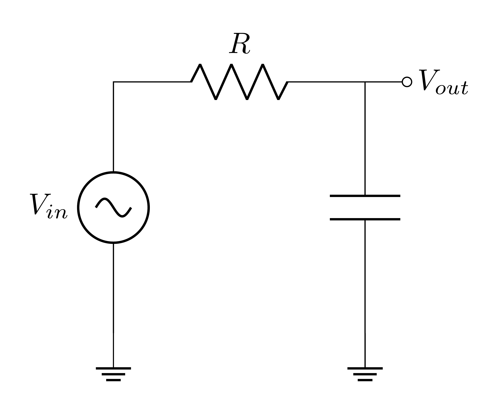
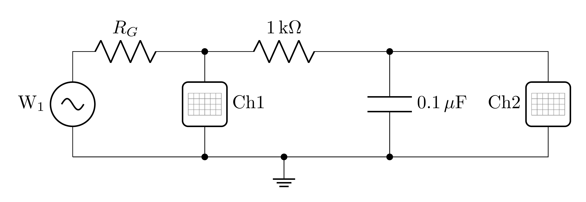
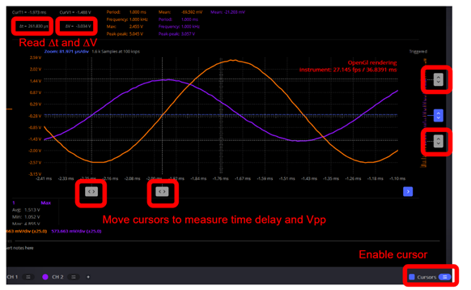
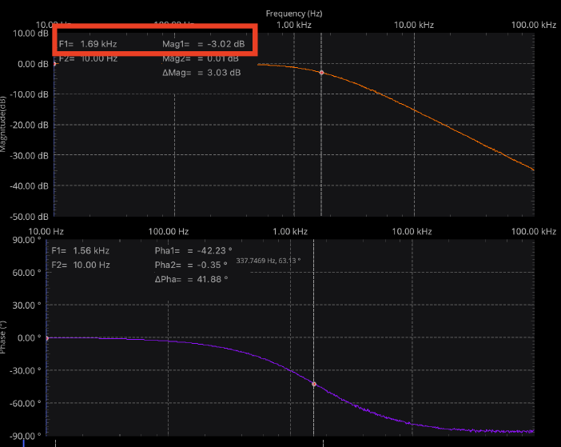
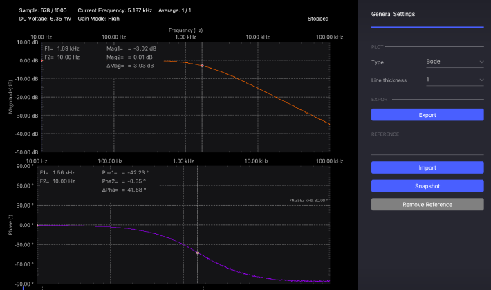
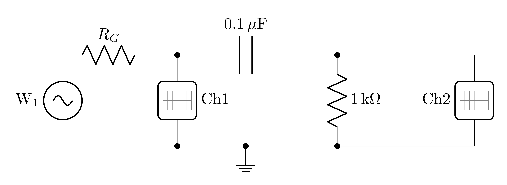

# ECE Lab #5: Low Pass and High Pass Filters

**Department of Electrical and Computer Engineering**

**Spring 2026**

## Overview

The purpose of Lab 5 is to:

- Understand the frequency response characteristics of low-pass and high-pass filters
- Measure and analyze the magnitude and phase responses of simple RC filters
- Use the M2K Network Analyzer to visualize filter characteristics through Bode plots
- Compare theoretical predictions with actual measurements
- Apply MATLAB to analyze and visualize filter behavior
- Interface with the M2K directly from MATLAB without Scopy

---

## 1. Prelab Assignment

Before the lab session, review the <a href="https://wiki.analog.com/university/tools/m2k/scopy/networkanalyzer" target="_blank" rel="noopener noreferrer"><strong>Scopy Network Analyzer</strong></a> documentation.

### 1.1 Complex Numbers

Filters are analyzed using complex numbers. Use the two widgets below to build your confidence with complex arithmetic before working through the filter calculations. There are no deliverables in this section.

> **Interactive Widget: Complex Number Visualizer**
>
> Use the <a href="https://aknoesen.github.io/eec1-widgets/complex_visualizer.html" target="_blank" rel="noopener noreferrer"><strong>Complex Number Visualizer</strong></a> to become familiar with the basic operations involving complex numbers: addition, subtraction, multiplication, and division. Explore how complex numbers are represented in rectangular and polar form and how operations change their magnitude and angle.

> **Interactive Widget: Complex Number Traps**
>
> Work through the <a href="https://aknoesen.github.io/eec1-widgets/complex_traps.html" target="_blank" rel="noopener noreferrer"><strong>Complex Number Traps</strong></a> activity to identify and correct common errors in complex number arithmetic. Work through each trap on your own first; then use the widget to check your thinking.

> **Prelab Deliverable #0**
>
> Complete the Complex Number Traps widget, then solve the following **by hand on paper**. Take a photo of your work and submit it.
>
> (a) Find the angle (in degrees) of $z = -4 - 3j$. Show the quadrant check and the correction step.
>
> (b) State the complex conjugate of $z = -4 - 3j$.

### 1.2 Filter Fundamentals and Transfer Functions

Review Impedance and Filters in <a href="https://ucdavis.box.com/s/oynuuuo39k6ptme193ffs8gq8dt3pf3w" target="_blank" rel="noopener noreferrer"><strong>ECE Confidential: Cracking the Code</strong></a> and watch the video <a href="https://video.ucdavis.edu/media/Impedance/1_iiy1q6u1" target="_blank" rel="noopener noreferrer"><strong>Impedance</strong></a>. Understand the following terms:

- *Transfer function*: The magnitude $|H(j\omega)|$ describes how the amplitude of the output signal varies with frequency relative to the input signal; the phase $\angle H(j\omega)$ describes the phase shift between input and output.

- *Cutoff frequency*: The frequency at which the magnitude of the transfer function falls to $\frac{1}{\sqrt{2}} \approx 0.707$ of its maximum value, corresponding to $-3$ dB. For an RC filter, $\omega_c = 2\pi f_c = \frac{1}{RC}$.

- *Low-pass filter*: A circuit whose transfer function passes low frequencies and attenuates high frequencies.

- *High-pass filter*: A circuit whose transfer function attenuates low frequencies and passes high frequencies.

The transfer functions for first-order RC filters follow directly from the impedance voltage divider. You will derive these from circuit diagrams in Deliverables 1b and 1c below before they appear as formulas.

---

> **Prelab Deliverable #1a**
>
> Explain what low-pass and high-pass filters are and how they are used in electronic systems. Describe at least three practical applications of each type of filter.

> **Prelab Deliverable #1b**
>
> For the two filter circuits shown below, identify which is a low-pass filter and which is a high-pass filter. Explain your reasoning in your own words. Use the limiting behavior of capacitor impedance: what happens to $Z_C$ as frequency approaches zero (DC), and what happens as frequency approaches infinity? Do not cite the transfer function formula; derive the conclusion from impedance behavior.

<!-- CIRCUITIKZ FIGURE: Rendered from LaTeX subfigure pair (Circuit 1 and Circuit 2) as media/fig_01-1.png -->


*Figure 1: RC Filter Circuits. Circuit 1 (left) is a low-pass filter; Circuit 2 (right) is a high-pass filter.*

> **Prelab Deliverable #1c**
>
> Calculate the cutoff frequency $f_c$ for an RC low-pass filter with $R = 1\,\text{k}\Omega$ and $C = 0.1\,\mu\text{F}$. Work on paper, showing all steps. Photograph your completed work and submit the image via the course submission app. Your name must be visible in the photo.

> **Prelab Deliverable #1d.A**
>
> For an RC low-pass filter with $R = 1\,\text{k}\Omega$ and $C = 0.1\,\mu\text{F}$, calculate the theoretical magnitude $|H(j\omega)|$ in dB and the phase shift in degrees at $f = f_c/10$. Work on paper, showing all steps. Photograph your completed work and submit the image via the course submission app. Your name must be visible in the photo.

> **Prelab Deliverable #1d.B**
>
> For the same filter, calculate the theoretical magnitude in dB and the phase shift in degrees at $f = f_c$. Confirm that the magnitude is $-3$ dB and the phase is $-45°$. Work on paper, showing all steps. Photograph your completed work and submit the image via the course submission app. Your name must be visible in the photo.

> **Prelab Deliverable #1d.C**
>
> For the same filter, calculate the theoretical magnitude in dB and the phase shift in degrees at $f = 10\,f_c$. Work on paper, showing all steps. Photograph your completed work and submit the image via the course submission app. Your name must be visible in the photo.

Complete the MATLAB starter code below to generate Bode plots for the RC low-pass and high-pass filters with $f_c \approx 1$ kHz. The finished script must produce **four separate figures**:

- `figure(1)`: low-pass magnitude response (dB vs. frequency)
- `figure(2)`: low-pass phase response (degrees vs. frequency)
- `figure(3)`: high-pass magnitude response
- `figure(4)`: high-pass phase response

Complete every line marked `=>`. Use your answer from Deliverable 1c to verify the low-pass plots, and confirm that the high-pass $-3$ dB frequency matches.

> **Prelab Deliverable #1e**
>
> Submit your completed MATLAB script via MATLAB Grader using the link provided on the course website.

> **Prelab Deliverable #1ei**
>
> `figure(1)`: Low-pass magnitude response plot (dB vs. frequency). Upload the figure as an image via the course submission app. Your name must be visible in the image before uploading.

> **Prelab Deliverable #1eii**
>
> `figure(2)`: Low-pass phase response plot (degrees vs. frequency). Upload the figure as an image via the course submission app. Your name must be visible in the image before uploading.

> **Prelab Deliverable #1eiii**
>
> `figure(3)`: High-pass magnitude response plot (dB vs. frequency). Upload the figure as an image via the course submission app. Your name must be visible in the image before uploading.

> **Prelab Deliverable #1eiv**
>
> `figure(4)`: High-pass phase response plot (degrees vs. frequency). Upload the figure as an image via the course submission app. Your name must be visible in the image before uploading.

```matlab
% RC Filter Bode Plot Generator

% Parameters
R = 1000;    % 1 kOhm resistor
% =>  C = ......   % COMPLETE: calculate C for ~1 kHz cutoff frequency

f = logspace(1, 5, 1000);   % frequency range: 10 Hz to 100 kHz
w = 2*pi*f;                  % angular frequency

% Transfer functions
H_lp = 1 ./ (1 + 1j*w*R*C);           % low-pass
% =>  H_hp = ......  % COMPLETE: high-pass transfer function

% Magnitude in dB
mag_lp_db = 20*log10(abs(H_lp));
mag_hp_db = 20*log10(abs(H_hp));

% Phase in degrees
phase_lp = angle(H_lp)*180/pi;
phase_hp = angle(H_hp)*180/pi;

% --- figure(1): Low-Pass Magnitude ---
figure(1);
semilogx(f, mag_lp_db);
title('Low Pass Filter - Magnitude Response');
xlabel('Frequency (Hz)');
ylabel('Magnitude (dB)');
grid on;
hold on;
semilogx([min(f), max(f)], [-3, -3], 'r--');   % -3 dB reference line
hold off;

% --- figure(2): Low-Pass Phase ---
figure(2);
semilogx(f, phase_lp);
title('Low Pass Filter - Phase Response');
xlabel('Frequency (Hz)');
ylabel('Phase (degrees)');
grid on;

% --- figure(3): High-Pass Magnitude ---
% =>  % COMPLETE: plot high-pass magnitude in the same format as figure(1)
% =>  % Include the -3 dB reference line

% --- figure(4): High-Pass Phase ---
% =>  % COMPLETE: plot high-pass phase in the same format as figure(2)
```

Starter code available for download: <a href="https://drive.google.com/file/d/10Ly2NI00kwKAccDSjq4E38_ZPHnInn8X/view?usp=sharing" target="_blank" rel="noopener noreferrer"><strong>Bode Plot Starter Code</strong></a>.

### 1.3 Reflective AI Exercise: RC Filters and Frequency Response

**Objective:** Having worked through the filter calculations above, use an AI assistant to deepen your understanding of frequency-dependent impedance and to practice evaluating AI-generated explanations.

#### Part 1: Exploration

Example prompts are provided below. You may use them, adapt them, or write your own at the same level of specificity.

**Focus Area 1: Capacitor Impedance and the Voltage Divider**

> *"I am an electrical engineering student preparing for a lab on RC filters. Can you explain how the impedance of a capacitor changes with frequency? Describe its behavior at very low frequencies and at very high frequencies, and explain in physical terms what that means for current flow through the capacitor in each case."*

Follow up with:

> *"In a DC circuit, a voltage divider uses two resistors. If I replace one resistor with a capacitor, why does the same voltage divider equation still apply? What is different about the result compared to the resistive case, and why does the output now depend on frequency?"*

**Focus Area 2: Transfer Functions, Cutoff Frequency, and Bode Plots**

> *"Can you explain what a transfer function is for a low-pass RC filter, and what the cutoff frequency means physically? I want to understand what is actually happening to the signal at, below, and above the cutoff frequency; not just what the formula says."*

Follow up with:

> *"A Bode plot shows a slope of $-20$ dB/decade above the cutoff frequency of a low-pass filter. What does that mean in practical terms? If my input signal is at ten times the cutoff frequency, by how much is the output reduced? What about one hundred times?"*

After completing both focus areas, compare the AI's explanations against your own calculations from Deliverables 1b--1d. Write two or three sentences connecting the AI's description of filter behavior to the specific numerical results you computed.

#### Part 2: The Self-Test

Using any AI assistant, write your own quiz prompt targeting the two concepts above. Your questions must involve at least one of the following: identifying the cutoff frequency of a filter from component values, predicting how a specific input waveform will be modified by a low-pass or high-pass filter, or connecting the frequency response to an observation from a prior lab.

Apply the meta-prompt from *A Mind Worth Questioning* (introduced in Module 1) to evaluate and strengthen your draft, then run the quiz. Submit your original draft, the AI's critique, your revised prompt, and the full quiz transcript.

#### Part 3: Formal Reflection (150--250 words)

Your written synthesis must address all three of the following points:

- **The Link** -- How frequency-dependent impedance is the only mechanism needed to turn a resistive voltage divider into a frequency-selective filter.

- **The Technical "Why"** -- Correct use of terms such as cutoff frequency, transfer function, or impedance.

- **The Lab Application** -- A connection between a specific observation you made in Lab 3 or Lab 4 and what you now understand about filters that explains it.

> **Prelab Deliverable #1f**
>
> Upload up to two screenshots capturing your Self-Test prompt-craft work (original draft prompt, the AI's critique, your revised prompt, and the quiz transcript) via the course submission app. Your name must be visible in each image before uploading.

> **Prelab Deliverable #1g**
>
> Submit your formal written reflection (150--250 words, continuous prose) addressing all three points: The Link, The Technical "Why", and The Lab Application. Include your word count at the end. Submit via the course submission app.

---

## 2. Lab Procedure: Low-Pass Filter

> **IMPORTANT**
>
> This lab must be completed during the scheduled lab session. While collaboration and discussion with classmates is encouraged, each student must complete and submit their own work. If you encounter difficulties, first consult with your peers for assistance. If questions remain unresolved, please seek help from the student assistant or TA, who are available to provide guidance throughout the lab period.

### 2.1 Circuit Construction

1. Measure the values of $R$ and $C$ using the Keysight EDU34450A bench multimeter. Record the measured values and their measurement errors; you will need them for the post-lab MATLAB analysis.

2. Construct the low-pass RC filter using a 1 k$\Omega$ resistor and a 0.1 $\mu$F capacitor as shown in Figure 2.

<!-- CIRCUITIKZ FIGURE: Rendered from LaTeX source as media/lp-circuit-1.png -->


*Figure 2: Connection diagram for low-pass filter measurement. W1 is the sinusoidal source; CH1 measures the input at the node between $R_G$ and the filter; CH2 measures the output across the 0.1 $\mu$F capacitor.*

> **Lab Deliverable #1a**
>
> Take a clear photograph of your low-pass filter circuit setup **together with a piece of paper in the frame on which the measured values of $R$ and $C$ are written, including the measurement errors**. Submit the image via the course submission app. Your name must be visible in the photo.

### 2.2 Low-Pass Filter: Time-Domain Measurements

1. Configure the signal generator to produce a 100 Hz sine wave with 2 V peak-to-peak amplitude.

2. Observe both the input (CH1) and output (CH2) signals on the oscilloscope.

3. Measure the peak-to-peak amplitude of both signals and calculate the magnitude of the transfer function:

$$|H(j\omega)| = \frac{V_{out}}{V_{in}}$$

where $\omega$ corresponds to the frequency set on the signal generator.

4. Convert the magnitude to decibels:

$$|H(j\omega)|_{\text{dB}} = 20\log_{10}\!\left(\frac{V_{out}}{V_{in}}\right)$$

5. Measure the phase difference between the input and output signals. Use the cursors to measure the time delay ($\Delta t$) between corresponding zero-crossings on CH1 and CH2, then convert to phase angle using:

$$\phi = \frac{\Delta t}{T} \times 360^\circ$$

where $T$ is the period of the waveform.



*Figure 3: Measuring time delay and amplitude with cursors in Scopy. Enable the Cursors toggle (bottom right), drag the two vertical cursor lines to corresponding points on each waveform, and read $\Delta t$ and $\Delta V$ from the measurement panel (upper left).*

6. At 100 Hz only: record a screenshot of the oscilloscope display showing both CH1 and CH2. **Annotate the screenshot to show clearly the measured amplitude and phase values.**

7. Repeat steps 1--6 at 500 Hz, 1 kHz, 2 kHz, 5 kHz, and 10 kHz. Record annotated screenshots at **1 kHz and 10 kHz** in addition to the 100 Hz screenshot above.

| **Frequency (Hz)** | **$V_{in}$ (V)** | **$V_{out}$ (V)** | **$\|H(j\omega)\|$** | **$\|H(j\omega)\|_{\text{dB}}$** | **Phase ($°$)** |
|---|---|---|---|---|---|
| 100 | | | | | |
| 500 | | | | | |
| 1000 | | | | | |
| 2000 | | | | | |
| 5000 | | | | | |
| 10000 | | | | | |

*Table 1: Low-Pass Filter Measurements*

> **Lab Deliverable #1b**
>
> Photograph your completed Table 1 and submit the image via the course submission app. Your name must be visible in the photo.

Screenshots are required at three frequencies that bracket the cutoff: well below $f_c$, at $f_c$, and well above $f_c$.

> **Lab Deliverable #1c**
>
> Low-pass at 100 Hz ($f \approx f_c/10$): annotated oscilloscope screenshot showing CH1 and CH2 with amplitude and phase measurements marked. Submit the image via the course submission app. Your name must be visible in the image before uploading.

> **Lab Deliverable #1d**
>
> Low-pass at 1 kHz ($f \approx f_c$): annotated oscilloscope screenshot showing CH1 and CH2 with amplitude and phase measurements marked. Submit the image via the course submission app. Your name must be visible in the image before uploading.

> **Lab Deliverable #1e**
>
> Low-pass at 10 kHz ($f \approx 10\,f_c$): annotated oscilloscope screenshot showing CH1 and CH2 with amplitude and phase measurements marked. Submit the image via the course submission app. Your name must be visible in the image before uploading.

### 2.3 Low-Pass Filter: Frequency-Domain Measurement

The Network Analyzer in Scopy automates the frequency response measurement by sweeping a sine wave across a range of frequencies and recording the magnitude and phase of the transfer function at each step.

1. Navigate to the Network Analyzer tab in Scopy.

2. Configure the Network Analyzer with the following settings:
   - Frequency range: 10 Hz to 100 kHz (logarithmic sweep)
   - Number of points: 1000
   - Amplitude: 2 V peak-to-peak
   - Reference channel: CH1 (input)
   - Measurement channel: CH2 (output)
   - Display: magnitude axis $-50$ dB to $+10$ dB; phase axis $-90°$ to $+90°$

3. Click *Run* to start the measurement.



*Figure 4: Scopy Network Analyzer Bode plot for the low-pass filter. The upper panel shows the magnitude rolling off above $f_c$; cursors identify the $-3$ dB point at approximately 1.69 kHz. The lower panel shows the phase falling from $0°$ toward $-90°$.*

4. Use the cursors to identify the $-3$ dB frequency on the magnitude plot. Record this value; it is your measured cutoff frequency for comparison with theory in the post-lab.

5. Export the frequency response data as `LPFrequencyResponse.csv` using the Export button in the General Settings panel.



*Figure 5: Exporting data from the Network Analyzer. Click *Export* in the General Settings panel to save magnitude and phase data as a CSV file.*

> **Lab Deliverable #1f**
>
> Screenshot of the Network Analyzer Bode plot with the cursors positioned to identify the $-3$ dB cutoff frequency. The cursor readout must be visible in the screenshot. Submit the image via the course submission app. Your name must be visible in the image before uploading.

---

## 3. Lab Procedure: High-Pass Filter

### 3.1 Circuit Construction

Using the **same 1 k$\Omega$ resistor and 0.1 $\mu$F capacitor from Part 1**, reconfigure the circuit as a high-pass filter as shown in Figure 6. The components are identical; only the positions of $R$ and $C$ are swapped. CH2 now measures the output across the resistor.

<!-- CIRCUITIKZ FIGURE: Rendered from LaTeX source as media/hp-circuit-1.png -->


*Figure 6: Connection diagram for high-pass filter measurement. W1 is the sinusoidal source; CH1 measures the input; CH2 measures the output across the 1 k$\Omega$ resistor.*

> **Lab Deliverable #2a**
>
> Take a clear photograph of your high-pass filter circuit setup. Submit the image via the course submission app. Your name must be visible in the photo.

### 3.2 High-Pass Filter: Time-Domain Measurements

The measurement procedure is identical to Part 1: generate a sine wave, measure $V_{in}$ and $V_{out}$ with the oscilloscope, compute $|H|$ and convert to dB, and measure the phase using cursor time delay. Follow the same steps and record data at the same six frequencies.

One important difference: for the high-pass filter the output *leads* the input. The phase shift $\phi$ is **positive** at frequencies below $f_c$ and approaches $+90°$ as frequency approaches zero. At $f_c$ the phase should be approximately $+45°$. When measuring time delay, if the CH2 zero-crossing occurs *before* CH1, the output leads and $\phi$ is positive.

| **Frequency (Hz)** | **$V_{in}$ (V)** | **$V_{out}$ (V)** | **$\|H(j\omega)\|$** | **$\|H(j\omega)\|_{\text{dB}}$** | **Phase ($°$)** |
|---|---|---|---|---|---|
| 100 | | | | | |
| 500 | | | | | |
| 1000 | | | | | |
| 2000 | | | | | |
| 5000 | | | | | |
| 10000 | | | | | |

*Table 2: High-Pass Filter Measurements*

> **Lab Deliverable #2b**
>
> Photograph your completed Table 2 and submit the image via the course submission app. Your name must be visible in the photo.

As in Part 1, annotated screenshots are required at three frequencies only.

> **Lab Deliverable #2c**
>
> High-pass at 100 Hz ($f \approx f_c/10$): annotated oscilloscope screenshot showing CH1 and CH2 with amplitude and phase measurements marked. Submit the image via the course submission app. Your name must be visible in the image before uploading.

> **Lab Deliverable #2d**
>
> High-pass at 1 kHz ($f \approx f_c$): annotated oscilloscope screenshot showing CH1 and CH2 with amplitude and phase measurements marked. Submit the image via the course submission app. Your name must be visible in the image before uploading.

> **Lab Deliverable #2e**
>
> High-pass at 10 kHz ($f \approx 10\,f_c$): annotated oscilloscope screenshot showing CH1 and CH2 with amplitude and phase measurements marked. Submit the image via the course submission app. Your name must be visible in the image before uploading.

### 3.3 High-Pass Filter: Frequency-Domain Measurement

1. Run the Network Analyzer sweep using the same settings as Part 1 (10 Hz to 100 kHz, 1000 points, 2 V pp, CH1 reference, CH2 measurement, same axis ranges).

2. Use the cursors to identify the $-3$ dB frequency on the magnitude plot. On the phase plot, confirm that the phase at $f_c$ is approximately $+45°$; the positive sign confirms that the output leads the input at this frequency.

3. Export the frequency response data as `HPFrequencyResponse.csv`.

> **Lab Deliverable #2f**
>
> Screenshot of the Network Analyzer magnitude plot for the high-pass filter, with cursors positioned to identify the $-3$ dB cutoff frequency. The cursor readout must be visible. Submit the image via the course submission app. Your name must be visible in the image before uploading.

> **Lab Deliverable #2g**
>
> Screenshot of the Network Analyzer phase plot for the high-pass filter, with the phase value at $f_c$ identified. Submit the image via the course submission app. Your name must be visible in the image before uploading.

> **Self-Verification Checklist**
>
> Before leaving the lab, verify that you have collected all the necessary information to complete your post-lab report:
>
> - [ ] **1a:** Photograph of your low-pass filter circuit setup.
> - [ ] **1b:** Photograph of completed Table 1 with all time-domain measurements.
> - [ ] **1c:** Annotated oscilloscope screenshot at 100 Hz (low-pass).
> - [ ] **1d:** Annotated oscilloscope screenshot at 1 kHz ($f \approx f_c$, low-pass).
> - [ ] **1e:** Annotated oscilloscope screenshot at 10 kHz ($f \approx 10\,f_c$, low-pass).
> - [ ] **1f:** Network Analyzer Bode plot screenshot with cursors at the $-3$ dB point (low-pass); exported `LPFrequencyResponse.csv`.
> - [ ] **2a:** Photograph of your high-pass filter circuit setup.
> - [ ] **2b:** Photograph of completed Table 2 with all time-domain measurements.
> - [ ] **2c:** Annotated oscilloscope screenshot at 100 Hz (high-pass).
> - [ ] **2d:** Annotated oscilloscope screenshot at 1 kHz (high-pass).
> - [ ] **2e:** Annotated oscilloscope screenshot at 10 kHz (high-pass).
> - [ ] **2f:** Network Analyzer magnitude screenshot with cursor readout (high-pass).
> - [ ] **2g:** Network Analyzer phase screenshot with $f_c$ identified (high-pass); exported `HPFrequencyResponse.csv`.

---

## 4. Post-Lab Analysis Report

### 4.1 MATLAB Analysis of Filter Frequency Response

*This section is completed individually outside the lab session.* Using MATLAB, compare your theoretical and measured filter responses for both filters.

Write a MATLAB script that performs the following steps:

1. Load `LPFrequencyResponse.csv` and `HPFrequencyResponse.csv`.

2. Plot the Network Analyzer magnitude and phase data for each filter as continuous curves on a Bode plot (magnitude in dB and phase in degrees, both vs. frequency on a logarithmic axis).

3. On the same axes, overlay the theoretical magnitude and phase curves computed from the transfer function using your measured component values.

4. On the same axes, overlay the six discrete magnitude-and-phase points from Tables 1 and 2 as individual markers.

Each plot must include a legend distinguishing the three data sources (Network Analyzer measurement, theoretical curve, time-domain discrete points), axis labels with units, and a descriptive title.

> **Lab Deliverable #3ai**
>
> Low-pass filter: magnitude Bode plot showing the Network Analyzer data, the theoretical curve, and the six discrete time-domain measurement points on the same axes. Upload the figure as an image via the course submission app. Your name must be visible in the image before uploading.

> **Lab Deliverable #3aii**
>
> Low-pass filter: phase Bode plot showing the Network Analyzer data, the theoretical curve, and the six discrete time-domain measurement points on the same axes. Upload the figure as an image via the course submission app. Your name must be visible in the image before uploading.

> **Lab Deliverable #3bi**
>
> High-pass filter: magnitude Bode plot, same structure as Deliverable 3ai using the high-pass data and transfer function. Upload the figure as an image via the course submission app. Your name must be visible in the image before uploading.

> **Lab Deliverable #3bii**
>
> High-pass filter: phase Bode plot, same structure as Deliverable 3aii using the high-pass data and transfer function. Upload the figure as an image via the course submission app. Your name must be visible in the image before uploading.

> **Lab Deliverable #3c**
>
> For both filters, calculate the percentage error between the theoretical $f_c$ (computed from your measured $R$ and $C$) and the $-3$ dB frequency identified from the Network Analyzer data. Work on paper, showing all steps for each filter. Photograph your completed work and submit the image via the course submission app. Your name must be visible in the photo.

> **Lab Deliverable #3d**
>
> Identify and discuss **at least three** sources of discrepancy between the theoretical and measured cutoff frequencies. Your discussion must address component tolerances, generator output resistance $R_G$, parasitic elements, and measurement limitations.

### 4.2 Understanding Filter Characteristics

> **Lab Deliverable #3ei**
>
> For **both** the low-pass and high-pass filters, describe in your own words how the magnitude response changes as frequency increases. Reference specific values from your measured data to support your description.

> **Lab Deliverable #3eii**
>
> For **both** filters, describe how the phase response changes across the frequency range and explain why phase shift is significant in signal processing applications.

> **Lab Deliverable #3eiii**
>
> For **both** filters, describe the asymptotic behavior in terms of roll-off slopes (dB/decade) at frequencies well above and well below $f_c$.

> **Lab Deliverable #3eiv**
>
> For **both** filters, explain the significance of the decibel scale and the logarithmic frequency axis in analyzing and presenting filter performance.
>
> You are encouraged to use an AI assistant to help structure your analysis or to clarify concepts such as Bode plot interpretation and filter frequency response. Ask it to explain, check your reasoning, or suggest a framework; then apply that framework to your own data. **The analysis you submit must be your own work: use AI as a thinking partner, not as a substitute for your own conclusions.**

> **IMPORTANT**
>
> Submit your completed work via the course submission app. All plots, images, data tables, and calculations must be clearly labeled and referenced in your post-lab report.
