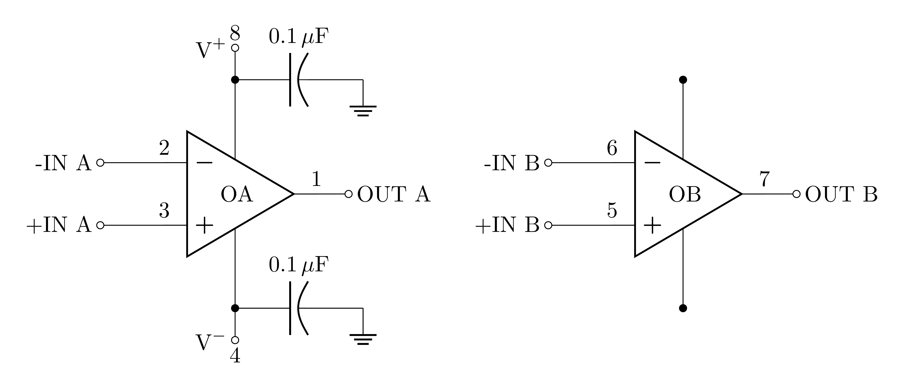
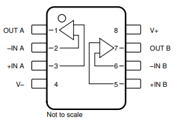

# ECE Lab \#6: Operational Amplifiers: Part 1

**Department of Electrical and Computer Engineering**

**Spring 2026** *(Note: Acknowledgment: The lab was derived from [Simple Op Amps, For ADALM2000 by Doug Mercer](https://wiki.analog.com/university/courses/electronics/electronics-lab-1))*

---

## Overview

The purpose of Lab 6 is to:

- Implement and Experiment with Op-Amp Circuits:
  - Perform experiments involving basic operational amplifier (op-amp) circuits using negative feedback.
  - Become familiar with a voltage follower.

- Understand the Characteristics of Op-Amps:
  - Learn about the defining properties of op-amps, including high input resistance, low output resistance, and large differential gain.
  - Understand how these characteristics make op-amps nearly ideal amplifiers and versatile building blocks in circuit applications.

- Explore DC Biasing for Active Circuits:
  - Gain an understanding of DC biasing and its significance in active circuit designs.

- Investigate Basic Functional Op-Amp Circuits:
  - Explore the behavior and functionality of fundamental op-amp circuit designs in practical scenarios.

- Develop Proficiency with Lab Equipment:
  - Continue building hands-on skills with lab hardware through practical experiments.

---

## 1. Prelab Assignment

Before the lab session, read **Appendix A** (Circuit Construction and Debugging) and **Appendix B** (The LMC662 Operational Amplifier). The deliverables below require specific information from both appendices.

### 1.1 LMC662 Device Specifications

> **Prelab Deliverable #1a**
>
> Referring to the [LMC662 datasheet](https://www.ti.com/lit/ds/symlink/lmc662.pdf) and Appendix B, complete the table below. For each parameter, record the datasheet value and write one sentence explaining what it means specifically for this lab: not a general definition, but a consequence for something you will build or measure.
>
> | **Parameter** | **Value** | **Practical meaning for Lab 6** |
> |---|---|---|
> | Gain-bandwidth product | | |
> | Slew rate | | |
> | Supply voltage range | | |
> | CMRR | | |
> | PSRR | | |

### 1.2 Gain-Bandwidth Product

> **Prelab Deliverable #1b**
>
> Using the LMC662 GBW value you recorded in Deliverable 1a, calculate the maximum closed-loop $-3$ dB bandwidth for the  at each of the three gains below. Present your results in a table and include the formula used.
>
> | **Closed-loop gain** | **Maximum bandwidth (Hz)** |
> |---|---|
> | 1 | |
> | 10 | |
> | 100 | |
>
> In one sentence, explain why gain and bandwidth trade off with each other in this way.

### 1.3 Slew Rate

> **Prelab Deliverable #1c**
>
> Using the slew rate value from Deliverable 1a: a square wave drives a voltage follower input, producing a 10 V output step.
>
> 1. Calculate the minimum rise time of the output.
> 2. At what square wave frequency would this rise time equal approximately 10% of the half-period? Show your work.

### 1.4 Voltage Follower Analysis

> **Prelab Deliverable #1d**
>
> Apply the Golden Rules to the voltage follower circuit shwon in Figure 2. Show all steps. Your analysis must:
>
> 1. State the two Golden Rules and the condition under which they apply.
> 2. Derive the output voltage in terms of the input voltage.
> 3. Explain in one sentence each why the voltage follower has (a) effectively infinite input resistance and (b) effectively zero output resistance.

### 1.5 Buffer Loading Calculations

The circuit in the Unity-Gain Buffer section of this lab uses a voltage divider built from two 4.7 k$\Omega$ resistors driven by a sinusoidal source. The output of the lower resistor is the node labeled $V_{in}$ to the op-amp.

> **Prelab Deliverable #1e**
>
> Calculate the expected amplitude of $V_{in}$ (as a fraction of $V_{source}$) for each load condition below. No buffer is present; the load connects directly across the lower 4.7 k$\Omega$ resistor. Show the equivalent resistance at each step.
>
> 1. 10 k$\Omega$ load across the lower resistor.
> 2. 1 k$\Omega$ load across the lower resistor.

> **Prelab Deliverable #1f**
>
> Now a 1 k$\Omega$ resistor is placed in parallel with the lower 4.7 k$\Omega$ resistor of the divider (Buffer Circuit 3 topology). Calculate the resulting parallel combination and the new value of $V_{in}$. This models what the signal source sees even before the load at the buffer output is considered.

### 1.6 M2K Power Supply Setup

> **Prelab Deliverable #1g**
>
> Referring to Appendix B (Section B.3) and the Scopy documentation:
>
> 1. Describe the steps to configure the M2K power supplies to $+5$ V and $-5$ V in Scopy.
> 2. Identify which physical M2K terminals provide $V^+$, $V^-$, and GND.
> 3. State which LMC662 pins each M2K terminal connects to, and which terminal on Appendix B Figure B.1 shows the required decoupling capacitor placement.

### 1.7 Reflective AI Exercise: Feedback, the Golden Rules, and Real Op-Amp Limits

**Objective:** Having worked through the device specifications and circuit calculations above, use an AI assistant to deepen your understanding of how negative feedback converts an impractically high open-loop gain into a stable, predictable amplifier, and how the real LMC662 deviates from ideal behavior in ways your calculations already quantify.

#### Part 1: Exploration

Example prompts are provided below. You may use them, adapt them, or write your own at the same level of specificity.

**Focus Area 1: Slew Rate vs. Gain-Bandwidth Product**

> *"My op-amp has a gain-bandwidth product of 10 MHz and a slew rate of 12 V/$\mu$s. Can you explain the difference between these two parameters? One describes a small-signal frequency limit and the other a large-signal rate-of-change limit, but I am not sure which is which or what causes each one physically."*

Follow up with:

> *"A voltage follower is supposed to reproduce the input perfectly at unity gain. How can slew rate cause the output to look different from the input even in a unity-gain configuration? Give me a concrete example with numbers that match the LMC662 specifications."*

**Focus Area 2: The Loading Problem and Why It Matters**

> *"I have a voltage divider with two 4.7 k$\Omega$ resistors. When I connect a 1 k$\Omega$ load across the lower resistor, the voltage I measure is much lower than the unloaded value. Can you explain physically why this happens? What does the voltage follower do to fix it, and what property of the ideal op-amp makes the fix work?"*

After completing both focus areas, compare the AI's explanations to your calculations in Deliverables 1b, 1c, 1e, and 1f. Write two or three sentences identifying where the AI's description matches your numbers and where, if anywhere, it glosses over something your calculation made explicit.

#### Part 2: The Self-Test

Using any AI assistant, write your own quiz prompt targeting the two concepts above. Your questions must involve at least one of the following: predicting whether a given signal will trigger slew-rate limiting in the LMC662 applying the Golden Rules to predict the output of the voltage follower, or explaining why the loading effect changes $V_{in}$ rather than just $V_{out}$ in Buffer Circuit 3.

Apply the meta-prompt from *A Mind Worth Questioning* (introduced in Module 1) to evaluate and strengthen your draft before running the quiz. Submit your original draft, the AI's critique, your revised prompt, and the full quiz transcript.

#### Part 3: Formal Reflection (150--250 words)

Your written synthesis must address all three of the following points:

- **The Link** -- How negative feedback forces the op-amp to behave predictably, and why this makes the Golden Rules valid rather than assumed.

- **The Technical "Why"** -- Correct use of at least two of the following terms: virtual short, negative feedback, slew rate, gain-bandwidth product, output saturation, loading effect.

- **The Lab Application** -- A specific measurement you expect to make in Lab 6 that will look different from the ideal prediction, and the LMC662 parameter responsible for the difference. Reference the numerical value from your prelab calculations.

> **Prelab Deliverable #1h**
>
> Upload up to two screenshots capturing your Self-Test prompt-craft work (original draft prompt, the AI's critique, your revised prompt, and the quiz transcript) via the course submission app. Your name must be visible in each image before uploading.

> **Prelab Deliverable #1i**
>
> Submit your formal written reflection (150--250 words, continuous prose) addressing all three points: The Link, The Technical "Why", and The Lab Application. Include your word count at the end. Submit via the course submission app.

---

## 2. Lab Procedure: Connecting DC Power

Op amps must always be supplied with DC power and therefore it is best to configure these connections first before adding any other circuit components. Figure 1 shows one possible power arrangement on your solderless breadboard. We use two of the long rails for the positive and negative supply voltages, and two others for any ground connections that may be required. Included are the so-called "supply de-coupling" capacitors connected between the power-supply and ground rails. It is too early to discuss in great detail the purpose of these capacitors, but they are used to reduce noise on the supply lines and avoid parasitic oscillations. It is considered good practice in analog circuit design to always include small bypass capacitors close to the supply pins of each op amp in your circuit. Use the side cutters available in the lab to make the wires are cut to as short as possible such that components are flat on the protoboard. Also make the connecting wires such that they are not excessively long.


*Power supply connection for a different op-amp, in this case the LM6134. Make sure your op-amp is oriented correctly. The pin count starts at the indentation (sometimes marked with a dot). In this op-amp, pin 4 is the positive power supply connection and pin 11 for the −5 V power supply connection. In the LMC662, pin 8 is the positive and pin 4 the negative.  If you get the power connections wrong, the op-amp will be damaged when voltages are applied. See how the red wire is used for positive, and the black for negative.  Make use of this color scheme on your breadboard!  Note how the decoupling caps are mounted.*

- Insert the op amp into your breadboard and add the wires and supply capacitors as shown in Figure 1. To avoid problems later you may want to attach a small label to the breadboard to indicate which rails correspond to +Vcc, -Vcc, and ground.

- Attach the supply and GND connections from the ADALM2000 board to the terminals on your breadboard. Use jumper wires to power the rails as shown. Remember, the power-supply GND terminal will be our circuit "ground" reference.

> **IMPORTANT**
>
> **Leave the power supplies off. Get your setup checked off by TA or lab assistant before proceeding to the next step.**

- Once checked off, run the Scopy software, set the power supplies to +5V and -5V, and turn on the power supplies.
- Once you have your supply connections, use the M2K to probe the IC pins directly to confirm that pin 8 is at +5V and pin 4 is at -5V.

> **Lab Deliverable #1a**
>
> Take a clear photograph of your power supply connections on the breadboard. Make sure the connections are neat. Submit the image via the course submission app. Your name must be visible in the photo.

> **Lab Deliverable #1b**
>
> Record the voltage measurements at pins 4 and 8 of the LMC662, including units. Submit via the course submission app.

> **IMPORTANT**
>
> **Leave the power supplies connected to the op-amp in this manner for the next two labs.**

---

## 3. Lab Procedure: Unity-Gain Amplifier

### 3.1 Background

The first op-amp circuit is a deceptively simple one, shown in Figure 2. It is known as unity-gain buffer, or sometimes just a voltage follower, defined by the transfer function $\text{V}_{\text{out}}$ = $\text{V}_{\text{in}}$. At first glance it may seem like a useless device, but as we will show later it finds use because of its high input resistance and low output resistance.

### 3.2 Hardware Setup

#### Materials

- 1 1 k$\Omega$ resistor
- 2 4.7 k$\Omega$ resistors
- 2 10 k$\Omega$ resistors
- 1 LMC662 bi op-amp
- 2 0.1 $\mu$F capacitors

Using the ECE Emerge adaptor board and the ADALM2000 power supplies, construct the circuit shown in Figure 2. **Note that the power connections have not been explicitly shown here; it is assumed that those connections must be made in any real circuit (as you did in the previous step), so it is unnecessary to show them in the schematic from this point on.** Use jumper wires to connect input and output to the waveform generator and oscilloscope leads.

> **IMPORTANT**
>
> **When you are constructing a circuit, turn the power supplies off.**

<!-- CIRCUITIKZ FIGURE: Rendered from LaTeX source as media/unity-gain-1.png -->


*Figure 2: Unity-gain buffer (voltage follower) circuit.*

### 3.3 Procedure

- Turn the power supplies on.
- Use the W1 waveform generator as source to provide a 2V amplitude peak-to-peak, 1 kHz sine wave excitation to the circuit.
- Configure the scope so that the input signal is displayed on channel 2 and the output signal is displayed on channel 1.
- Take a screenshot of the two resulting waveforms, noting the parameters of the waveforms (peak values and the fundamental time-period or frequency). Your waveforms should confirm the description of this as a "unity-gain" or "voltage follower" circuit.

> **Lab Deliverable #2a**
>
> Screenshot of the oscilloscope display showing the input (CH2) and output (CH1) waveforms at 1 kHz, confirming unity-gain operation. Submit the image via the course submission app. Your name must be visible in the image before uploading.


*Figure 3: Example oscilloscope waveforms for the unity-gain voltage follower. The orange Channel 1 input and purple Channel 2 output waveforms at 1 kHz are nearly identical in amplitude and phase, confirming unity gain and no phase shift.*

> **Lab Deliverable #2b**
>
> Take a clear photograph of your unity-gain amplifier circuit on the breadboard. Make sure the connections are neat. Submit the image via the course submission app. Your name must be visible in the photo.

### 3.4 Slew Rate Limitations

For an ideal op-amp the output will follow the input signal precisely for any input signals, but in a real amplifier the output signal can never respond instantaneously to the input signal. This non-ideality can be observed when the input signal is a rapidly changing function of time. For large-amplitude signals this limitation is quantified by the slew rate, which is the maximum rate-of-change (slope) of the output voltage that the op-amp is capable of delivering. The units of slew-rate are usually expressed as V/$\mu$s.


*Figure 4: Slew rate definition. Rise time $T_r$ is measured from the 10% to 90% points of the voltage swing $\Delta V = 0.8(V_{\text{max}} - V_{\text{min}})$, and slew rate is defined as $\Delta V / T_r$.*

#### 3.4.1 Procedure

- Set the waveform generator to a square wave signal with a 2V amplitude peak-to-peak and increase the frequency until you see a significant departure from ideal behavior, that is, when the output starts looking more like a trapezoid than a square wave. From about 20 kHz you should start seeing the effects of slew rate. You will need to adjust the time scale (Sec/Div) on the scope display to see this.

- From the display, measure the 10-90% rise time (and 90-10% fall time) as defined in Figure 4 using the cursors available in Scopy. Note the peak-to-peak voltage of the output signal. Take a screenshot of the display.


*Figure 5: Rising edge measurement using Scopy oscilloscope cursors. Place the horizontal cursors at the 10% and 90% voltage levels and read $\Delta V$ and $\Delta T$ from the cursor panel to calculate slew rate.*

- Compute and record the slew rate for both the rising and falling edges using:

$$\text{Slew Rate} = \frac{\Delta V}{T_r}$$

where $\Delta V = 0.8(V_{\text{max}} - V_{\text{min}})$ and $T_r$ is the 10%--90% rise time. Compare your measured value to the LMC662 datasheet specification of 12 V/$\mu$s. Note any asymmetry between the rising and falling edge results and suggest a reason.

> **Lab Deliverable #2c**
>
> Screenshot of the oscilloscope display showing the slew-rate-limited output with cursors positioned at the 10% and 90% voltage levels. The cursor readout must be visible. Submit the image via the course submission app. Your name must be visible in the image before uploading.

> **Lab Deliverable #2d**
>
> Record the values from your Deliverable 2c cursor readout: measured $\Delta V$, $T_r$ (10%--90% rise time), and $T_f$ (90%--10% fall time), along with the peak-to-peak output voltage. Submit via the course submission app.

---

## 4. Lab Procedure: M2K MATLAB Control

In the final project you will not use Scopy to configure the M2K. Instead, you will control the M2K directly from MATLAB using the `M2K` class.

### 4.1 Setup

1. Download **M2K.m** from: <https://ucdavis.box.com/s/gk3w1nbyqafmo13irx35ia1ziil8lqga>

2. Place the file in your working MATLAB folder, *or* add its location permanently to the MATLAB path:

```
addpath('C:/path/to/folder/containing/M2K')
savepath
```

3. Verify that MATLAB can find the class:

```
which M2K
```

MATLAB should respond with the full path to `M2K.m`. If it does not, confirm that the file is in the correct folder and that `addpath` was run successfully.

4. A complete usage guide \<To be created\>

### 4.2 Procedure

Use the voltage follower circuit from the previous section. You will use MATLAB to command the M2K to generate an input signal and to simultaneously record the input and output voltages.

**Step 1: Create the M2K object and configure channels.**
W1 generates the input to the op-amp; CH1 measures the input; CH2 measures the output.

```matlab
myM2K = M2K();
myM2K.enableAnalogOut(1);           % enable W1
myM2K.enableAnalogIn(1);            % enable Ch1
myM2K.enableAnalogIn(2);            % enable Ch2

ADCRate = 1000000;                   % ADC rate = 1 MHz
DACRate = 750000;                    % DAC rate = 750 kHz

myM2K.setAnalogOutSampleRate(DACRate);
myM2K.setAnalogInSampleRate(ADCRate);
```

**Step 2: Define input signal parameters.**

```matlab
frequency = 100;    % sine wave frequency (Hz)
amplitude = 1;      % sine wave amplitude (V)
```

**Step 3: Generate the signal.**

```matlab
myM2K.setW1SineWave(amplitude, frequency, DACRate);
```

**Step 4: Acquire samples.**
Clear the ADC buffer before reading to avoid stale data.

```matlab
myM2K.clearAnalogInSampleBuffer();

% acquire 10 complete periods from Ch1 and Ch2
[t, Vin_samples, Vout_samples] = ...
myM2K.getAnalogInSamples(10 / frequency, ADCRate);
```

**Step 5: Apply a smoothing filter.**

```matlab
Vin_samples  = smoothdata(Vin_samples,  'movmedian', 15);
Vout_samples = smoothdata(Vout_samples, 'movmedian', 15);
```

**Step 6: Plot the results.**

```matlab
figure;
plot(t, Vin_samples);  hold on;
plot(t, Vout_samples);
title(sprintf('Voltage Follower Response at %d Hz', frequency));
xlabel('Time (s)');
ylabel('Voltage (V)');
legend('Ch1 - Input (V_{in})', 'Ch2 - Output (V_{out})');
grid on;
```

> **Lab Deliverable #3a**
>
> Run the script above. Confirm that the output follows the input as expected for a unity-gain voltage follower. Add your name as a second line of the plot title using `subtitle()` or by modifying the `title()` call. Upload the figure as an image via the course submission app. Your name must be visible in the image before uploading.

---

## 5. Lab Procedure: Unity-Gain Amplifier as a Buffer

The high input resistance of the op amp (zero input current) means there is very little loading on the generator; i.e., no current is drawn from the source circuit and therefore no voltage drops on any internal resistance. Thus in this configuration the op amp acts like a "buffer" to shield the source from the loading effects from other parts of the system.

From the perspective of the load circuit, the buffer transforms a non-ideal voltage source into a nearly ideal voltage source. Figure 6 describes a simple circuit that we can use to demonstrate this feature of a unity-gain buffer. Here the buffer is inserted between a voltage-divider circuit and some "load" resistance:

<!-- CIRCUITIKZ FIGURE: Rendered from LaTeX source as media/buffer-example-1.png -->


*Figure 6: Buffer Circuit #1 with the 10 k$\Omega$ load resistor.*

### 5.1 Hardware Setup

- **Shut off the power supply before assembling a new circuit.**
- Add the resistors to your circuit as shown in Figure 6 (note we have not changed the op-amp connections here, we have just flipped the op-amp symbol relative to Figure 2). **Make sure to follow good prototyping techniques.**

> **Lab Deliverable #4a**
>
> Take a clear photograph of your buffer circuit on the breadboard. Make sure the connections are neat. Submit the image via the course submission app. Your name must be visible in the photo.

> **IMPORTANT**
>
> **Leave the power supplies off. Get your setup checked off by TA or lab assistant before proceeding to the next step.**

- Once checked off, turn on the power supplies and observe the current draw to be sure there are no accidental shorts.

### 5.2 Procedure

- Set the waveform generator to a 1 kHz sine signal with a 4V amplitude peak-to-peak.
- Use the scope to simultaneously observe Vin and Vout.

> **Lab Deliverable #4b**
>
> Screenshot of the oscilloscope display showing $V_{in}$ and $V_{out}$ simultaneously at 1 kHz with the 10 k$\Omega$ load. Submit the image via the course submission app. Your name must be visible in the image before uploading.

> **Lab Deliverable #4c**
>
> Record the measured amplitudes of $V_{in}$ and $V_{out}$ with the 10 k$\Omega$ load. Submit via the course submission app.

- Remove the 10 k$\Omega$ load and substitute a 1 k$\Omega$ resistor instead. (You do not have to turn off the power supply. You only need to turn off the power supplies if there is a major reconstruction.)

<!-- CIRCUITIKZ FIGURE: Rendered from LaTeX source as media/buffer-example2-1.png -->


*Figure 7: Buffer Circuit #2 with the 1 k$\Omega$ load resistor.*

> **Lab Deliverable #4d**
>
> Record the measured amplitudes of $V_{in}$ and $V_{out}$ with the 1 k$\Omega$ load. Submit via the course submission app.

- Now move the 1 k$\Omega$ load between pin 3 and ground, so that it is in parallel with the 4.7 k$\Omega$ resistor. Replace the 10 k$\Omega$ load.

<!-- CIRCUITIKZ FIGURE: Rendered from LaTeX source as media/buffer-example3-1.png -->


*Figure 8: Buffer Circuit #3 with the 10 k$\Omega$ load resistor and a 1 k$\Omega$ resistor in parallel with the lower 4.7 k$\Omega$ voltage divider resistor.*

> **Lab Deliverable #4e**
>
> Record the measured amplitudes of $V_{in}$ and $V_{out}$ with the 1 k$\Omega$ resistor in parallel with the lower 4.7 k$\Omega$ voltage-divider resistor. Note how the measured $V_{in}$ amplitude has changed compared to the previous configurations. Submit via the course submission app.

> **IMPORTANT**
>
> Keep your circuit implementation as is. You will use it again in Lab #7.

> **Self-Verification Checklist**
>
> Before leaving the lab, verify that you have collected all the necessary information to complete your post-lab report:
>
> - [ ] **1a:** Photograph of power supply connections on the breadboard.
> - [ ] **1b:** Voltage measurements at LMC662 pins 4 and 8.
> - [ ] **2a:** Oscilloscope screenshot of unity-gain waveforms at 1 kHz.
> - [ ] **2b:** Photograph of unity-gain amplifier circuit.
> - [ ] **2c:** Oscilloscope screenshot of slew-rate-limited output with cursors.
> - [ ] **2d:** Recorded $\Delta V$, $T_r$, $T_f$, and peak-to-peak output voltage.
> - [ ] **3a:** MATLAB voltage follower plot with name visible in the title.
> - [ ] **4a:** Photograph of buffer circuit on the breadboard.
> - [ ] **4b:** Oscilloscope screenshot of $V_{in}$ and $V_{out}$ with 10 k$\Omega$ load.
> - [ ] **4c:** Measured amplitudes of $V_{in}$ and $V_{out}$ with 10 k$\Omega$ load.
> - [ ] **4d:** Measured amplitudes of $V_{in}$ and $V_{out}$ with 1 k$\Omega$ load.
> - [ ] **4e:** Measured amplitudes of $V_{in}$ and $V_{out}$ with 1 k$\Omega$ in parallel with 4.7 k$\Omega$.

---

## 6. Post-Lab Analysis Report

### 6.1 Quantitative Analysis

> **Lab Deliverable #5a**
>
> Using your measured values of $\Delta V$, $T_r$, and $T_f$ from Deliverable 2d, compute the slew rate for both the rising and falling edges using $\text{Slew Rate} = \Delta V / T_r$. Present your results in a table showing: measured $\Delta V$, $T_r$, $T_f$, computed slew rate for both edges, and the LMC662 datasheet specification of 12 V/$\mu$s. Work on paper, showing all steps. Photograph your completed work and submit the image via the course submission app. Your name must be visible in the photo.

> **Lab Deliverable #5b**
>
> Using your measured amplitudes from Deliverables 4c, 4d, and 4e, and the values you predicted in Deliverables 1e and 1f, construct a comparison table with the following columns: Load configuration, Predicted $V_{in}$ (from prelab), Measured $V_{in}$, Measured $V_{out}$. Work on paper, showing all steps. Photograph your completed work and submit the image via the course submission app. Your name must be visible in the photo.

### 6.2 Discussion Questions

> **Lab Deliverable #5c**
>
> Based on your slew rate measurements in Deliverable 5a, discuss any asymmetry between the rising and falling edge results. Suggest a physical reason for the asymmetry, referencing the internal structure of the LMC662 or the nature of the test signal. Submit via the course submission app.

> **Lab Deliverable #5d**
>
> Using your data from Deliverables 4c, 4d, and 4e, discuss how your measurements demonstrate the buffering property of the unity-gain amplifier. Address: (1) how the output amplitude changes with load when no buffer is present between the voltage divider and the load, and (2) how the buffer isolates the load from the input divider. Reference specific measured values to support your reasoning.
>
> You are encouraged to use an AI assistant to help structure your analysis or to clarify concepts such as input and output impedance and the loading effect. Ask it to explain, check your reasoning, or suggest a framework; then apply that framework to your own data. **The analysis you submit must be your own work: use AI as a thinking partner, not as a substitute for your own conclusions.**

> **IMPORTANT**
>
> Submit your completed work via the course submission app. All plots, images, data tables, and calculations must be clearly labeled and referenced in your post-lab report.

---

## Appendix A: Circuit Construction and Debugging

> **IMPORTANT**
>
> The TA will ask you to describe your wiring color scheme and your initial debugging plan before you power up the circuit in Experiment 1. Be prepared to answer from memory.

### A.1 Construction Practices

Neatness directly affects whether your circuit works the first time and how long it takes to find problems when it does not. The following practices are required in this course.

1. **Component placement.** Cut and bend resistor and capacitor leads so components lie flat against the board. This keeps the circuit low-profile and stable, and makes pin connections visually verifiable.

2. **Wire length.** Use the shortest jumper that reaches between two points. Excess wire length increases parasitic inductance and capacitance; at the frequencies used in Labs 5 and 6 these parasitics are small but not zero. Long wires also create loops that act as antennas and pick up interference.

3. **Color coding.** Follow this scheme on every build without exception:
   - **Red**: positive supply ($+V_{cc}$, pin 8 of the LMC662)
   - **Black**: negative supply ($-V_{cc}$, pin4 of the LMC662)
   - **Green**: ground

4. **Signal flow.** Arrange components so the signal path reads left-to-right or top-to-bottom. Place the op-amp in the center of the breadboard with passive components and connections radiating outward from it.

### A.2 Debugging Procedure

When the circuit does not behave as expected, resist the assumption that a component has failed. Approximately 99% of circuit problems are wiring errors or power supply issues. Follow this sequence before doing anything else:

1. **Power down immediately.** Do not probe a circuit that is behaving unexpectedly while it is energized.

2. **Inspect visually.** Check every wire against the schematic. Confirm that each IC pin connects to the correct breadboard row. Confirm the IC orientation (pin 1 at the notch).

3. **Verify power with the M2K voltmeter.** Before any signal is applied, confirm that $+V_{cc}$ (pin 4) reads $+5$ V and $-V_{cc}$ (pin 11) reads $-5$ V with respect to ground. A missing supply rail is the single most common cause of op-amp failure in the lab.

4. **Verify ground continuity.** Confirm that the M2K GND, the breadboard ground rail, and the op-amp ground reference are all connected.

5. **Check component values.** Use the Keysight multimeter to confirm resistor and capacitor values match the schematic before insertion.

6. **Probe the signal path.** Apply a known input with the M2K signal generator. Use the oscilloscope to follow the signal from source to each stage output. Stop at the first node where the measurement does not match the expected value; that is where the fault is.

Do not ask the TA to find the fault for you. Describe your debugging sequence and the last node where the measurement matched the prediction. That is the information needed to locate the problem.

---

## Appendix B: The LMC662 Operational Amplifier

[**Data Sheet: LMC662**](https://www.ti.com/lit/ds/symlink/lmc662.pdf?). Open this before completing the prelab deliverables.

### B.1 Package and Pin Assignment

The LMC662 is a **dual op-amp**: two independent op-amps in a single 8-pin DIP package. The two share power supply pins: pin 8 for $+V_{cc}$ and pin 4 for $-V_{cc}$.




*Figure B.1: LMC662 connection diagram. The $0.1\,\mu$F decoupling
		capacitors are required on every build. Because pins 4 and 8 are
		shared across both op-amps, one capacitor pair placed adjacent
		to the supply pins protects both amplifiers simultaneously..*



*Figure B.2: LMC662 physical pin configuration (DIP-8, top view). The notch on the left end of the package identifies pin 1. Pins are numbered counterclockwise.*

### B.2 Key Specifications

*Table B.1: LMC662 specifications referenced in Prelab Deliverables 1a--1c and 1g.*
| **Parameter** | **Value** | **Significance** |
|---|---|---|
| Supply voltage range | 4.75 V – 15.5 V | Single-supply or dual-supply operation; powered from M2K ±5 V ($V_S = 10$ V) in this lab, well within the rated range. |
| Gain-bandwidth product | 1.4 MHz | At closed-loop gain $G$, the $-3$ dB bandwidth is $1.4\text{ MHz}/G$. See Deliverable 1b. |
| Slew rate | 1.1 V/µs | Maximum rate of output voltage change. Determines how fast the output can follow a large step. See Deliverable 1c. |
| CMRR | 85 dB | Signals identical on both inputs are attenuated by a factor of $10^{85/20} \approx 17{,}783$ relative to a differential signal. |
| PSRR | 85 dB | Power supply fluctuations are attenuated by a factor of $10^{85/20} \approx 17{,}783$ at the output. |
| Quiescent current (per amp) | 375 µA | Total dual-package draw: $2 \times 375\ \mu\text{A} = 750\ \mu\text{A}$. Well within M2K supply limits. |

### B.3 Decoupling Capacitors

Every op-amp circuit in this course requires a 0.1 $\mu$F capacitor from the positive supply rail to ground and a second 0.1 $\mu$F capacitor from the negative supply rail to ground, placed as close as possible to pins 4 and 11.

**Why they are required.** When the op-amp output switches or amplifies a transient, it draws a brief surge of current from the supply. If the supply wiring has any inductance (which it always does), this surge creates a momentary voltage dip on the supply rail. A capacitor placed near the IC absorbs the surge locally, preventing the dip from propagating through the supply and coupling into the input through PSRR. Without decoupling capacitors, op-amp circuits at these frequencies often oscillate or produce distorted outputs that are difficult to explain.

**Placement.** Insert the capacitors in breadboard rows immediately adjacent to pins 4 and 11. Use one capacitor from pin 4 to the nearest ground rail and one from pin 11 to the nearest ground rail. This is shown in Figure B.1.

### B.4 M2K Power Supply Configuration

The ADALM2000 provides two programmable DC supply outputs: $V^+$ (positive rail) and $V^-$ (negative rail), both adjustable from the Scopy power supply panel.

1. Open Scopy and navigate to the *Power Supply* tab.
2. Enable $V^+$ and set it to $+5$ V. Enable $V^-$ and set it to $-5$ V. Enable the output.
3. Connect the M2K $V^+$ terminal to LMC662 pin 8 rail via a red wire.
4. Connect the M2K $V^-$ terminal to the LMC662 pin 4 rail via a black wire.
5. Connect the M2K GND terminal to the breadboard ground rail via a green wire. All circuit grounds (M2K oscilloscope GND, signal generator GND, and the breadboard GND rail) must share this connection.

> **WARNING**
>
> Verify supply voltages with the M2K voltmeter before connecting any signal to the circuit. Confirm $+5$ V at pin 4 and $-5$ V at pin 11 with respect to the ground rail. Do not proceed to Experiment 2 until these readings are confirmed and the TA has checked off your power connections.
