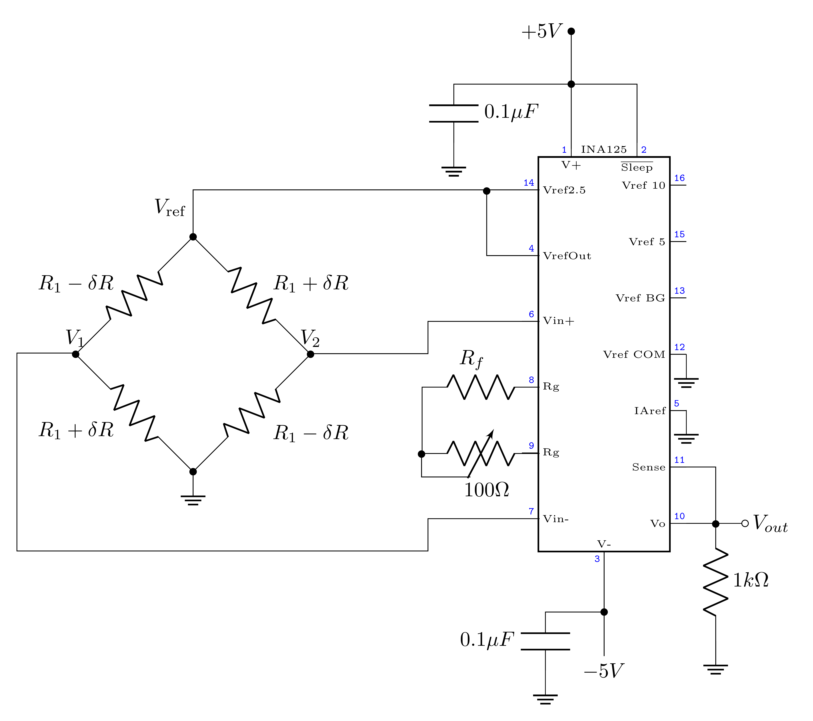

# ECE Emerge Project: Phase 1 -- Signal Conditioning Bring-Up

**Department of Electrical and Computer Engineering**

**Spring 2026**

---

## Overview

This lab session launches the ECE Emerge capstone project.
The complete project description, system architecture, technical
requirements, check-off criteria, and deliverables are specified
in the **ECE Emerge Project Document**, available on Canvas.
Read that document in full before this session.

Phase 1 covers the analog signal conditioning chain: the INA125
instrumentation amplifier and the inverting summing amplifier.
During this lab session, the team builds and verifies the complete
signal conditioning chain on a solderless breadboard. After this
session, one team member will transfer the verified design to a
soldered prototype on the M2K adapter board. The breadboard must
be working before any soldering begins.

Unlike previous labs, no fixed procedure is provided. The team's
pre-lab design document is the guide. The checkpoints below define
the minimum progress required for a satisfactory Phase 1 milestone.

> **IMPORTANT**
>
> Each team member must have completed Lab 7 before the team receives
> an INA125. The INA125 is a precision integrated circuit. Apply
> supply voltages carefully. A replacement for a destroyed device
> may be available subject to a grading penalty (see the project
> document for details).

---

## Individual and Team Work

This project involves both individual and team deliverables.
Understanding which is which matters for academic integrity.

**Individual work.** The Reflective AI Exercise
(Section 1) is completed independently by each
team member before the lab session. Each member submits their own
reflection to Gradescope. Discussing the concepts with teammates
is encouraged; the written submission must be each person's own work.

**Team work.** The pre-lab design document
(Section 2), the breadboard bring-up, and the
Phase 1 Milestone Report (Section 4) are team
deliverables. One submission per team. All team members are
expected to contribute to the design, the lab session, and the
report. The exit survey at the end of the project (see the project
document) asks each member to describe their individual contributions
specifically.

---

## 1. Individual Pre-Lab: Reflective AI Exercise

**Completed individually. Due: Tuesday noon, submitted to Gradescope before entering the lab.**

### 1.1 Reflective AI Exercise: Instrumentation Amplifier and Signal Chain

**Objective:** Demonstrate understanding of how the INA125
three-op-amp topology solves the limitations of the difference
amplifier, and how the Wheatstone bridge and instrumentation
amplifier together form a complete signal chain from mechanical
force to digital value.

#### Part 1: Exploration

Example prompts are provided below. You may use them, adapt them,
or write your own at the same level of specificity.

**Focus Area 1: The Three-Op-Amp INA Topology**

> *"I am an electrical engineering student designing an
> instrumentation amplifier signal chain. Can you explain what
> goes wrong with a single op-amp difference amplifier when the
> source impedance is not perfectly balanced between the two input
> terminals? Describe the effect on common-mode rejection in
> physical terms."*

Follow up with:

> *"Now explain how the three-op-amp instrumentation amplifier
> topology solves this problem. Focus on why the input buffer stage
> is necessary, and how the single shared resistor
> $R_\text{G}$ controls differential gain without degrading
> common-mode rejection. Use the virtual short concept to explain
> what voltage appears across $R_\text{G}$ and why."*

**Focus Area 2: The Wheatstone Bridge as a Signal Source**

> *"I am connecting a Wheatstone bridge load cell to an
> instrumentation amplifier. Can you explain what the bridge output
> represents physically, and why both output terminals sit near the
> same voltage even when a load is applied? Why is this common-mode
> voltage not a defect to be eliminated before amplification?"*

Follow up with:

> *"If the bridge produces only 10 mV of differential output
> under full load, and the common-mode voltage at both terminals is
> approximately half the excitation voltage, what does the
> instrumentation amplifier need to do well to recover a clean signal?
> What happens if the CMRR of the amplifier is poor?"*

After completing both focus areas, connect them to your design: the
INA125 gain is set by a single external resistor $R_\text{G}$.
If you increase the gain by reducing $R_\text{G}$, what constraint
does that place on the input signal range, and how does the bridge
output level determine where you set that limit?

#### Part 2: The Self-Test

Open Gemini and write your own quiz prompt targeting these two
concepts. Your questions must involve selecting an appropriate INA
gain from a design specification, explaining how the three-op-amp
topology maintains CMRR when source impedance is not perfectly
balanced, and predicting how a change in $R_\text{G}$ affects both
gain and the signal chain's ability to reject common-mode noise.

Apply the meta-prompt from *A Mind Worth Questioning* to
evaluate and strengthen your draft, then run the quiz. Submit your
original draft, the AI's critique, your revised prompt, and the full
quiz transcript to Gradescope.

#### Part 3: Formal Reflection (150--250 words)

Your written synthesis must address all three of the following points:

- **The Link** -- How the Wheatstone bridge produces a differential
  signal proportional to applied force, and why the INA's ability to
  reject the simultaneous common-mode voltage is essential to recovering
  that signal.
- **The Technical "Why"** -- Correct use of terms such as CMRR,
  virtual short, common-mode voltage, or differential gain.
- **The Lab Application** -- A specific design decision from your
  Phase 1 bring-up -- gain selection, $R_\text{G}$ value, or summing
  amplifier resistor ratio -- and the constraint or measurement result
  that justified it.

> **Prelab Deliverable #1**
>
> Submit your Part 2 prompt-craft artifact and
> your Part 3 reflection (150--250 words) to Gradescope as part of
> the pre-lab assignment, due Tuesday at noon.

---

## 2. Team Pre-Lab: Design Document

**One submission per team. Due: Tuesday noon, submitted to Gradescope before entering the lab.**

This is the team's engineering design document, not a worksheet.
It is the evidence that the team has thought through the system
before picking up a component. The signal chain design procedure
is worked through in full in Example 12.2 of Chapter 11. The
INA125 gain formula is:

$$G = 4 + \frac{60\,\text{k}\Omega}{R_g}.$$

Consult the INA125 datasheet (linked on Canvas) for the pinout,
supply limits, and output swing specification.

> **Prelab Deliverable #1**
>
> **INA gain selection.**
> State the selected gain value. Show the calculation of $R_g$ from
> the INA125 gain formula. Identify the nearest standard resistor
> value and state the gain it produces. Justify the gain choice:
> what bridge output specification sets the upper limit, and what
> supply voltage limits the output swing?

> **Prelab Deliverable #2**
>
> **Summing amplifier design.**
> Derive the resistor ratios $R_f/R_a$ and $R_f/R_b$ from the two
> boundary conditions (zero load maps to $+2.5$ V; full load maps to
> $-2.5$ V). State the specific standard resistor values selected.
> Write out the complete transfer function $v_\text{ADC} = f(v_\text{INA})$
> and verify it numerically at both endpoints.

> **Prelab Deliverable #3**
>
> **Theoretical resolution.**
> Calculate the weight resolution per ADC count (in grams per count)
> for your chosen gain and the M2K 12-bit ADC with a 5 V input range.
> State how this compares to the 1.1 g jelly bean target.

> **Prelab Deliverable #4**
>
> **INA125 pinout diagram.**
> Provide an annotated diagram of the INA125 pinout (from the datasheet
> or the project document) showing the intended connection for every
> pin: positive and negative supply, both differential inputs, both
> gain pins with $R_g$, the reference pin (IAref, pin 5), and the
> output. No pin should be left unlabeled.

> **Prelab Deliverable #5**
>
> **Breadboard plan.**
> Provide a sketch of the proposed breadboard layout showing the
> placement of the INA125, the op-amp used for the summing stage,
> power connections, decoupling capacitors, and the load cell
> interface. Stage separation must be clearly indicated.

---

## 3. Phase 1 Bring-Up

This is an open-ended engineering session. The team's design
document is the guide. Build and verify each stage in isolation
before connecting the stages together. Refer to the
*Analog Circuit Prototyping Best Practices* appendix of the
project document throughout.

<!-- CIRCUITIKZ FIGURE: Rendered from LaTeX source as media/INA125_complete-1.png -->

*Figure 1: Complete INA125 instrumentation amplifier circuit with load cell interface. The gain is set by the resistance between pins 8 and 9.*

> **WARNING**
>
> Power off the breadboard before modifying any circuit connection.
> Do not apply power to a stage that has not been checked for wiring
> errors. Verify supply voltages at the IC pins after every power-on.

### 3.1 Stage 1: INA125 Bring-Up in Isolation

The circuit that you will implement, on a solderless breadboard, is shown in Figure 1 before connecting the load cell. Make sure your wiring is neat and you use representative colored wires. DO NOT BUILD THE WHOLE CIRCUIT, YOU MUST BUILD IT IN STAGES AS INSTRUCTED BELOW. ALSO, DO NOT CONNECT IT TO THE LOAD CELL AT THIS STAGE. Instead of the load cell, you should use four resistors to produce a predictable test differential voltage input for verifying gain.

1. **Power verification.**
   Connect $\pm5$ V to the INA125 supply pins. Before applying any input, power on and
   measure the supply voltages at the IC pins with the M2K voltmeter.

2. **Balanced bridge test.**
   Connect four resistors in the range of 1 k$\Omega$ in a bridge configuration. Choose resistors such that an approximate 10 mV differential signal is produced by the bridge. To start things off, use $R_f$ resistor without the potentiometer (you will later find optimum $R_f$ and add the potentiometer to adjust the total feedback resistance). Choose $R_f$ to produce a gain of 100.

   > **Lab Deliverable #1a**
   >
   > Measure the resistor values accurately and estimate what differential voltage will be produced. If it is not approximately a 10 mV signal with 10 V excitation, place larger resistors in parallel with the bridge resistors. Without connecting the INA125 input pins, measure the differential input voltage from component mismatch in the resistor bridge, and confirm it is in the expected range.

3. **INA output measurement.**
   Now, connect the input signal to INA125 input pins, measure output voltage. Calculate the measured gain from
   your measurements: $G_\text{meas} = V_\text{out} / (V_1 - V_2)$.
   Compare to the expected set gain. Does the measured value make sense? If not, troubleshoot the circuit.

   > **Lab Deliverable #1b**
   >
   > Take a photograph of the completed Stage 1, and submit.

### 3.2 Stage 2: Summing Amplifier Bring-Up in Isolation

Test the summing amplifier separately before connecting it to the
INA125 output. Use the M2K power supply to provide a DC voltage
substituting for the INA output.

1. **Zero-input condition.**
   Apply 0 V DC to the summing amplifier input. Measure the output.
   The designed output at zero input is $+2.5$ V.

   > **Lab Deliverable #2a**
   >
   > Measured output voltage at 0 V input. Percent error from
   > the designed value of $+2.5$ V.

2. **Full-scale input condition.**
   Apply the full-scale INA output voltage from your design (nominally
   $+4.0$ V, or the maximum available from the M2K supply) to the
   summing amplifier input. Measure the output. The designed output
   at full-scale input is $-2.5$ V.

   > **Lab Deliverable #2b**
   >
   > Measured output voltage at full-scale input. Calculated
   > transfer function slope from the two measurements. Percent error
   > from the designed value of $-2.5$ V. Photograph of the
   > completed Stage 2 breadboard.

### 3.3 Stage 3: Load Cell Connection and End-to-End Measurement

Connect the load cell to the INA125 inputs only after Stage 1 has
been verified and signed off. The load cell wires are color-coded;
consult the load cell specifications in the project document
Appendix A for the correct wiring assignment.

> **WARNING**
>
> Handle the load cell carefully. Do not apply forces beyond the
> rated 2 kg capacity. Do not bend the cable sharply near the
> connector.

1. **Unloaded baseline.**
   With the load cell connected and no weight applied, record the INA125
   output voltage and the ADC reading from the M2K.

   > **Lab Deliverable #3a**
   >
   > Measured INA output voltage at zero load. M2K ADC reading at
   > zero load. M2K screenshot.

2. **Known-weight test.**
   Place a known calibration weight (use a labeled lab standard, do not
   estimate) on the load cell. Record the INA125 output voltage and the
   M2K ADC reading.

   > **Lab Deliverable #3b**
   >
   > Known weight used (state the value in grams). Measured INA
   > output voltage under load. M2K ADC reading under load.
   > Calculated implied sensitivity in mV/g from the two INA output
   > measurements.

3. **End-to-end signal chain.**
   Connect the INA125 output to the summing amplifier input. Record
   the ADC input voltage (summing amplifier output) at zero load and
   under the known weight. Confirm that zero load maps to
   approximately $+2.5$ V and that load maps toward $-2.5$ V.

   > **Lab Deliverable #3c**
   >
   > ADC input voltage at zero load and under known weight.
   > Confirmation that signal polarity is as designed (ADC reading
   > decreases as load increases). Photographs of the complete
   > breadboard with load cell connected.

---

## 4. Phase 1 Milestone Report

**One submission per team. Due: Saturday noon, submitted to Gradescope using the Project Phase 1 Submission Template (PDF).**

The milestone report documents the team's engineering decisions and
bring-up results. It is a design record: what the team decided,
why, what was measured, and what discrepancies were found.

### Next Step: Soldered Prototype

After the breadboard has been verified and the milestone report
submitted, one team member will transfer the circuit to a soldered
prototype on the M2K adapter board. Soldering should not begin
until the breadboard bring-up is complete and the end-to-end signal
chain has been confirmed. Refer to the *Soldered Prototype
Phase* section of the project document for construction guidance.

### Section 1: Design Decisions

- Final INA gain: the selected value, the $R_g$ calculation, the
  nearest standard value used, and the justification for the choice.
- Summing amplifier resistor values: the standard values selected,
  the transfer function they produce, and the actual zero-load and
  full-load output voltages calculated from the chosen components.
- Comparison of designed and achievable performance given standard
  resistor availability.

### Section 2: Bring-Up Results

- Stage 1: measured INA gain from the balanced-bridge test;
  photographs of the breadboard at Stage 1 completion.
- Stage 2: measured summing amplifier transfer function at the
  two test points; percent error from design.
- Stage 3: measured baseline and known-weight ADC readings;
  calculated sensitivity; photographs of the complete breadboard
  with the load cell connected.

### Section 3: Discrepancy Analysis

- Identify any measurement that deviated from the design by more
  than 10% and propose the most likely cause.
- If the end-to-end signal chain behaved as designed, state what
  confirmed it and which measurement provided the highest confidence.

### Section 4: Plan for Phase 2

- What the team intends to accomplish in Phase 2 (MATLAB interface,
  calibration routine, and GUI).
- Any design changes identified during Phase 1 bring-up that must
  be incorporated before Phase 2.

---

## Submission Instructions

> **IMPORTANT**
>
> **Individual submissions (each team member):**
> Prelab Deliverable 1 (Reflective AI Exercise) -- submitted
> individually to Gradescope, due Tuesday noon.
>
> **Team submissions (one per team):**
> Prelab Deliverables 2--6 (Design Document) -- due Tuesday noon.
> Phase 1 Milestone Report -- submitted using the provided template,
> converted to PDF, due Saturday noon.
> All photographs, screenshots, and calculations must be clearly
> labeled.
