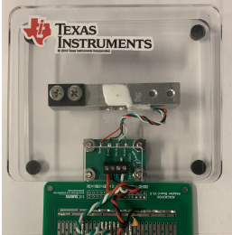

# ECE Emerge: Digital Scale Project

---

## Overview

The Jelly Belly factory is transitioning from selling jelly beans by weight to charging per individual bean. This change demands a measurement system capable of resolving a single jelly bean from the total weight on the pan.

Your team will design, build, and demonstrate a high-resolution digital scale that measures weights up to 2 kg with sufficient accuracy to detect a single jelly bean. *(Note: The average mass of a Jelly Belly bean is approximately 1.10 grams; see Appendix C for relevant statistical background.)* The system must operate as a standalone measurement solution: hardware, signal conditioning, analog-to-digital conversion, software, and a user interface are all the team's responsibility.

Unlike the structured lab experiments completed earlier in the course, this project does not specify how to build the system. Chapter 11 of the reader (*The Signal in the Difference*) and Chapters 10 and 9 provide the theoretical foundation. The team is expected to draw on that material, consult datasheets, and make engineering decisions independently.

---

## Project Objectives

Design and build a digital scale that:

- Weighs objects from 0 to 2 kg.
- Achieves a resolution sufficient to detect the addition or removal of a single jelly bean.
- Provides a user-friendly interface for calibration, taring, and weight display.
- Functions as a complete standalone system suitable for practical use.

---

## System Architecture

The scale consists of five subsystems. The team is responsible for the design and integration of all five.

*Figure 1: System overview: five subsystems from sensor to user interface.*

1. **Sensing Element.** A 2 kg Wheatstone bridge load cell converts applied weight into a small differential voltage. See Appendix A for load cell specifications.

2. **Signal Conditioning.** Two amplification stages raise the millivolt-level bridge output to a level that spans the full ADC input range. The INA125 instrumentation amplifier is provided as the first stage; it must be powered from the $\pm 5$ V split supply available on the M2K adapter board. The team designs the second stage, a summing amplifier, which applies an inverting gain and a DC offset derived from the $-5$ V rail to map the full measurement range to the full ADC window. Relevant theory is covered in Section 11.4 of the reader.

3. **Data Acquisition.** The M2K analog-to-digital converter (ADC) digitizes the conditioned signal. The M2K communicates with MATLAB over USB.

4. **Computer Interface.** MATLAB code configures the M2K ADC and acquires data. See the course website for the USB interface reference.

5. **Graphical User Interface.** A MATLAB App Designer GUI provides calibration, taring, and weight display.

*Figure 2: The load cell platform used in this project.*

---

## Technical Requirements

### Signal Conditioning Requirements

- **ADC utilization.** The M2K ADC has a 12-bit resolution and an input range of $-2.5$ V to $+2.5$ V (5 V total). The signal conditioning chain must be designed so that the full 2 kg measurement range corresponds to as close to the full 5 V ADC input range as is achievable. Signal conditioning that uses only a fraction of the ADC range wastes resolution proportionally. Section 11.4 of the reader quantifies how unused ADC range degrades effective resolution.

- **Theoretical resolution.** With a 5 V ADC range and 12-bit conversion, the ADC partitions the input into 4,096 levels of approximately 1.2 mV each. At 2 kg full scale, this corresponds to a theoretical weight resolution of:

$$\frac{2000\,\text{g}}{4096} \approx 0.49\,\text{g per level}.$$

  The objective is to approach this limit as closely as practical constraints allow.

- **Supply configuration.** The INA125 must be powered from the $\pm 5$ V split supply on the M2K adapter board, with the reference pin (IAref, pin 5) connected to ground. The summing amplifier second stage uses the $-5$ V rail to generate the DC offset required to shift the signal to the lower ADC boundary at zero load.

- **Signal polarity.** The inverting topology of the summing amplifier means that the ADC reading decreases as load increases: zero load produces approximately $+2.5$ V at the ADC input and full load produces approximately $-2.5$ V. This inversion is expected and is not a fault. The calibration software must account for the resulting negative slope when converting ADC readings to weight.

- **Linearity.** The conditioned signal should exhibit consistent linearity across the full measurement range.

- **Noise.** The team is responsible for identifying noise sources in the system and mitigating them through circuit design, wiring practice, and software averaging. See Appendix B for applicable techniques.

### GUI Requirements

The graphical user interface must support the following functions.

1. **Interface design.** Intuitive layout with clearly labeled controls, status indicators for calibration and tare state, and real-time display updates.

2. **Calibration.** A calibration routine using reference weight standards, with user input for calibration mass and real-time feedback.

3. **Taring.** A tare control that resets the displayed weight to zero, adjusts live readings to exclude the tared weight, and maintains the tare state until explicitly reset.

4. **Output display.** Weight in grams with accuracy and reliability quantified; jelly bean count estimate derived from the measured weight; dual display of weight and estimated count.

---

## Project Check-Offs

Three graded check-offs are scheduled. At each check-off, different team members are expected to lead the demonstration for different aspects of the system. Evaluators take note of team member engagement across check-offs.

### Pre-Project Check-Offs

Each check-off is 15 minutes. At least one team member must be present.

1. **Software Check-Off 1: M2K Interface Demonstration.** Demonstrate MATLAB's ability to configure the ADC and acquire data.

   The evaluation requires:
   - An M2K and ECE Emerge adapter board (solderless breadboard, no signal conditioning circuits) connected to the project laptop.
   - MATLAB code to acquire the voltage on Ch1 and compute the mean and standard deviation over intervals of at least 0.5 seconds. Scripts must be prepared and ready to run from the command line.
   - A plot of computed mean and standard deviation over a 5-second duration, using sample rate to determine timing.
   - The evaluator will supply a voltage between $-2.5$ V and $+2.5$ V; the team must read and display it correctly.

2. **Hardware Check-Off 1: Solderless Breadboard Demonstration.** Demonstrate, on a solderless breadboard, two separate circuits:

   - **Instrumentation amplifier stage.** The evaluator will place 0 kg, 1 kg, and 2 kg loads on the scale. The output voltage must be measurably different at 1950 g and 2000 g. The output must not saturate at 2 kg.

   - **Summing amplifier stage, tested independently.** The evaluator will supply a test input voltage. The stage must demonstrate inverting behavior with DC offset: a 0 V input must produce approximately $+2.5$ V at the output, and a $+4$ V input must produce approximately $-2.5$ V. The two stages must not be connected at this check-off.

### Mid-Project Check-Offs

Each check-off is 15 minutes. At least one team member must be present.

1. **Software Check-Off 2: GUI Prototype Demonstration.** Demonstrate the GUI prototype as developed with MATLAB App Designer. The GUI does not need to be finalized. Test voltages should be generated from MATLAB on the DAC and read through Ch1 to simulate the load cell, without any signal conditioning circuits present.

   The prototype must show at minimum:
   - Interface layout for calibration
   - Taring control
   - Output display showing mean, standard deviation, and confidence intervals of the measurement

2. **Hardware Check-Off 2: Robust Soldered Prototype.** Demonstrate two separately soldered circuits on the M2K adapter board prototype area. The two stages must not be connected at this check-off. MATLAB readout of ADC values is required (as implemented in Software Check-Off 1); the full GUI is not required at this stage.

   - **Instrumentation amplifier stage.** Same requirements as Hardware Check-Off 1: 0 kg, 1 kg, 2 kg outputs must be distinct and within the rail limits; 1950 g and 2000 g must be distinguishable.

   - **Summing amplifier stage.** The evaluator will supply a test input voltage. The same inverting behavior required at Check-Off 1 applies: 0 V input must produce approximately $+2.5$ V output, and $+4$ V input must produce approximately $-2.5$ V output.

### Final Project Demonstration

Each team has a 15-minute slot. All team members must be present. Thirty minutes before the demonstration, teams may set up and calibrate using a specified load cell. The evaluator will select one team member to present on behalf of the group.

The team must:

- Produce a plot of weight versus ADC output voltage using [**the provided script**](https://drive.google.com/file/d/1cvzQnWN2NxrCuvVuC6KTP3q3qRAWrsc7/view?usp=sharing), demonstrating that the design achieves close to a 5 V swing without saturating any amplifier stage. The plot should show a negative slope: approximately $+2.5$ V at zero load decreasing to approximately $-2.5$ V at full load.

- Estimate the number of jelly beans in a closed container. A similar empty container will be provided for taring.

---

## Deliverables and Grading

### Final Report

A concise technical report, prepared by the team, documenting the system implementation, emphasizing design decisions made and their rationale, and providing suggestions for improvement based on observations during testing and calibration. See Appendix F for the report prompts.

### Individual Exit Survey

Each team member must complete an individual exit project survey. The survey asks each member to describe their personal contributions to the project and to evaluate the contributions of each teammate. General statements such as "we all participated equally" are not acceptable and will not be credited.

---

## Logistics

### Lab and Support Schedule

After Lab 7, no further lab sessions are scheduled. To facilitate project work:

- Teams may attend any lab section to work on the project or seek assistance from teaching assistants.
- Instructor and teaching assistant office hours remain available for technical questions.

### Project Timeline

- Regular team meetings are essential. All members must be informed of project status and task assignments at all times.

### Equipment Access

- Approximately 25 load cells are available. A check-out system allows teams to borrow a load cell for approximately three days. Detailed check-out procedures will be announced separately.
- Calibration weights from 1 g to 2 kg are available in the lab.
- Each team receives one INA125 instrumentation amplifier after at least one team member has completed Lab 7. *(Note: The INA125 is a precision integrated circuit. Apply supply voltages carefully. If the device is destroyed, a replacement may be available subject to a grading penalty.)*

---

## Appendix A: Load Cell Specifications

### A.1 General Specifications

| Parameter | Specification |
|---|---|
| Weight range | 1–10 kg |
| Output sensitivity | $1.0 \pm 0.1$ mV/V |
| Non-linearity | 0.03% F.S. |
| Creep | 0.03% F.S. |
| Repeatability | 0.03% F.S. |
| Drift | 0.05% F.S./3 min |
| Zero output | $-0.15 \pm 0.05$ mV/V |
| Output resistance | $1000 \pm 10$ $\Omega$ |
| Quadrature error | 0.05% F.S. |
| Temperature sensitivity drift | 0.03% F.S./$10^\circ$C |
| Zero temperature drift | 0.3% F.S./$10^\circ$C |
| Product dimensions | $75 \times 12.7 \times 12.7$ mm |

*F.S. denotes full scale.*

For the 5 kg full-scale load cell used in this project, key absolute limits are: non-linearity, creep, and repeatability each at 1.5 g; drift at 2.5 g/3 min; zero temperature drift at 15 g/$10^\circ$C.

### A.2 Practical Implications

- **Warm-up time.** Allow at least 30 minutes of powered operation before calibration and measurement.

- **Repeatability.** Repeated measurements of the same weight may differ by up to 1.5 g. Statistical averaging improves effective resolution.

- **Creep.** For measurements extending over time, readings may drift by up to 1.5 g under a constant load.

- **Temperature.** Changes in ambient temperature affect the zero reading. Maintain a stable environment or account for temperature variation.

- **Mounting.** Forces must be applied along the primary measurement axis to avoid quadrature error.

*Figure A.1: [Load cell dimensions.](https://cdn-shop.adafruit.com/product-files/4541/C14641+C14642+C14643+datasheet.png)*

---

## Appendix B: Noise Reduction

The bridge output is a differential voltage in the millivolt range. At this signal level, electromagnetic interference (EMI) from power lines, motors, and other sources can be significant relative to the signal of interest. Two complementary techniques are essential.

### Twisted Pair Wiring

Twisting the load cell wires together significantly reduces EMI pickup. Each half-twist reverses the orientation of the wire loop, so induced voltages from external fields alternate in direction and cancel when the signal is subtracted differentially. The effectiveness of the cancellation increases with the number of twists per unit length.

Twisted pair wiring is mandatory for all connections to the load cell in the final prototype (Figure 2).

### Multicore Wire

Solid-core wire must not be used for connections to or from the load cell in the final prototype. Solid-core wire exerts mechanical strain on solder joints during flexing and leads to connection failures. Use multicore (stranded) wire for all connections to the load cell and between the board and any external connectors. Tin the wire ends by applying a thin layer of solder before insertion.

*Figure B.1: EMI cancellation by twisted pair wiring. In configuration (a), parallel wires act as antennas and accumulate interference. In configuration (b), alternating twist orientations cause induced voltages to cancel.*

### Additional Noise Mitigation

- Place decoupling capacitors as close as possible to the power supply pins of each integrated circuit.
- Apply averaging of multiple ADC readings in software.
- Consider a simple digital filter if averaging alone is insufficient.

---

## Appendix C: Statistical Background

Scale performance cannot be evaluated from a single measurement. Multiple repeated measurements of the same weight reveal the distribution of readings around the true value. The following statistical quantities are the minimum required for a rigorous performance characterization. MATLAB provides built-in functions for all of them.

### Measures of Central Tendency and Dispersion

**Mean.** The arithmetic average of the measurements. Estimates the systematic reading for a given load.

**Standard deviation.** A measure of measurement-to-measurement variability. A lower standard deviation indicates better precision (repeatability).

**Variance.** The square of the standard deviation. Useful in further statistical calculations.

**Coefficient of variation.** Standard deviation expressed as a percentage of the mean. Values below 10% generally indicate acceptable consistency for a measurement system.

### Confidence Intervals

A 95% confidence interval provides a range within which the true mean lies with 95% probability, given the observed sample. The interval width depends on both the standard deviation and the number of samples. Larger sample counts narrow the interval and improve confidence in the estimated mean.

In the context of this project, a confidence interval on the scale reading for a known calibration weight shows whether the scale has a statistically significant bias. If zero does not lie within the confidence interval, a systematic offset is present.

### Outliers

Individual readings that fall far from the majority of measurements may indicate transient noise, mechanical disturbance, or software errors. The interquartile range (IQR) method provides a robust criterion: readings below $Q_1 - 1.5 \times \text{IQR}$ or above $Q_3 + 1.5 \times \text{IQR}$ are flagged as outliers, where $Q_1$ and $Q_3$ are the 25th and 75th percentiles respectively.

### Jelly Bean Weight Statistics

A reference sample of 91 jelly beans was weighed individually. Key statistics: mean 1.106 g, median 1.110 g, standard deviation 0.088 g, range 0.45 g. The coefficient of variation is 7.9%, indicating good bean-to-bean consistency within the sample. The natural variability of individual bean weights (standard deviation of 0.088 g) sets a practical floor on counting precision that is independent of scale resolution.

---

## Appendix D: Analog Circuit Prototyping Best Practices

Analog circuits require a more methodical construction approach than digital circuits. Analog signals are not bounded to fixed voltage levels, and integrated circuit pins do not have built-in reverse polarity protection. The following practices reduce the risk of component damage and wasted debugging time.

### Solderless Breadboard Phase

1. **Study the pinout before placing any component.** Sketch the connections on paper. Check the datasheet pin diagram against your sketch before applying power.

2. **Connect power and ground first.** Add decoupling capacitors. Verify positive and negative supply connections before powering on. After power-up, confirm that current draw is within the expected range.

3. **Build and test each stage separately.** Verify the instrumentation amplifier stage in isolation before connecting the summing amplifier. Connect the stages only after each has been checked off independently.

4. **Test with a known differential input before connecting the load cell.** Four 1 k$\Omega$ resistors arranged as a balanced bridge with 2.5 V excitation will produce a small differential voltage due to component tolerances. This provides a safe, predictable test input to verify gain before the load cell is attached.

### Soldered Prototype Phase

1. **Understand the adapter board layout.** Note which pads on the front and back are electrically connected. Vias provide physical through-holes but do not create automatic front-to-back connections; connections must be made deliberately with solder bridges.

2. **Place all components on the front of the board.** Route all wire connections on the back. Use labels on the back to track pin assignments.

3. **Solder ICs with minimal solder on each pin** to allow desoldering if a component must be replaced.

4. **Follow the same stage-by-stage testing sequence** as the solderless phase. A soldered circuit that has never been tested in stages is significantly harder to debug.

### Critical Warnings

- Do not power on a complete, untested analog circuit expecting it to function immediately.
- Do not apply power while building or modifying the circuit.
- Do not use a soldering iron on a powered circuit.

---

## Appendix E: Calibration

Calibration establishes the quantitative relationship between the ADC output and the actual weight applied to the scale. Without calibration, ADC readings are arbitrary numbers. The relationship must be determined experimentally because component tolerances, load cell sensitivity variation, and amplifier offsets make it impossible to compute the conversion factor purely from nominal specifications.

### Two-Point Calibration

The simplest calibration assumes a linear relationship between weight $W$ and measured voltage $V$:

$$W = m \cdot V + b.$$

Two measurements establish the slope $m$ and intercept $b$: one at zero load ($V_0$, $W = 0$) and one at a known reference weight ($V_1$, $W_1$). From these:

$$m = \frac{W_1}{V_1 - V_0}, \qquad b = -m \cdot V_0.$$

Because the summing amplifier stage is inverting, the ADC voltage decreases as load increases. The slope $m$ will therefore be negative: heavier loads produce lower ADC readings. This is expected behavior and does not indicate a wiring error. Two-point calibration is accurate at the two calibration points and interpolates linearly between them. Non-linearity in the load cell or amplifier chain degrades accuracy at intermediate points.

### Multi-Point Calibration

Measuring at several known weights distributed across the full 0 to 2 kg range and fitting a line by least squares provides a better estimate of slope and intercept. Specific advantages are:

- Random measurement noise in individual readings is averaged out across all calibration points.
- The quality of the linear assumption can be assessed from the residual errors and the $R^2$ coefficient.
- Non-linear behavior, if present, becomes visible in the residuals and can be addressed with a higher-order polynomial fit.

Weight standards in 250 g increments from 0 to 2 kg are available in the lab. A linear fit to nine calibration points provides substantially better accuracy than a two-point calibration, and is the recommended approach for the final system.

### Calibration in the GUI

The calibration routine should be integrated into the GUI so that it can be repeated without modifying code. The user should be guided through placing known weights on the scale in sequence, and the GUI should store the resulting calibration parameters and apply them to all subsequent measurements.

---

## Appendix F: Project Report

### Instructions

The team report documents the system implementation and provides a critical evaluation of design decisions. It is submitted via the course submission app using the provided template. All team members are expected to contribute to the preparation of the report and to agree to its content before submission. One submission per team.

### Report Prompts

1. **Technical System Design and Implementation.** Describe the complete system architecture: signal conditioning circuit design decisions, M2K ADC interface, and MATLAB communication. Provide photographs of the hardware implementation (front and back of prototype board). Explain the key design choices made by the team and the trade-offs encountered. (Less than one page.)

2. **Calibration and Performance Analysis.** Detail the calibration procedure and present quantitative results including accuracy, precision, linearity, and effective measurement range. Discuss sources of error and how they were addressed. Include relevant plots and statistical analysis. (Less than one page.)

3. **MATLAB GUI Development and User Experience.** Explain the GUI design rationale and implementation. Describe the key features included, how real-time data acquisition and display were handled, and any challenges encountered. Include screenshots. (Less than one page.)

4. **Team Collaboration and Project Management.** Reflect on how the team organized work, made decisions, and resolved technical and interpersonal challenges. Describe communication strategies, the division of responsibilities, and what the team learned about working effectively on a technical project. (Less than one page.)

5. **Problem-Solving and Learning Outcomes.** Analyze the most significant technical challenges encountered and the approach taken to resolve them. Reflect on the skills and knowledge gained through this project and how the experience prepares team members for subsequent engineering coursework and work. (Less than one page.)
